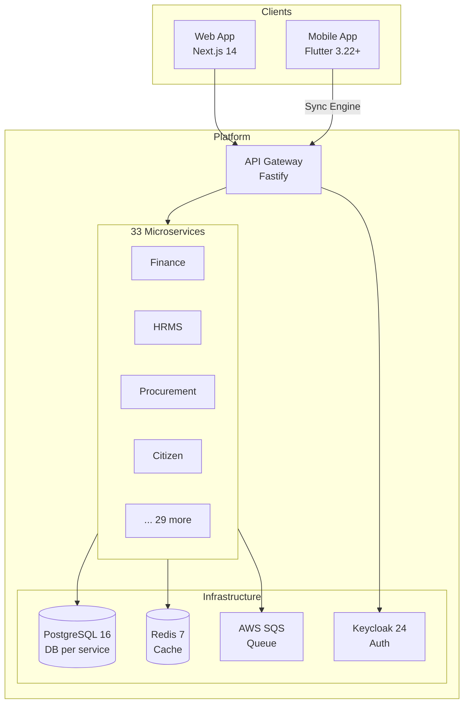

<div align="center">
  <h1>◈ CivitasOne Suite</h1>
  <p><strong>The ERP that works without internet.</strong></p>
  <p>Built for Indian Government, PSU, and Small Offices. Offline-first. Zero training. ₹0 licensing.</p>

  <p>
    <a href="https://civitasone.app">Website</a> ·
    <a href="https://civitasone.app/docs">Documentation</a> ·
    <a href="https://civitasone.app/sandbox">Try Sandbox</a> ·
    <a href="https://civitasone.app/pricing">Pricing</a>
  </p>

  
  
  
  
  
  
  
</div>

---

<table>
<tr>
<td align="center"><strong>📡 Offline-First</strong><br/>Works without internet.<br/>Sync when connected.</td>
<td align="center"><strong>🧩 33 Modules</strong><br/>Finance, HR, Procurement,<br/>Citizen Services & more.</td>
<td align="center"><strong>🌍 5 Languages</strong><br/>English, Hindi, Tamil,<br/>Telugu, Kannada.</td>
<td align="center"><strong>💰 ₹0 Licensing</strong><br/>AGPL-3.0 open source.<br/>No per-seat fees.</td>
</tr>
</table>

---

## What is CivitasOne?

CivitasOne Suite is a **unified enterprise resource planning (ERP) platform** purpose-built for Indian Government departments, Public Sector Undertakings (PSUs), and small offices. It replaces fragmented legacy systems with a single, modern, multi-tenant platform that handles finance, procurement, HR, citizen services, and 29 more domains.

Unlike traditional ERPs that require constant internet connectivity, CivitasOne is **offline-first by design**. The Flutter mobile app and progressive web interface both include a robust sync engine that queues operations locally and reconciles automatically when connectivity is restored — critical for field officers in remote districts.

---

## Features

- 📴 **Offline-first** — full CRUD without internet, sync on reconnect
- 🏦 **33 microservices** — Finance, HR, Procurement, Projects, Grants, Legal, Helpdesk, Citizen, Audit...
- 📱 **Mobile-first** — Flutter app with GPS attendance, barcode scanner, digital ID
- 🌐 **5 languages** — English, Hindi, Tamil, Telugu, Kannada
- 🧩 **Modular** — turn modules on/off per tenant
- 🔌 **Plugin SDK** — extend with TypeScript plugins (no ABAP)
- 💬 **AI Assistant** — contextual help powered by RAG
- 🔒 **Enterprise security** — PKCE, device trust, encrypted storage, GPS spoofing detection
- 📊 **1,185 API endpoints** — OpenAPI 3.1 documented
- ✅ **1,400+ automated tests** — 80%+ coverage

---

## Tech Stack

| Layer | Technology |
|-------|-----------|
| Backend | Node.js 20+, Fastify 4, Drizzle ORM, PostgreSQL 16 |
| Frontend | Next.js 14, React 18, Tailwind CSS, shadcn/ui |
| Mobile | Flutter 3.22+, Riverpod, go_router |
| Queue | AWS SQS (LocalStack in dev) |
| Cache | Redis 7 |
| Auth | Keycloak 24 (OIDC/PKCE) |
| Search | Meilisearch |
| Monorepo | pnpm 9 + Turborepo 2 |
| Testing | Vitest, Playwright, k6 |
| CI/CD | GitHub Actions |

---

## Quick Start

### Prerequisites

- Node.js 20+
- pnpm 9+
- Docker & Docker Compose

### Setup

```bash
# Clone
git clone https://github.com/dbn1972/civitasone-suite.git
cd civitasone-suite

# Install
pnpm install

# Start infrastructure (Postgres, Redis, Keycloak, LocalStack)
docker compose -p civitasone --env-file infra/.env -f infra/docker-compose.yml up -d

# Run all tests
pnpm test

# Start web app
pnpm --filter @civitasone/web dev

# Start a single service
pnpm --filter @civitasone/finance-service dev
```

### Dev URLs

| Service | URL |
|---------|-----|
| Web App | http://localhost:3000 |
| API Gateway | http://localhost:4000 |
| Keycloak Admin | http://localhost:8180 |

---

## Architecture

CivitasOne follows **CQRS + Event Sourcing** with strict service isolation:

```
Route → Validate (zod) → Publish Command to SQS → Return 202 Accepted
Consumer → Idempotency Check → Write (Outbox) → Emit Audit Event → Refresh Cache
```

- **Database per service** — 33 isolated PostgreSQL databases
- **All reads through Redis** — cache-first via `getOrLoad`
- **Cross-service writes** — async via SQS, never direct SQL
- **Immutable audit trail** — every mutation logged



> 📖 Full architecture docs: [`docs/architecture/`](./docs/architecture/)

---

## Project Structure

```
civitasone-suite/
├── apps/
│   ├── web/              — Next.js 14 frontend (marketing + app)
│   └── mobile/           — Flutter mobile app
├── services/             — 33 Fastify microservices
├── packages/             — 17 shared workspace packages
├── infra/                — Docker Compose, Terraform, Helm
├── docs/                 — Architecture, user manual, API spec
├── tests/                — Cross-service contract tests
└── scripts/              — Dev/CI utilities
```

---

## Modules

| Domain | Service | Description |
|--------|---------|-------------|
| **Platform** | `identity-service` | Authentication, SSO, device trust |
| | `tenant-service` | Multi-tenant provisioning & config |
| | `policy-service` | RBAC, permissions, access control |
| | `audit-service` | Immutable audit trail |
| | `notification-service` | Email, SMS, push, in-app |
| | `workflow-service` | Approval flows & task routing |
| | `gateway-service` | API gateway & rate limiting |
| | `queue-service` | Message broker orchestration |
| | `admin-service` | System administration |
| | `install-service` | Getting Started wizard |
| | `plugin-service` | Plugin registry & lifecycle |
| | `theme-service` | White-label theming |
| **Finance** | `finance-service` | Double-entry accounting, treasury, GST, TDS |
| | `billing-service` | Invoicing, receipts, challans |
| | `grant-service` | Grant management & disbursement |
| **Operations** | `procurement-service` | Tendering, GEM integration, purchase orders |
| | `contract-service` | Contract lifecycle management |
| | `asset-service` | Fixed asset register & depreciation |
| | `stock-service` | Store & stock management |
| | `inventory-service` | Consumable tracking |
| | `project-service` | Project planning & milestones |
| **People** | `hrms-service` | Employee lifecycle, leave, attendance |
| | `payroll-service` | Salary, arrears, statutory compliance |
| | `estab-service` | Establishment & cadre management |
| **Citizen** | `citizen-service` | RTI, grievances, service requests |
| | `helpdesk-service` | Ticket management |
| | `telephony-service` | Call center integration |
| **Knowledge** | `knowledge-service` | Document management & search |
| | `report-service` | Report generation & scheduling |
| | `analytics-service` | Dashboards & KPIs |
| | `legal-service` | Legal case tracking |
| | `crm-service` | Stakeholder relationship management |
| | `location-service` | Geo-hierarchy & office mapping |

---

## Testing

1,400+ tests across the full stack:

| Type | Tool | Scope |
|------|------|-------|
| Unit | Vitest | Business logic, validators, domain |
| Integration | Vitest + Supertest | API routes, consumers, repos |
| E2E | Playwright | Full user workflows |
| Widget | Flutter test | Mobile UI components |
| Load | k6 | Performance at 1,000 TPS |
| Contract | Cross-service | Event schema compatibility |

```bash
pnpm test                    # All tests
pnpm test -- --coverage      # With coverage report
pnpm test:integration        # Integration suite
pnpm test:contract           # Cross-service contracts
pnpm arch:guard              # Architecture boundary enforcement
```

---

## Documentation

| Resource | Link |
|----------|------|
| User Manual | [civitasone.app/docs](https://civitasone.app/docs) |
| API Reference (OpenAPI 3.1) | [civitasone.app/docs/api](https://civitasone.app/docs/api) |
| Architecture Guide | [`docs/architecture/`](./docs/architecture/) |
| Plugin SDK | [civitasone.app/docs/plugins](https://civitasone.app/docs/plugins) |
| Self-Hosting Guide | [civitasone.app/docs/self-host](https://civitasone.app/docs/self-host) |

---

## Contributing

We welcome contributions from everyone. Please read our [Contributing Guide](CONTRIBUTING.md) to get started.

Quick overview:
- **Branch naming**: `feat/`, `fix/`, `docs/`, `test/`, `refactor/`, `chore/`
- **Commits**: [Conventional Commits](https://www.conventionalcommits.org/) format
- **Testing**: 80%+ coverage on changed code required
- **Reviews**: 2 approvals for backend/infra, 1 for frontend/docs

---

## Security

Found a vulnerability? Please see our [Security Policy](SECURITY.md) for responsible disclosure.

**Do not** open a public issue for security vulnerabilities. Email **security@civitasone.app** instead.

---

## License

CivitasOne Suite is licensed under the [GNU Affero General Public License v3.0](LICENSE) — you can use, modify, and distribute freely. Network use counts as distribution.

---

## Community

- 💬 [GitHub Discussions](https://github.com/dbn1972/civitasone-suite/discussions) — questions, ideas, show & tell
- 🐛 [Issue Tracker](https://github.com/dbn1972/civitasone-suite/issues) — bugs and feature requests
- 🔒 [Security Reports](mailto:security@civitasone.app) — responsible disclosure
- 📧 [hello@civitasone.app](mailto:hello@civitasone.app) — general inquiries

---

<p align="center">
  Built with ❤️ in India for India
  <br />
  <sub>© 2024–2026 CivitasOne Contributors</sub>
</p>
