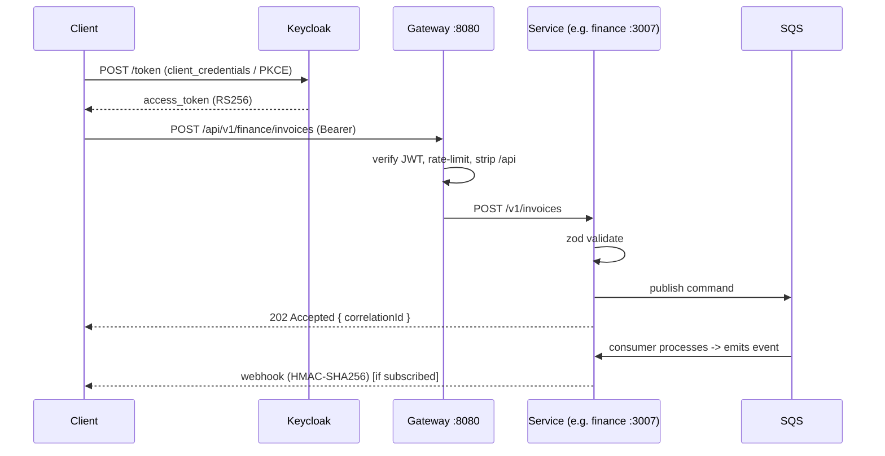

# CivitasOne Suite — API Guide

CivitasOne Suite is an ERP platform for Indian Government departments, PSUs, Section-8
companies, cooperatives, and small offices. It is built as **33 Fastify microservices**
fronted by a single **API gateway** (port `8080`), with a Next.js 14 web app and a
Flutter (Android) mobile client as first-class consumers of this same API.

- **Version:** `v0.1.0`
- **License:** AGPL-3.0
- **API style:** REST + CQRS. Reads return data; writes are asynchronous commands.
- **Auth:** OAuth 2.0 / OIDC via Keycloak 24 (RS256 bearer JWTs).

This guide is the contract you code against. Everything below is exercised through the
gateway — you should never talk to a service port directly in production.

---

## 1. Authentication (Keycloak OIDC)

All protected endpoints require a **Bearer access token** issued by Keycloak. Tokens are
signed with **RS256**; the gateway and every downstream service verify the signature
against Keycloak's published JWKS (`/protocol/openid-connect/certs`) and reject anything
that is expired, has the wrong `aud`, or is signed with an unknown key.

### 1.1 Token lifecycle

| Token          | Lifetime (typical) | Purpose                                             |
|----------------|--------------------|-----------------------------------------------------|
| `access_token` | ~5 min             | Sent as `Authorization: Bearer …` on every request. |
| `refresh_token`| ~30 min – hours    | Exchanged for a fresh access token, no re-login.    |
| `id_token`     | matches access     | OIDC identity claims (used by web/mobile clients).  |

Access tokens are deliberately short-lived. Clients should:

1. Cache the access token and its `exp`.
2. Refresh **before** expiry (e.g. at 80% of lifetime) using the refresh token.
3. Fall back to a full re-authentication if the refresh token itself has expired.

### 1.2 Grant types

- **Machine-to-machine / server integrations:** `client_credentials`.
- **Web app (`apps/web`):** Authorization Code + PKCE.
- **Mobile app (`apps/mobile`):** Authorization Code + PKCE via `flutter_appauth`.

### 1.3 Key claims

Downstream services read these from the verified JWT:

- `sub` — user id.
- `tenant_id` (or realm/group mapping) — drives tenant isolation. **Every** query is
  scoped to the caller's tenant.
- `realm_access.roles` / `resource_access` — RBAC roles (e.g. `plugin_admin`,
  `super_admin`, module-specific roles).
- `edition` — one of `govt`, `psu`, `private`, `ngo`, `section8`, `cooperative`,
  `small_office`. Feature gating keys off this.

---

## 2. Base URL & routing

The external contract is:

```
https://{host}:8080/api/v1/{service}/{resource}
```

The gateway strips the leading `/api` and proxies to the target service's own
`/v1/...` route. So an external call to:

```
GET /api/v1/finance/invoices
```

is proxied to the **finance** service (`:3007`) as:

```
GET /v1/invoices
```

Representative service map (full suite is 33 services):

| Service      | Port | Example resources                         |
|--------------|------|-------------------------------------------|
| identity     | 3001 | `/users`, `/roles`, `/sessions`           |
| audit        | 3004 | `/audit-logs`                             |
| finance      | 3007 | `/invoices`, `/ledgers`, `/vouchers`      |
| procurement  | 3008 | `/tenders`, `/purchase-orders`            |
| hrms         | 3012 | `/employees`, `/leaves`                   |
| payroll      | 3013 | `/pay-runs`, `/payslips`                  |
| workflow     | 3029 | `/definitions`, `/instances`, `/tasks`    |
| gateway      | 8080 | edge — auth, rate limiting, proxy         |

> Do not hardcode service ports in clients. They exist for local development and internal
> service-to-service calls only. Always go through `:8080/api/v1/...`.

---

## 3. Common response shapes

### 3.1 Writes: `202 Accepted` + correlation id (CQRS)

Write routes do **not** apply changes synchronously. They validate the request (zod),
publish a command to SQS, and immediately return `202 Accepted` with a command /
correlation id. A consumer processes the command asynchronously and emits events.

```http
HTTP/1.1 202 Accepted
Content-Type: application/json

{
  "commandId": "3f2b9c7e-1a4d-4e88-9b21-5c9f0e2a7d10",
  "correlationId": "3f2b9c7e-1a4d-4e88-9b21-5c9f0e2a7d10",
  "status": "accepted"
}
```

Use the `correlationId` to:
- Trace the command through logs (it is threaded into every pino log line).
- Correlate the eventual event (or webhook) that confirms completion.

> **Consistency note:** because writes are eventually consistent, a read issued
> immediately after a `202` may not yet reflect the change. Poll the resource, subscribe
> to the event, or use the returned id to check status.

### 3.2 Reads: data + pagination

List endpoints accept `limit` and `offset` and return the page plus paging metadata:

```http
GET /api/v1/finance/invoices?limit=25&offset=50
```

```json
{
  "data": [
    { "id": "inv_01H...", "number": "INV-2026-000123", "amount": 154000, "status": "posted" }
  ],
  "pagination": { "limit": 25, "offset": 50, "total": 812 }
}
```

- `limit` — page size (bounded by the service; oversized values are clamped).
- `offset` — number of rows to skip.
- `total` — total matching rows (for computing page count).

### 3.3 Error envelope

All errors return a consistent JSON envelope:

```json
{ "code": "VALIDATION_ERROR", "message": "amount must be a positive integer" }
```

Common status codes:

| Status | Meaning                                             |
|--------|-----------------------------------------------------|
| 400    | Validation failure (zod) — `code: VALIDATION_ERROR` |
| 401    | Missing/invalid/expired token                       |
| 403    | Authenticated but lacks the required role/tenant    |
| 404    | Resource not found (or not in caller's tenant)      |
| 409    | Conflict (e.g. duplicate, version mismatch)         |
| 429    | Rate limit exceeded                                 |
| 5xx    | Server error — safe to retry idempotent reads       |

---

## 4. Rate limiting

Rate limiting is enforced at the **gateway** with a 3-tier model:

1. **Global** — a ceiling across the whole edge.
2. **Per-tenant** — each tenant gets its own budget so one tenant cannot starve others.
3. **Per-route class** — heavier operations may carry tighter budgets.

Every response carries standard headers so clients can self-throttle:

```
X-RateLimit-Limit: 600
X-RateLimit-Remaining: 587
X-RateLimit-Reset: 1751600000
Retry-After: 12        # only on 429
```

On `429`, honor `Retry-After` (seconds) and back off. Clients should treat rate-limit
handling as mandatory — batch jobs in particular should respect `X-RateLimit-Remaining`.

---

## 5. Events & webhooks (HMAC)

Services publish domain events to **SQS**; internal subscribers consume them. For
*external* integrators, the **admin-service** exposes **outbound webhooks**: you register
an HTTPS endpoint and the platform POSTs signed event payloads to it.

### 5.1 Signature scheme

Each webhook delivery is signed with **HMAC-SHA256** using the shared secret you receive
at registration. Verify before trusting the payload:

- Header carries the signature (hex HMAC of the raw request body).
- Recompute `HMAC_SHA256(secret, rawBody)` and compare in constant time.
- Reject on mismatch. Also reject stale deliveries if a timestamp header is present.

```js
import crypto from 'node:crypto';

function verifyWebhook(rawBody, signatureHeader, secret) {
  const expected = crypto.createHmac('sha256', secret).update(rawBody).digest('hex');
  const a = Buffer.from(expected);
  const b = Buffer.from(signatureHeader);
  return a.length === b.length && crypto.timingSafeEqual(a, b);
}
```

Deliveries are retried with backoff on non-2xx responses, so your handler must be
**idempotent** — deduplicate on the event id.

---

## 6. Worked examples

The following five operations cover the shape of nearly everything in the API.
Replace `KC_HOST`, `API_HOST`, `CLIENT_ID`, `CLIENT_SECRET`, and `REALM` accordingly.

### 6.1 Obtain a token (client credentials)

**cURL**
```bash
curl -s -X POST \
  "https://$KC_HOST/realms/$REALM/protocol/openid-connect/token" \
  -H "Content-Type: application/x-www-form-urlencoded" \
  -d "grant_type=client_credentials" \
  -d "client_id=$CLIENT_ID" \
  -d "client_secret=$CLIENT_SECRET"
```

**JavaScript (fetch)**
```js
const res = await fetch(
  `https://${KC_HOST}/realms/${REALM}/protocol/openid-connect/token`,
  {
    method: 'POST',
    headers: { 'Content-Type': 'application/x-www-form-urlencoded' },
    body: new URLSearchParams({
      grant_type: 'client_credentials',
      client_id: CLIENT_ID,
      client_secret: CLIENT_SECRET,
    }),
  },
);
const { access_token } = await res.json();
```

**Python (requests)**
```python
import requests

resp = requests.post(
    f"https://{KC_HOST}/realms/{REALM}/protocol/openid-connect/token",
    data={
        "grant_type": "client_credentials",
        "client_id": CLIENT_ID,
        "client_secret": CLIENT_SECRET,
    },
)
access_token = resp.json()["access_token"]
```

### 6.2 List resources (paginated)

**cURL**
```bash
curl -s "https://$API_HOST/api/v1/finance/invoices?limit=25&offset=0" \
  -H "Authorization: Bearer $ACCESS_TOKEN"
```

**JavaScript**
```js
const res = await fetch(
  `https://${API_HOST}/api/v1/finance/invoices?limit=25&offset=0`,
  { headers: { Authorization: `Bearer ${accessToken}` } },
);
const { data, pagination } = await res.json();
```

**Python**
```python
resp = requests.get(
    f"https://{API_HOST}/api/v1/finance/invoices",
    params={"limit": 25, "offset": 0},
    headers={"Authorization": f"Bearer {access_token}"},
)
page = resp.json()
```

### 6.3 Create via command (expect `202`)

**cURL**
```bash
curl -s -i -X POST "https://$API_HOST/api/v1/finance/invoices" \
  -H "Authorization: Bearer $ACCESS_TOKEN" \
  -H "Content-Type: application/json" \
  -d '{
        "vendorId": "ven_01H...",
        "amount": 154000,
        "currency": "INR",
        "lineItems": [{ "description": "Consulting", "amount": 154000 }]
      }'
# -> HTTP/1.1 202 Accepted  { "commandId": "...", "correlationId": "..." }
```

**JavaScript**
```js
const res = await fetch(`https://${API_HOST}/api/v1/finance/invoices`, {
  method: 'POST',
  headers: {
    Authorization: `Bearer ${accessToken}`,
    'Content-Type': 'application/json',
  },
  body: JSON.stringify({ vendorId: 'ven_01H...', amount: 154000, currency: 'INR' }),
});
// res.status === 202
const { correlationId } = await res.json();
```

**Python**
```python
resp = requests.post(
    f"https://{API_HOST}/api/v1/finance/invoices",
    headers={"Authorization": f"Bearer {access_token}"},
    json={"vendorId": "ven_01H...", "amount": 154000, "currency": "INR"},
)
assert resp.status_code == 202
correlation_id = resp.json()["correlationId"]
```

### 6.4 Fetch by id

**cURL**
```bash
curl -s "https://$API_HOST/api/v1/finance/invoices/inv_01H..." \
  -H "Authorization: Bearer $ACCESS_TOKEN"
```

**JavaScript**
```js
const res = await fetch(
  `https://${API_HOST}/api/v1/finance/invoices/${id}`,
  { headers: { Authorization: `Bearer ${accessToken}` } },
);
if (res.status === 404) { /* not found or not in your tenant */ }
const invoice = await res.json();
```

**Python**
```python
resp = requests.get(
    f"https://{API_HOST}/api/v1/finance/invoices/{invoice_id}",
    headers={"Authorization": f"Bearer {access_token}"},
)
invoice = resp.json()
```

### 6.5 Subscribe a webhook

Registered against **admin-service**; the response carries the signing secret — store it
securely, it is used to verify every delivery.

**cURL**
```bash
curl -s -X POST "https://$API_HOST/api/v1/admin/webhooks" \
  -H "Authorization: Bearer $ACCESS_TOKEN" \
  -H "Content-Type: application/json" \
  -d '{
        "url": "https://integrations.example.gov.in/hooks/civitasone",
        "events": ["finance.invoice.posted", "procurement.po.approved"]
      }'
```

**JavaScript**
```js
const res = await fetch(`https://${API_HOST}/api/v1/admin/webhooks`, {
  method: 'POST',
  headers: {
    Authorization: `Bearer ${accessToken}`,
    'Content-Type': 'application/json',
  },
  body: JSON.stringify({
    url: 'https://integrations.example.gov.in/hooks/civitasone',
    events: ['finance.invoice.posted', 'procurement.po.approved'],
  }),
});
const { id, secret } = await res.json(); // store `secret` securely
```

**Python**
```python
resp = requests.post(
    f"https://{API_HOST}/api/v1/admin/webhooks",
    headers={"Authorization": f"Bearer {access_token}"},
    json={
        "url": "https://integrations.example.gov.in/hooks/civitasone",
        "events": ["finance.invoice.posted", "procurement.po.approved"],
    },
)
secret = resp.json()["secret"]  # used for HMAC verification (see section 5.1)
```

---

## 7. Request flow at a glance



---

## 8. Practical tips

- **Thread `correlationId`.** Log it on your side; it is your join key against platform logs.
- **Treat every write as async.** Never assume a read right after a `202` reflects the write.
- **Respect rate-limit headers.** Especially for bulk/batch integrations.
- **Verify webhook signatures** with a constant-time compare, and dedupe by event id.
- **Never bypass the gateway.** Service ports are internal; the contract is `/api/v1/...`.
