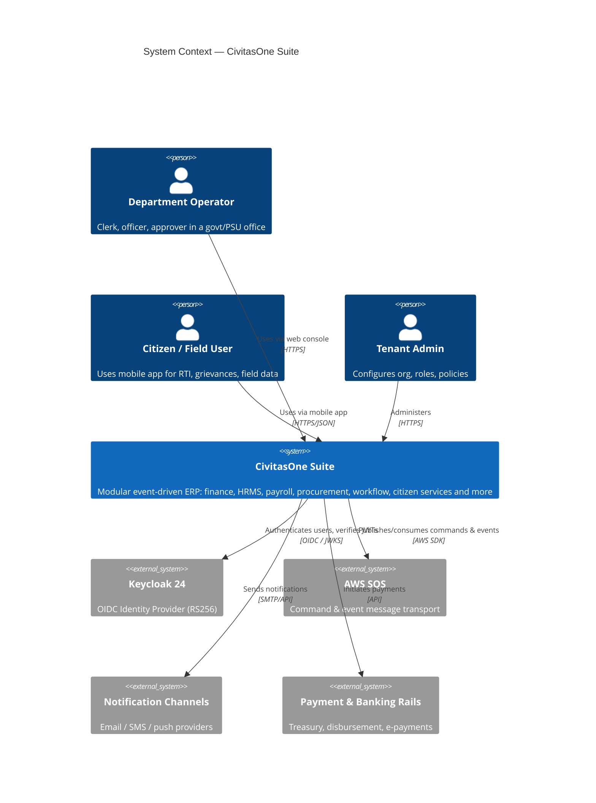
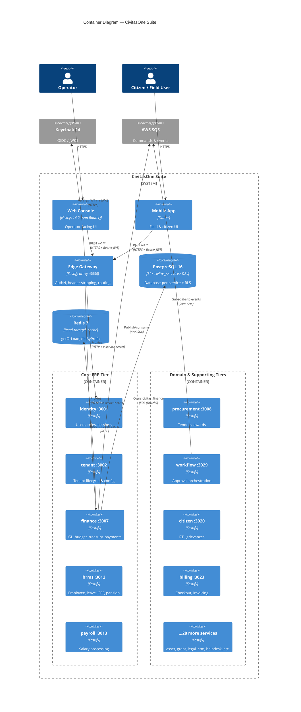
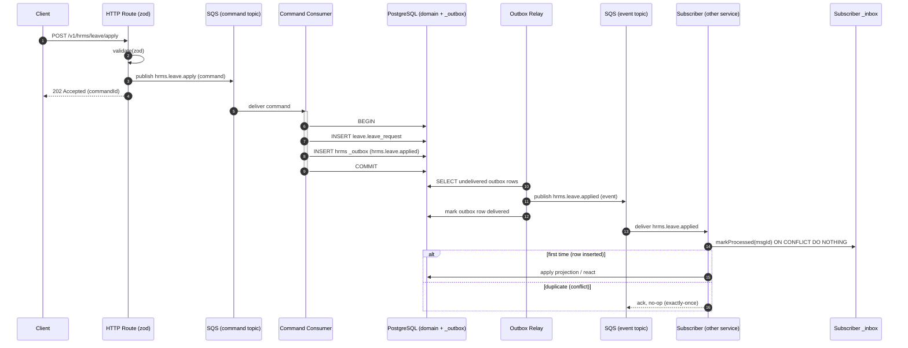
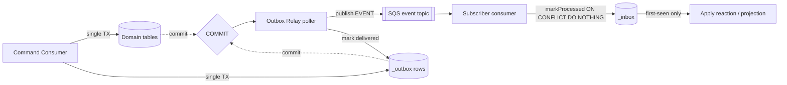
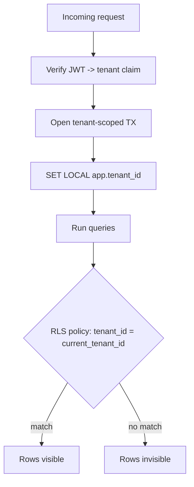
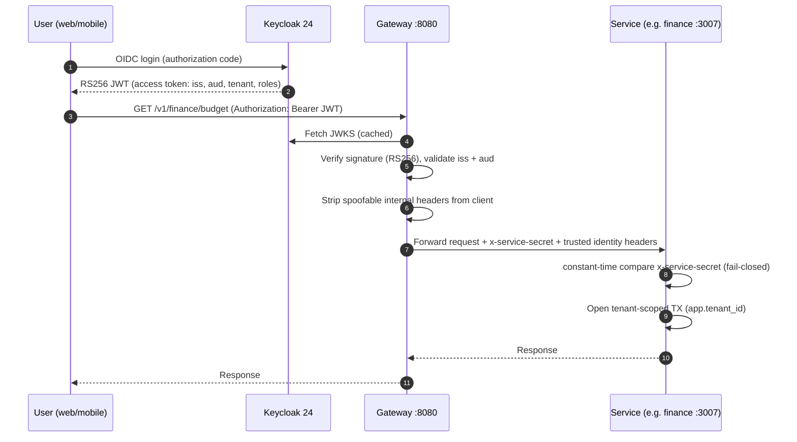
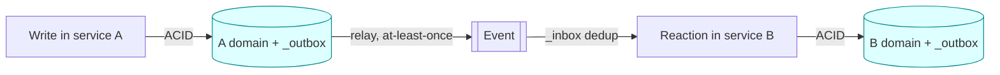

# CivitasOne Suite — Architecture

> **Version:** 0.1.0 · **License:** AGPL-3.0
> **Target segments:** Indian Government departments, PSUs, Section-8 companies, cooperatives, and small offices.
> CivitasOne is a modular, event-driven ERP built as a fleet of small, independently deployable services with strict data ownership boundaries.

---

## 1. Overview

CivitasOne is composed of:

- **33 Fastify microservices** (Fastify 4.27, Node 20, TypeScript), each owning a bounded context.
- **A Next.js 14.2 web application** (App Router) as the primary operator console.
- **A Flutter mobile application** for field and citizen-facing use.
- **An edge gateway** (port `8080`) that terminates public traffic, authenticates, and proxies to services.
- **32 PostgreSQL 16 databases** (database-per-service), **Redis 7** (read-through cache), **AWS SQS** (command/event transport), and **Keycloak 24** (OIDC identity provider, RS256).

The system follows a **CQRS + event-driven** style with a **transactional outbox** for reliable event publication and an **inbox** for exactly-once consumption. Every service is isolated at the data layer (its own database), and cross-service coordination happens exclusively through asynchronous events — never through direct database sharing.

Cross-cutting conventions:

- **Money** is represented as `BigInt` **paise** everywhere (no floats for currency).
- **Timestamps** are `timestamptz`.
- **Multi-tenancy** uses a `tenant_id` column plus PostgreSQL Row-Level Security (RLS) in the shared (Pool) tier; a Silo tier offers dedicated databases per tenant.

---

## 2. C4 Level 1 — System Context



---

## 3. C4 Level 2 — Container Diagram



Each service is a peer container: it owns exactly one database, one cache namespace, and one set of SQS topics. The gateway is the only public ingress; internal service-to-service calls (rare, used for synchronous reads) carry an `x-service-secret` header.

---

## 4. CQRS — Command & Event Flow

Writes never touch domain tables directly from the HTTP handler. Instead:

1. An HTTP route **validates** the request body with **zod**.
2. The route **publishes a COMMAND** to an SQS topic named `{service}.{aggregate}.{action}`.
3. A **durable consumer** processes the command **inside a single DB transaction**: it writes domain tables **and** inserts a row into the transactional **OUTBOX** (same transaction — atomic).
4. An **outbox relay** polls undelivered outbox rows and **publishes EVENT topics** named `{service}.{aggregate}.{pastTense}`.
5. **Other services' consumers** subscribe to those events. Each records the message in its **INBOX** via `markProcessed` (`INSERT ... ON CONFLICT DO NOTHING`) for idempotent, exactly-once handling.



Representative topics in use:

| Command topic | Emitted event topic |
|---|---|
| `billing.checkout.verify` | `billing.checkout.verified` |
| `hrms.leave.apply` | `hrms.leave.approved` |
| `finance.budget.create` | `finance.budget.created` |
| `procurement.tender.award` | `procurement.tender.awarded` |
| `citizen.rti.transfer` | `citizen.rti.transferred` |
| `workflow.instance.create` | `workflow.instance.created` |
| `asset.disposal.file_decided` | `asset.disposal.decided` |

Every service declares its topic surface in `src/shared/topics.ts`, which exports a `COMMANDS` object and an `EVENTS` object. This file is the single source of truth for a service's messaging contract.

---

## 5. Database-per-Service Strategy

Each of the 33 services owns exactly one PostgreSQL database, named `civitas_<service>` (32 databases; `queue` is an embedded library and `gateway` is a stateless proxy, so they hold no database of their own). Examples:

- `civitas_identity`, `civitas_finance`, `civitas_hrms`, `civitas_payroll`, `civitas_procurement`, `civitas_workflow`, `civitas_analytics`, …

**No service reads or writes another service's database.** All coordination is via events. This gives:

- **Independent deployability** — schema changes are local to one service.
- **Blast-radius containment** — a bad migration cannot corrupt another domain.
- **Bounded contexts** — each database maps to one aggregate family.

Within a database, a service organizes tables into **per-module PostgreSQL schemas**. For example:

- `civitas_finance` → schemas `gl`, `budget`, `treasury`, `payments`, `org`.
- `civitas_hrms` → schemas `employee`, `leave`, `gpf`, `pension`, `disciplinary`, `claims`, `recruitment`.

Every service database **also** carries two infrastructure schemas:

- `_outbox` — transactional outbox rows awaiting relay publication.
- `_inbox` — dedup ledger for consumed events (exactly-once).

---

## 6. Event-Driven & Outbox Pattern

The **transactional outbox** solves the dual-write problem: writing domain state and publishing an event must be atomic, but a database and a message broker cannot participate in one distributed transaction cheaply.



- Domain write and outbox insert commit together → the event is **guaranteed** to be recorded if and only if the state change persisted.
- The relay is **at-least-once**: it may re-publish after a crash. Duplicates are harmless because subscribers dedup via `_inbox`.
- The relay is hardened to survive restarts and back off on transient SQS errors, draining the outbox in order.

---

## 7. Multi-Tenancy Model

CivitasOne is single-database-per-service but **multi-tenant within** each database (the **Pool tier**):

- Every tenant-scoped table has a `tenant_id` column.
- **Row-Level Security** is enabled and forced:

  ```sql
  ALTER TABLE leave.leave_request ENABLE ROW LEVEL SECURITY;
  ALTER TABLE leave.leave_request FORCE ROW LEVEL SECURITY;

  CREATE POLICY tenant_isolation ON leave.leave_request
    USING (tenant_id = current_tenant_id());
  ```

- `current_tenant_id()` is a SQL helper that reads the `app.tenant_id` **GUC** (session/transaction setting):

  ```sql
  CREATE FUNCTION current_tenant_id() RETURNS uuid
    LANGUAGE sql STABLE AS
    $$ SELECT current_setting('app.tenant_id', true)::uuid $$;
  ```

- Each request runs inside a **tenant-scoped transaction** that first executes `SET LOCAL app.tenant_id = '<tenant>'`. RLS then transparently filters every query to that tenant — application code cannot accidentally leak across tenants.

For tenants with regulatory isolation requirements, a **Silo tier** provisions a dedicated database per tenant. The application code is identical; only the connection routing differs.



---

## 8. Cache Strategy

CivitasOne uses **read-through caching** via the shared `packages/cache` module:

- `getOrLoad(key, loader, ttl)` — returns the cached value or runs the loader and populates the cache.
- **Key convention:** `{service}:{tenant}:{resource}:{id}` — tenant is embedded so cross-tenant reads can never collide.
- **TTL clamp:** requested TTLs are clamped to the range **1 second – 1 hour** to bound staleness.
- **Invalidation:** writes call `delByPrefix({service}:{tenant}:{resource})` to evict all cached entries for a resource, guaranteeing the next read repopulates from PostgreSQL.

Because the cache is keyed per tenant and invalidated on write, it is safe under RLS: a cache hit for tenant A can never be served to tenant B.

---

## 9. Authentication & Authorization

Identity is centralized in **Keycloak 24** (OIDC, RS256). The gateway is the trust boundary.



Key controls:

- **JWT verification** at the edge: RS256 signature checked against **JWKS**; both `iss` (issuer) and `aud` (audience) are validated.
- **Header stripping**: the gateway removes any client-supplied internal identity headers before forwarding, so a client cannot spoof its tenant or roles.
- **Service-to-service**: internal calls carry `x-service-secret`, compared in **constant time** and **fail-closed** (a missing/incorrect secret is rejected).

---

## 10. Cross-Service Communication Patterns

| Pattern | Transport | When used |
|---|---|---|
| **Async command** | SQS command topic | All state changes (writes). |
| **Async event** | SQS event topic (via outbox relay) | Domain facts broadcast to subscribers. |
| **Synchronous read** | HTTP + `x-service-secret` | Rare, low-latency lookups needing another service's current state. |
| **Cache lookup** | Redis `getOrLoad` | Hot reads, per-tenant keyed. |

The **default and preferred** pattern is asynchronous events. Synchronous inter-service HTTP is deliberately rare, kept behind the service-secret boundary, and never used for writes.

---

## 11. Data-Consistency Guarantees

- **Within a service:** strong consistency. Domain write + outbox insert are one ACID transaction.
- **Across services:** **eventual consistency** via the outbox relay. A subscriber sees an event shortly after the producer commits.
- **Exactly-once effect:** delivery is at-least-once, but the `_inbox` dedup (`markProcessed` → `INSERT ... ON CONFLICT DO NOTHING`) makes reactions **idempotent**, yielding exactly-once *effect* even under redelivery.
- **Ordering:** per-aggregate ordering is preserved by the relay draining the outbox in insertion order.
- **Tenant integrity:** RLS enforces isolation at the database engine level, independent of application correctness.



---

## 12. Technology Summary

| Concern | Technology |
|---|---|
| Service framework | Fastify 4.27 (Node 20, TypeScript) |
| ORM | Drizzle ORM 0.30 |
| Database | PostgreSQL 16 (database-per-service, RLS) |
| Cache | Redis 7 (read-through) |
| Messaging | AWS SQS (commands + events) |
| Identity | Keycloak 24 (OIDC, RS256, JWKS) |
| Logging | pino 8.21 |
| Web | Next.js 14.2 (App Router) |
| Mobile | Flutter |
| Gateway | Fastify edge proxy (`:8080`) |
| Money | `BigInt` paise |
| Time | `timestamptz` |

---

*This document describes the architecture of CivitasOne Suite v0.1.0. For per-service detail see `SERVICES.md`; for data model detail see `DATABASE-SCHEMA.md`.*
