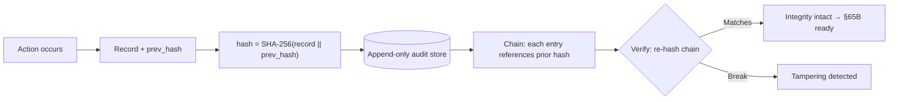

# CivitasOne Suite — Compliance Guide

**Version:** 0.1.0 · **License:** AGPL-3.0 · **Audience:** Compliance officers, auditors, government IT

CivitasOne is built for Indian Government, PSU, Section-8, cooperative, and small-office use,
so it is designed against the Indian regulatory stack: the **DPDP Act 2023**, **CERT-In**
directions, **GFR 2017**, **CSMOP** (Central Secretariat Manual of Office Procedure / eOffice),
**IT Act §65B** (admissibility of electronic records), and **RBI/PFMS** e-payment rules.

This guide maps each regulation to concrete, shipped platform features. It is a mapping
document, not legal advice — final compliance depends on how a deploying department configures
and operates the platform.

---

## 1. Cross-cutting security controls

Several controls satisfy requirements across multiple regulations and are referenced
throughout:

- **AES-256-GCM PII field encryption** — sensitive personal fields are encrypted at rest with
  a key supplied via `PII_ENC_KEY` (32-byte, base64). GCM provides confidentiality **and**
  integrity (authenticated encryption).
- **Append-only audit hash chain** — the `audit` service (`:3004`) records every consequential
  action as an immutable entry chained with **SHA-256**: each record hashes the previous
  record's hash, so any tampering breaks the chain and is detectable.
- **Row-Level Security (RLS)** — tenant data is isolated on `tenant_id`, enforced by the
  `current_tenant_id()` GUC set per tenant-scoped transaction. No tenant can read another's
  data even through a shared connection pool.
- **OIDC / RS256 auth** — Keycloak 24 issues RS256 access tokens; services verify signatures
  against the realm JWKS. Authentication and authorization are centralised and auditable.
- **Structured audit-grade logging** — pino JSON logs with tenant/correlation context feed
  central retention (see `SELF-HOSTING.md` §6).

---

## 2. DPDP Act 2023 (Digital Personal Data Protection)

| Requirement | Platform implementation |
|-------------|-------------------------|
| **Consent** for processing personal data | Consent capture and consent-status tracking tied to the data principal; processing gated on a recorded consent state. Consent changes are written to the immutable audit chain. |
| **Right to erasure / correction** | Erasure and rectification workflows remove or correct a principal's personal data across the owning service's database; the erasure *event* is recorded in the audit chain (the log of the action is retained, the PII is not). |
| **PII protection at rest** | AES-256-GCM field encryption via `PII_ENC_KEY`; PII is never logged in plaintext. |
| **Purpose limitation & minimisation** | Database-per-service (`civitas_<service>`) plus RLS confine personal data to the service and tenant that need it; least-privilege access via Keycloak roles. |
| **Data residency** | Fully self-hostable inside Indian government data centres (on-prem Helm chart `infra/onprem/helm/civitasone`, or Ansible pattern) so personal data never leaves national infrastructure. |
| **Breach detectability** | Hash-chained audit + centralized logs make unauthorized access/modification detectable and reportable. |

---

## 3. CERT-In directions

| Requirement | Platform implementation |
|-------------|-------------------------|
| **Audit trails of security events** | `audit` service captures authentication, authorization, and data-change events in the append-only SHA-256 chain. |
| **Log retention** | pino JSON logs shipped to central store; retain security-relevant logs for **≥ 180 days** (per CERT-In direction) in rollover-protected storage. |
| **Accurate time sync** | Hosts run NTP so log/audit timestamps are consistent — required for CERT-In-grade correlation and for the audit chain's ordering. |
| **Incident response readiness** | Prometheus + Alertmanager (`infra/observability`) raise alerts on anomalies (auth failures, error spikes, DLQ growth); the immutable audit trail supports forensic reconstruction. |
| **Integrity of records** | GCM authenticated encryption + SHA-256 chaining make tampering evident. |

**Incident-response flow (recommended):** detect (alerts) → contain (isolate affected service
zone) → investigate (audit chain + central logs) → report to CERT-In within the mandated
window → remediate forward (compensating audit entries, never history rewrite).

---

## 4. GFR 2017 (General Financial Rules)

Financial-workflow services — `finance` (:3007), `procurement` (:3008), `contract` (:3009),
`billing` (:3023), `grant` (:3019), `payroll` (:3013) — encode GFR controls.

| Requirement | Platform implementation |
|-------------|-------------------------|
| **Maker–checker segregation** | Financial transactions require initiation by one role and approval by another; enforced through `workflow` (:3029) and role separation in Keycloak. |
| **Sanctions & approvals** | Expenditure sanctions and multi-level approvals are modelled as workflow states with an audited approval trail. |
| **Procurement discipline** | `procurement` supports tender/bid/award stages with an auditable trail, aligning with GFR procurement rules. |
| **Financial precision** | All money is `BigInt` **paise** — no floating-point rounding in sanctions, payments, or reconciliations (see `PERFORMANCE.md` §5). |
| **Traceability of every financial action** | Every state change is written to the immutable audit chain, giving a complete, tamper-evident financial trail for audit by C&AG/internal audit. |

---

## 5. CSMOP / eOffice (Central Secretariat Manual of Office Procedure)

| Requirement | Platform implementation |
|-------------|-------------------------|
| **Noting & file movement** | `workflow` (:3029) models file/noting movement between officers with recorded transitions, mirroring eOffice noting discipline. |
| **Establishment & personnel procedure** | `estab` (:3010) and `hrms` (:3012) manage establishment matters and personnel records per office-procedure norms. |
| **Knowledge / document handling** | `knowledge` (:3028) and document handling support institutional record-keeping. |
| **Accountability of every action** | Each noting/approval/movement is attributed to an authenticated Keycloak identity and recorded in the audit chain — supporting the CSMOP requirement that actions on files be traceable. |

---

## 6. IT Act §65B — admissibility of electronic records

Section 65B of the IT Act requires that electronic records tendered as evidence be
accompanied by a certificate attesting to the integrity and reliable operation of the system
that produced them. CivitasOne's design directly supports this:

| Requirement | Platform implementation |
|-------------|-------------------------|
| **Integrity of the electronic record** | The `audit` service's **append-only SHA-256 hash chain** makes records immutable and tamper-evident: any alteration invalidates every subsequent hash. |
| **Reliability of the producing system** | Deterministic services, health/readiness gating (`/ready` sheds traffic on dependency failure), and structured logs demonstrate the system operated properly during the record's creation. |
| **Reproducible verification** | The chain can be re-walked and re-hashed at any time to independently confirm no record was altered — the technical basis for a §65B certificate. |
| **Attribution** | Every record is bound to an authenticated identity (Keycloak RS256) and tenant, establishing who did what and when. |

---

## 7. RBI / PFMS e-payment compliance

`payroll` (:3013), `finance` (:3007), and `billing` (:3023) integrate with government payment
rails.

| Requirement | Platform implementation |
|-------------|-------------------------|
| **PFMS integration** | Payment flows integrate with PFMS for sanction-to-disbursement traceability; integration credentials are supplied via env (`PFMS_*`) and never hard-coded. |
| **RBI e-payment norms** | Payment initiation follows maker–checker and sanctioned-amount controls; amounts are exact `BigInt` paise. |
| **Secure credential handling** | Integration secrets come from the k8s `existingSecret` (`civitasone-secrets`) / secrets manager, encrypted in transit over TLS. |
| **Reconciliation trail** | Every payment event is audited (immutable chain) enabling reconciliation against PFMS/bank records. |

---

## 8. Consolidated regulation → requirement → implementation matrix

| Regulation | Key requirement | Concrete implementation |
|-----------|-----------------|--------------------------|
| DPDP 2023 | Consent | Consent capture/tracking, audited |
| DPDP 2023 | Erasure/correction | Erasure & rectification workflows; event audited |
| DPDP 2023 | PII protection | AES-256-GCM field encryption (`PII_ENC_KEY`) |
| DPDP 2023 | Data residency | Self-host on-prem (Helm chart / Ansible pattern) |
| CERT-In | Audit trail | `audit` SHA-256 append-only chain |
| CERT-In | Log retention | pino JSON logs, ≥180-day central retention |
| CERT-In | Incident response | Prometheus/Alertmanager + audit forensics |
| GFR 2017 | Maker–checker | `workflow` + Keycloak role segregation |
| GFR 2017 | Sanctions/approvals | Multi-level audited approval workflows |
| GFR 2017 | Financial precision | `BigInt` paise money |
| CSMOP | Noting/file movement | `workflow` file transitions, attributed & audited |
| CSMOP | Establishment procedure | `estab` + `hrms` |
| IT Act §65B | Record integrity/admissibility | SHA-256 hash chain, re-verifiable |
| RBI/PFMS | e-payment traceability | PFMS integration, maker-checker, audited reconciliation |

---

## 9. Auditor quick-start

1. **Verify the audit chain** — re-walk the `audit` service chain and confirm each entry's
   `SHA-256(record || prev_hash)` matches; a match certifies no tampering (§65B basis).
2. **Confirm PII encryption** — inspect that personal fields are ciphertext at rest and that
   `PII_ENC_KEY` is held in a secrets manager, not config.
3. **Confirm tenant isolation** — verify RLS policies and the `current_tenant_id()` GUC on
   tenant-scoped tables.
4. **Check retention** — confirm central logs retain ≥180 days.
5. **Check financial controls** — confirm maker–checker separation in `workflow` and `BigInt`
   paise typing on money columns.

---

## 10. Related documents

- `DEPLOYMENT.md` — env reference (`PII_ENC_KEY`, secrets), migration & rollback.
- `SELF-HOSTING.md` — data residency, backup/DR, log retention, monitoring.
- `PERFORMANCE.md` — BigInt paise precision, caching, pooling.
