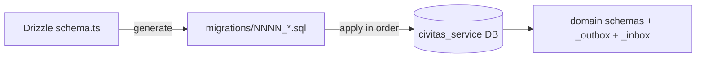

# CivitasOne Suite — Database Schema

> **Version:** 0.1.0 · PostgreSQL 16 · Drizzle ORM 0.30
> Database-per-service. 32 physical databases named `civitas_<service>`. `queue` (embedded library) and `gateway` (stateless proxy) own no database.

---

## 1. Database Inventory

Each service owns exactly one database. Money columns are `BigInt` (paise); all timestamps are `timestamptz`.

| # | Service | Port | Database | Owns DB |
|---|---|---|---|---|
| 1 | identity | 3001 | `civitas_identity` | yes |
| 2 | tenant | 3002 | `civitas_tenant` | yes |
| 3 | policy | 3003 | `civitas_policy` | yes |
| 4 | audit | 3004 | `civitas_audit` | yes |
| 5 | install | 3005 | `civitas_install` | yes |
| 6 | notification | 3006 | `civitas_notification` | yes |
| 7 | finance | 3007 | `civitas_finance` | yes |
| 8 | procurement | 3008 | `civitas_procurement` | yes |
| 9 | contract | 3009 | `civitas_contract` | yes |
| 10 | estab | 3010 | `civitas_estab` | yes |
| 11 | stock | 3011 | `civitas_stock` | yes |
| 12 | hrms | 3012 | `civitas_hrms` | yes |
| 13 | payroll | 3013 | `civitas_payroll` | yes |
| 14 | project | 3014 | `civitas_project` | yes |
| 15 | asset | 3015 | `civitas_asset` | yes |
| 16 | report | 3016 | `civitas_report` | yes |
| 17 | plugin | 3017 | `civitas_plugin` | yes |
| 18 | theme | 3018 | `civitas_theme` | yes |
| 19 | grant | 3019 | `civitas_grant` | yes |
| 20 | citizen | 3020 | `civitas_citizen` | yes |
| 21 | legal | 3021 | `civitas_legal` | yes |
| 22 | admin | 3022 | `civitas_admin` | yes |
| 23 | billing | 3023 | `civitas_billing` | yes |
| 24 | crm | 3024 | `civitas_crm` | yes |
| 25 | inventory | 3025 | `civitas_inventory` | yes |
| 26 | telephony | 3026 | `civitas_telephony` | yes |
| 27 | helpdesk | 3027 | `civitas_helpdesk` | yes |
| 28 | knowledge | 3028 | `civitas_knowledge` | yes |
| 29 | workflow | 3029 | `civitas_workflow` | yes |
| 30 | analytics | 3031 | `civitas_analytics` | yes |
| 31 | location | 4012 | `civitas_location` | yes |
| 32 | queue | — (embedded lib) | — | no |
| 33 | gateway | 8080 (proxy) | — | no |

> 32 of the 33 services are backed by a `civitas_<service>` database. Every one of those databases carries the two infrastructure schemas `_outbox` and `_inbox` in addition to its domain schemas.

---

## 2. Schema Organization Within a Database

A service groups its tables into **per-module PostgreSQL schemas**, plus the two mandatory infra schemas:

- Domain schemas — one per functional module (e.g. `gl`, `budget`, `leave`).
- `_outbox` — transactional outbox rows pending relay publication.
- `_inbox` — dedup ledger for consumed events (exactly-once effect).

### Common infra tables (present in every `civitas_<service>`)

**`_outbox.messages`**

| Column | Type | Notes |
|---|---|---|
| id | uuid PK | outbox row id |
| tenant_id | uuid | tenant scope (RLS) |
| topic | text | event topic `{service}.{aggregate}.{pastTense}` |
| payload | jsonb | serialized event |
| created_at | timestamptz | insertion time (ordering) |
| delivered_at | timestamptz null | set when relay publishes |

**`_inbox.processed`**

| Column | Type | Notes |
|---|---|---|
| message_id | text PK | dedup key; `INSERT ... ON CONFLICT DO NOTHING` |
| tenant_id | uuid | tenant scope |
| topic | text | consumed event topic |
| processed_at | timestamptz | first-seen timestamp |

---

## 3. Major Service Schemas

The following covers the highest-traffic services. Relationships are described as text (FK direction shown with `→`).

### identity — `civitas_identity`
Schemas: `auth`, `rbac`, `session`.

- `auth.user` — id, tenant_id, keycloak_sub, email, status.
- `rbac.role` — id, tenant_id, name.
- `rbac.user_role` — user_id → `auth.user`, role_id → `rbac.role` (many-to-many).
- `rbac.permission` — id, code; `rbac.role_permission` maps role_id → permission_id.
- `session.session` — id, user_id → `auth.user`, issued_at, expires_at.

### tenant — `civitas_tenant`
Schemas: `org`, `config`.

- `org.tenant` — id, name, tier (`pool` | `silo`), status.
- `org.unit` — id, tenant_id, parent_id → `org.unit` (self-referential org tree).
- `config.setting` — tenant_id, key, value (jsonb).

### finance — `civitas_finance`
Schemas: `gl`, `budget`, `treasury`, `payments`, `org`.

- `gl.account` — id, tenant_id, code, type (asset/liability/income/expense).
- `gl.journal` — id, tenant_id, posted_at; `gl.journal_line` — journal_id → `gl.journal`, account_id → `gl.account`, debit BigInt, credit BigInt.
- `budget.head` — id, tenant_id, code, fiscal_year.
- `budget.allocation` — head_id → `budget.head`, amount BigInt.
- `treasury.account` — bank account records; `payments.voucher` — voucher_id, amount BigInt, status; `payments.disbursement` — voucher_id → `payments.voucher`.
- Emits `finance.budget.created`; consumes payroll disbursement events.

### hrms — `civitas_hrms`
Schemas: `employee`, `leave`, `attendance`, `gpf`, `pension`, `disciplinary`, `claims`, `recruitment`, `contracts`.

- `employee.employee` — id, tenant_id, code, name, unit_id, manager_id, functional_manager_id (dotted-line/matrix), project_manager_id (project-based matrix), fitness_status varchar(16) default 'pending' CHECK (pending/fit/unfit/restricted/exempt).
- `leave.leave_type`, `leave.leave_balance` (employee_id → `employee.employee`), `leave.leave_request` (employee_id, type_id → `leave.leave_type`, status).
- `gpf.account` — employee_id → `employee.employee`, opening_balance BigInt; `gpf.transaction`.
- `pension.case` — employee_id, retirement_date, status.
- `disciplinary.case`, `claims.claim`, `recruitment.vacancy` / `recruitment.application`.
- `recruitment.hrms_job_openings` — vacancy master (id, tenant_id, ref_no, title, department_id, vacancies, status, posted_at, closes_at, version, …). `disclose_rejection_reason` boolean (default false, R-RA-0118): when true a candidate-facing rejection notice may include the high-level reason CATEGORY only — never internal scores, remarks, or ranks. Fail-closed default (disclose nothing unless the vacancy explicitly opts in).
- `recruitment.hrms_screening_overrides` — id, tenant_id, application_id, job_opening_id, from_decision, to_decision, reason_code, reason, status (pending/approved/rejected/cancelled, default pending), original_screened_by, requested_by, requested_at, decided_by, decided_at, decision_note, version. Maker-checker override of a screening decision (R-RA-0111): one admin requests, a DIFFERENT admin (separation of duties — approver != requester and != original screener) approves/rejects; only on approval is `recruitment.hrms_applications.screening_decision` changed. Partial unique index on (tenant_id, application_id) WHERE status = 'pending' — at most one pending request per application.
- `recruitment.hrms_interview_comms` — id, tenant_id, interview_id, application_id, comm_type (invite/reminder/reschedule/cancel), channel (email/sms/stub), status (queued/stubbed), message, scheduled_for, created_at, created_by. Append-only interview communications log (R-RA-0142): one row per candidate comm. Delivery is behind `FEATURE_INTERVIEW_COMMS_ENABLED` — when on the comm is queued to the outbox (status queued, event `hrms.interview.comm.dispatch`); when off it is recorded as a stub (channel stub, status stubbed) with no real send. Messages are candidate-facing only (no internal scores/remarks). Indexed on (tenant_id, interview_id, created_at).
- `recruitment.hrms_interview_responses` — id, tenant_id, interview_id, application_id, response_type (confirm/reschedule_request), status (confirmed/pending/approved/declined), preferred_date, preferred_time, reason, from_date, from_time, decided_by, decided_at, decision_note, created_at, created_by, version. Candidate interview self-service response (R-RA-0143): a `confirm` is terminal (status confirmed); a `reschedule_request` starts pending and is approved/declined by HR under maker-checker. Partial unique index on (tenant_id, interview_id) WHERE status = 'pending' enforces at most one open reschedule request per interview. Indexed on (tenant_id, interview_id, created_at).
- `recruitment.hrms_interview_recordings` — id, tenant_id, interview_id, application_id, kind (recording/transcript), storage_key, consent_given (default false), consent_reference (nullable, pointer to the external DPDP consent artefact backing consent_given), consent_by, consent_at, retention_until, status (active/deleted, default active), deleted_at, deleted_by, object_purged_at (nullable, set when the storage-seam object bytes are actually purged — distinct from the soft-delete flip so the purge job is idempotent/auditable), created_at, created_by, version. Interview recording / transcript with consent + retention (R-RA-0152): only the object-store key is stored (bytes live behind the storage seam). Consent is mandatory before a recording may be used; `retention_until` drives the purge job; erasure is a soft-delete (status deleted + deleted_at/deleted_by) per DPDP right to erasure. Indexed on (tenant_id, interview_id, created_at); partial index on (tenant_id, retention_until) WHERE status = 'active' drives the retention purge.
- `recruitment.hrms_application_fees` — id, tenant_id, application_id, job_opening_id, amount_minor (bigint paise, default 0, CHECK >= 0), currency (default INR), status (exempt/pending/paid/refunded, default pending), exemption_reason (nullable), provider (none/manual/gateway, default none), payment_ref (nullable), paid_at (nullable), created_at, created_by, updated_at, updated_by, version. Recruitment application fee (R-RA-0099): one fee record per application — exempt (amount 0 + exemption_reason), pending, paid (manual/offline reference, or gateway when the online payment seam is wired), or refunded. Online gateway payment is an external seam; `provider` records which rail settled the fee. Unique index on (tenant_id, application_id) enforces one fee per application; indexed on (tenant_id, job_opening_id, status).
- `attendance.hrms_attendance_locks` — id, tenant_id, period (char(7) YYYY-MM), status (locked/open, default locked), reason, locked_by, locked_at, version. Unique index on (tenant_id, period). Payroll cut-off / attendance period lock (DEF-AT-001, T&A-ATM-0247): once a period is locked, attendance marking and regularisation for dates in that month are rejected (422 ATTENDANCE_LOCKED) until re-opened.
- `contracts.hrms_contracts` — id, tenant_id, employee_id, contract_no (unique per tenant), start_date, end_date, terms JSONB, renewal_count, status (draft/active/expiring/expired/renewed/terminated/escalated), previous_contract_id, version. Partial unique index on (tenant_id, employee_id) WHERE status = 'active'.
- `contracts.hrms_contract_renewals` — id, tenant_id, contract_id, renewal_number, initiated_by, status (pending_approval/approved/rejected/budget_insufficient/cancelled), new_end_date, original_terms JSONB, new_terms JSONB, approval_chain JSONB, approved_by, rejected_by, rejection_reason, budget_ref, new_contract_id, version. Partial unique index on (tenant_id, contract_id) WHERE status = 'pending_approval'.
- `contracts.hrms_contract_notifications` — id, tenant_id, contract_id, milestone (integer), sent_at. Unique constraint on (tenant_id, contract_id, milestone) for deduplication.
- `contracts.hrms_contract_config` — id, tenant_id (unique), reminder_milestones JSONB, approval_chain JSONB, auto_separation_enabled boolean, scheduler_time_utc, version.
- `contracts.hrms_contract_seq` — tenant_id (PK), next_val integer. Sequential contract number generator per tenant.
- Emits `hrms.leave.approved`; on leave approval, payroll and finance react.
- Emits `hrms.contract.*` events (created, renewed, expired, escalated, separated); consumes `contractRenewalDecided` from workflow-service.

### payroll — `civitas_payroll`
Schemas: `run`, `component`, `payslip`, `bank`.

- `run.payroll_run` — id, tenant_id, period, status.
- `component.earning` / `component.deduction` — code, amount BigInt.
- `payslip.payslip` — run_id → `run.payroll_run`, employee_id, gross BigInt, net BigInt.
- `bank.mandate` — employee_id, account, ifsc.
- Consumes `hrms.leave.approved` (loss of pay), emits disbursement commands to finance.

### procurement — `civitas_procurement`
Schemas: `tender`, `bid`, `award`, `vendor`.

- `vendor.vendor` — id, tenant_id, name, gstin.
- `tender.tender` — id, tenant_id, ref_no, status.
- `bid.bid` — tender_id → `tender.tender`, vendor_id → `vendor.vendor`, amount BigInt.
- `award.award` — tender_id, bid_id → `bid.bid`.
- Emits `procurement.tender.awarded`; contract service reacts to create the contract.

### inventory — `civitas_inventory`
Schema: `inventory`.

- `inventory.items` / `inventory.categories` / `inventory.uoms` — item master, HSN/GST classification, reorder levels, standard unit cost in paise.
- `inventory.stores` / `inventory.bins` — physical storage locations.
- `inventory.movements` / `inventory.movement_lines` / `inventory.stock_ledger` / `inventory.stock_balances` — stock movement and on-hand balance tracking.
- `inventory.batches` / `inventory.serial_numbers` — batch and serial tracking.
- `inventory.cost_layers` — FIFO/WAVG costing layers.
- `inventory.cycle_counts` — physical vs system count reconciliation with supervisor approval.
- `inventory.reservations` — stock allocated against an indent/PO but not yet issued.
- `inventory.goods_returns` — returned/rejected items with QC gate (qcStatus, disposition).
- `inventory.three_way_matches` — PO × GRN × Invoice verification outcomes; gates payment authorisation via `payment_blocked`. `grn_id`, `po_id`, `invoice_id` are plain uuids (no cross-database FK — see §6).
- `inventory.store_receipt_notes` — id, tenant_id, grn_id (plain uuid, no cross-database FK — see §6), store_officer_id, received_at, remarks, status (`draft` | `signed`, CHECK-constrained), created_at. Store Receipt Note (SRN): GFR Rule 149 requires a signed SRN before payment against a GRN is authorised. Unique on (tenant_id, grn_id) — one SRN per GRN. The three-way-match consumer checks `status = 'signed'` before publishing `payment.released`; absent or draft publishes `payment.blocked` with `reason: 'SRN_MISSING'`.
- Emits `srn.created` / `srn.signed` (consumed by the matching module); consumes GRN acceptance state from procurement-service events.

### workflow — `civitas_workflow`
Schemas: `definition`, `instance`, `task`.

- `definition.workflow` — id, tenant_id, key, version, dag (jsonb of steps).
- `instance.instance` — id, definition_id → `definition.workflow`, status, context (jsonb).
- `task.task` — instance_id → `instance.instance`, assignee, state (pending/approved/rejected).
- Consumes `workflow.instance.create`, emits `workflow.instance.created` and per-task events; drives approvals for leave, tenders, disposals.

### audit — `civitas_audit`
Schemas: `log`.

- `log.event` — id, tenant_id, actor, action, resource, occurred_at, detail (jsonb).
- Append-only. Subscribes broadly to `*.{pastTense}` events across services to build an immutable audit trail.

### estab — `civitas_estab`
Schemas: `post`, `posting`, `seniority`, `quarters`, `fleet`.

- `post.post` — sanctioned posts (id, tenant_id, grade, cadre).
- `posting.posting` — employee_id (from hrms), post_id → `post.post`, from_date, to_date.
- `seniority.list` — cadre-wise seniority ordering.
- `quarters.estab_quarters` — quarter inventory (id, tenant_id, quarter_no, quarter_type, category, address, locality, carpet_area_sqft, status, condition, org_unit, version).
- `quarters.estab_quarter_allotments` — allotment workflow (id, tenant_id, quarter_id → `quarters.estab_quarters`, employee_ref, eligibility_score, waitlist_position, status, allotted_at/by, occupied_at, vacation_due_date, vacated_at, version).
- `quarters.estab_licence_fee_rates` — effective-dated monthly licence-fee schedule (id, tenant_id, quarter_type, pay_level, monthly_minor BigInt, currency, effective_from/to, version).
- `quarters.estab_overstay_penalties` — overstay penalty records (id, tenant_id, allotment_id → `quarters.estab_quarter_allotments`, employee_ref, penalty_days, daily_rate_minor BigInt, multiplier, total_minor BigInt, status, version).
- `fleet.fuel_logs` — refuelling events (id, tenant_id, vehicle_id, log_date, fuel_type, litres numeric(10,2), cost_minor BigInt, currency, odometer_km, pump_name, receipt_ref, version).
- `fleet.trip_logs` — trip/log-book (id, tenant_id, vehicle_id, driver_id, trip_date, start_odometer, end_odometer, start_time, end_time, purpose, passenger_name, route, status, version).
- `fleet.vehicle_documents` — permits/insurance/PUC/fitness (id, tenant_id, vehicle_id, doc_type, doc_number, issued_at, valid_from, valid_until, issuer, amount_minor BigInt, currency, status, reminder_sent, version).
- `fleet.driver_roster` — driver shift assignments (id, tenant_id, driver_id, vehicle_id, shift_date, shift_type, status, version).

### grant — `civitas_grant`
Schemas: `scheme`, `sanction`, `utilization`.

- `scheme.scheme` — id, tenant_id, name, fiscal_year, ceiling BigInt.
- `sanction.sanction` — scheme_id → `scheme.scheme`, beneficiary, amount BigInt, status.
- `utilization.uc` — sanction_id → `sanction.sanction`, utilized BigInt (utilization certificate).

### asset — `civitas_asset`
Schemas: `register`, `lifecycle`, `depreciation`, `maintenance`, `insurance`, `enterprise`.

- `register.asset` — id, tenant_id, tag, category, acquired_at, cost BigInt.
- `depreciation.entry` — asset_id → `register.asset`, period, amount BigInt.
- `lifecycle.asset_disposals` — asset_id, method, status; emits `asset.disposal.decided` after `asset.disposal.file_decided` command.
- `lifecycle.condemnation_surveys` — id, tenant_id, asset_id, survey_date, surveyed_by, condition, estimated_repair_cost_minor BigInt, recommendation, status, version.
- `lifecycle.condemnation_recommendations` — id, tenant_id, survey_id, asset_id, committee_members JSONB, decision, reserve_value_minor BigInt, floor_value_minor BigInt, status, version.
- `lifecycle.asset_auctions` — id, tenant_id, asset_id, recommendation_id, reserve_value_minor BigInt, highest_bid_minor BigInt, sale_proceeds_minor BigInt, finance_receipt_ref, status, version.
- `maintenance.ticket` — asset_id, schedule.

### citizen — `civitas_citizen`
Schemas: `rti`, `grievance`, `service`, `application`, `catalogue`, `eligibility`, `documents`, `fee`, `issuance`, `appeal`, `discovery`.

- `rti.request` — id, tenant_id, applicant, subject, status.
- `rti.transfer` — request_id → `rti.request`, to_unit; emits `citizen.rti.transferred` after `citizen.rti.transfer`.
- `grievance.grievance` — id, applicant, category, status.
- `service.application` — citizen service delivery requests.

**Service delivery — SVC-081..090 (migrations `0015`/`0016`; every table tenant_id + FORCE RLS via `portal.current_tenant_id()`):**
- `catalogue.service_definitions` — **SVC-081** versioned service catalogue: owner, linked eligibility rule-set / fee schedule / issuance type, required-docs checklist, SLA, channels, forms, outputs. Maker-checker + immutable-per-version publish; emits `citizen.catalogue.published`.
- `application.citizen_applications` (+ `tracking_no`, `channel`, `assisted_by`, `acknowledged_at`), `application.application_drafts` — **SVC-082** online + assisted intake: draft save/resume, acknowledgement with unique tracking number, channel attribution (portal/counter/mobile/assisted).
- `eligibility.rule_sets` (versioned, maker-checker publish), `eligibility.evaluations` — **SVC-083** configurable entitlement rules → reasoned outcome (eligible / refer-manual / not-eligible); emits `citizen.eligibility.ruleset_published`.
- `documents.submissions` — **SVC-084** upload + DigiLocker-gated intake (env-gated: `provider_unconfigured`, no fake success), checklist sourced from catalogue, verify/reject/deficiency-memo/resubmission; emits `citizen.document.verified`.
- `fee.schedules`, `fee.payments`, `fee.refunds` — **SVC-085** fee calc + exemptions, online (gateway env-gated → honest `pending`) + offline receipt, refund (maker-checker), reconciliation; emits `citizen.payment.requested`, `citizen.receipt.issued`.
- `issuance.counters`, `issuance.certificates`, `issuance.certificate_events` — **SVC-086** certificate/licence/permit issuance: maker-checker approval, gapless number, HMAC seal + public token/QR verify (no auth), validity + amend/renew/revoke; emits `citizen.certificate.issued`, `citizen.certificate.revoked`.
- `appeal.appeals`, `appeal.hearings` — **SVC-089** appeal/review/revision: filing-window validation, appellate authority, records transfer, hearing, order (maker-checker prepare≠issue), remand; emits `citizen.appeal.filed`, `citizen.appeal.decided`.
- `discovery.consents`, `discovery.matches` — **SVC-090** consent-gated proactive discovery: run eligibility rules against a citizen profile → likely-eligible services → notify + assisted enrolment; emits `notification.send`, `citizen.discovery.service_discovered`.

> Runtime note: `citizen_svc` currently holds `BYPASSRLS`, so the FORCE-RLS policies above are a defence-in-depth backstop; tenant isolation is enforced at the app layer via tenant-scoped `WHERE` (`findByIdTx(id, tenantId)`).

### billing — `civitas_billing`
Schemas: `checkout`, `invoice`, `subscription`.

- `checkout.session` — id, tenant_id, amount BigInt, status; command `billing.checkout.verify` → event `billing.checkout.verified`.
- `invoice.invoice` — session_id → `checkout.session`, number, total BigInt.
- `subscription.subscription` — tenant_id, plan, period.

### journey — `civitas_journey`
Schemas: `journey`.

- `journey.journeys` — id, tenant_id, name varchar(200), status varchar(24) (draft/active/paused/archived, default draft), trigger_config jsonb (event/schedule/segment-entry trigger definition), steps jsonb (ordered list of step definitions), version int, created_at, updated_at, created_by, updated_by. Multi-step campaign orchestration blueprints. Indexed on (tenant_id) and (tenant_id, status).
- `journey.journey_executions` — id, tenant_id, journey_id → `journey.journeys`, profile_id (CDP golden profile, cross-service identifier — no FK), status varchar(24) (enrolled/in_progress/completed/exited, default enrolled), current_step_index int (default 0, CHECK >= 0), enrolled_at, completed_at (set on completed/exited), version int, created_at, updated_at, created_by, updated_by. Per-profile enrollment + progress through a journey; state machine enrolled → in_progress → completed / exited (terminal). Indexed on (tenant_id, enrolled_at DESC), (tenant_id, journey_id), (tenant_id, profile_id), (tenant_id, status); partial unique index on (tenant_id, journey_id, profile_id) WHERE status IN ('enrolled','in_progress') allows at most one in-flight enrollment per profile per journey while permitting re-enrollment after a terminal run.
- `journey.step_executions` — id, tenant_id, journey_id → `journey.journeys`, profile_id, step_index int, status varchar(24) (pending/executing/completed/failed/skipped, default pending), executed_at (nullable until the step runs), created_at, updated_at, created_by, updated_by, version int. Per-step execution log; state machine pending → executing → completed / failed / skipped (all terminal). `step_index` is validated against the length of the journey's `steps` jsonb array at the route boundary, so an out-of-bounds index is rejected as a **400** `INVALID_STEP_INDEX` rather than persisted. Step types (send_notification/wait/condition_check/api_call) are likewise validated in `steps/domain.ts` — they are not stored on the row, only on the journey's step definition.
- `journey.triggers` — id, tenant_id, journey_id → `journey.journeys`, trigger_type varchar(32) (event_based/time_based/segment_entry), config jsonb (default `{}`), status varchar(24) (active/paused/inactive, default active), created_at, updated_at, created_by, updated_by, version int. Conditions that enroll profiles into a journey. `config` requirements are type-dependent and enforced in `triggers/domain.ts` — event_based needs `eventName`, time_based needs `schedule` (cron), segment_entry needs `segmentId`; a mismatch is a **400** `INVALID_CONFIG`. Only `active` triggers match incoming events; soft-delete sets `status = 'inactive'`.
- Emits `journey.journey.created`, `journey.journey.started`, `journey.execution.enrolled`, `journey.trigger.created`, `journey.step.completed`.

### works — `civitas_works`
Schema: `works`.

**Masters (17 lookup/reference tables):**
- `works.authorities` — id, tenant_id, name, code, level, active, version.
- `works.work_types` — id, tenant_id, name, code, active, version.
- `works.work_sub_types` — id, tenant_id, work_type_id → `works.work_types`, name, code, active, version.
- `works.proposer_types` — id, tenant_id, name, active, version.
- `works.programs` — id, tenant_id, name, active, version.
- `works.publication_levels` — id, tenant_id, name, active, version.
- `works.repair_types` — id, tenant_id, program_id → `works.programs`, name, active, version.
- `works.schemes` — id, tenant_id, name, sponsor, active, version.
- `works.scopes` — id, tenant_id, work_type_id → `works.work_types`, name, unit, active, version.
- `works.tender_types` — id, tenant_id, name, rate_type, active, version.
- `works.user_departments` — id, tenant_id, name, demand_number, active, version.
- `works.contractor_classes` — id, tenant_id, name, description, active, version.
- `works.issue_types` — id, tenant_id, name, active, version.
- `works.issue_description_types` — id, tenant_id, issue_type_id → `works.issue_types`, name, active, version.
- `works.assets` — id, tenant_id, code, name, type, district, taluka, chainage, cost BigInt, active, version.
- `works.work_description_types` — id, tenant_id, work_type_id → `works.work_types`, keyword, active, version.
- `works.sr_items` — id, tenant_id, zone, sr_year, item_code, description, unit, rate BigInt, active, version.

**Domain tables (proposals, approvals, BoQ, tender, execution, billing):**
- `works.work_proposals`, `works.work_coa_mappings`, `works.work_office_mappings`, `works.work_splits`
- `works.administrative_approvals`, `works.technical_sanctions`, `works.financial_targets`
- `works.boq_items`, `works.schedule_a_items`, `works.material_coefficients`, `works.recapitulation`
- `works.tenders`, `works.pre_tenders`, `works.quotations`, `works.quotation_items`, `works.awards`
- `works.work_scopes`, `works.scope_progress`, `works.work_issues`, `works.issue_observations`, `works.work_photos`, `works.physical_targets`, `works.physical_completions`
- `works.measurement_books`, `works.measurements`, `works.bills`, `works.bill_items`, `works.bill_recoveries`, `works.account_compilations`, `works.work_closures`

---

## 4. Migration Conventions

- Migrations are authored with **Drizzle ORM 0.30** and materialized as **numbered SQL files** under each service's `migrations/` directory (e.g. `0001_init.sql`, `0002_add_leave_balance.sql`).
- Migrations are **additive and idempotent**: prefer `CREATE ... IF NOT EXISTS`, `ADD COLUMN IF NOT EXISTS`, and guarded policy creation so re-running is safe.
- Numbering is strictly increasing; migrations apply in order and are never edited after release — a follow-up numbered migration corrects a prior one.
- Each service migrates its **own** database only; there are no cross-database migrations.



---

## 5. RLS Policy Overview

Every tenant-scoped table uses the same isolation pattern:

```sql
-- Helper (created once per database)
CREATE OR REPLACE FUNCTION current_tenant_id() RETURNS uuid
  LANGUAGE sql STABLE AS
  $$ SELECT current_setting('app.tenant_id', true)::uuid $$;

-- Per table
ALTER TABLE leave.leave_request ENABLE ROW LEVEL SECURITY;
ALTER TABLE leave.leave_request FORCE ROW LEVEL SECURITY;

CREATE POLICY tenant_isolation ON leave.leave_request
  USING (tenant_id = current_tenant_id())
  WITH CHECK (tenant_id = current_tenant_id());
```

- `current_tenant_id()` reads the **`app.tenant_id` GUC**, which the service sets per request via `SET LOCAL app.tenant_id = '<tenant>'` inside a tenant-scoped transaction.
- `USING` filters reads; `WITH CHECK` prevents writing rows for another tenant.
- `FORCE ROW LEVEL SECURITY` ensures the policy applies even to the table owner.
- The `_outbox` and `_inbox` schemas are likewise `tenant_id`-scoped so relayed events and dedup records never cross tenants.
- **Silo tier** tenants get a dedicated database; RLS still applies but the tenant set is a single tenant.

---

## 6. Cross-Service Referential Integrity

Because each service owns its own database, **there are no cross-database foreign keys**. References to entities owned by another service (e.g. payroll referencing an hrms `employee_id`) are stored as **plain identifiers** and kept consistent through events:

- hrms emits employee lifecycle events; payroll/estab project the minimal fields they need into their own tables.
- Integrity across services is **eventual**, reconciled by the outbox→event→inbox pipeline, not enforced by the database engine.

### revenue — `civitas_revenue`
Schemas: `rates`, `assessee`, `billing`, `bbps`, `collection`.

- `rates.rate_heads` — id, tenant_id, code varchar(64), name, category varchar(64) (property_tax/water/sewerage/etc.), unit_of_measure, is_active boolean, version. Unique: (tenant_id, code).
- `rates.rate_slabs` — id, tenant_id, rate_head_id → `rates.rate_heads`, slab_type varchar(16) (flat/band/ad_valorem), band_from BigInt, band_to BigInt, rate_value BigInt (paise or bps depending on slab_type), effective_from date, effective_to date, unit_of_measure, is_active, version.
- `rates.penalty_rules` — id, tenant_id, rate_head_id → `rates.rate_heads`, interest_type (simple/compound), annual_rate_bps int, grace_days int, cap_months int (nullable = uncapped), rounding_mode (round_half_up/floor/ceil), is_active, version.
- `rates.rebate_rules` — id, tenant_id, rate_head_id → `rates.rate_heads`, rebate_type (early_payment/category), discount_bps int, valid_until_days_before_due int, is_active, version.
- `assessee.assessees` — property/tax assessees (id, tenant_id, registration details).
- `billing.bills` — demand/bill generation (id, tenant_id, amount BigInt).
- `bbps.biller_config`, `bbps.bbps_transactions` — BBPS integration.
- `collection.collections` — payment collections.
- Port 3038, gateway prefix `/api/v1/revenue`.
- Emits `revenue.rate_head.created`, `revenue.bill.generated`; consumes `finance.bank_statement.reconciled`.

### loyalty — `civitas_loyalty`
Schemas: `loyalty`. Points are `bigint` throughout and are serialised to JSON as **decimal strings** (never numbers) so values above 2^53 survive round-tripping — the same money-precision rule the rest of the suite applies to paise.

- `loyalty.programs` — id, tenant_id, name varchar(200), status varchar(24) (draft/active/suspended/archived, default draft), earn_ratio bigint (default 100 — points earned per ₹1 / 100 paise), expiry_days int (nullable = points never expire), tier_config jsonb (default `{}`), version int, created_at, updated_at, created_by, updated_by. Program lifecycle state machine in `programs/domain.ts`: draft → active | archived, active → suspended | archived, suspended → active | archived; archived is terminal. Only draft and active programs are editable (422 `NOT_EDITABLE` otherwise).
- `loyalty.enrolments` — id, tenant_id, program_id → `loyalty.programs`, profile_id (CDP golden profile, cross-service identifier — no FK), status varchar(24) (active/suspended/cancelled, default active), tier varchar(50) (default `base`, denormalised from the current tier assignment), points_balance bigint (default 0 — spendable), lifetime_points bigint (default 0 — cumulative, drives tier evaluation), enrolled_at, created_at, updated_at, created_by, updated_by, version int. A profile holds at most one non-cancelled enrolment per program. Balance moves are optimistic-locked on `version`, so a concurrent accrue/redeem loses rather than double-spends (409 `VERSION_CONFLICT`).
- `loyalty.accruals` — id, tenant_id, enrolment_id → `loyalty.enrolments`, points bigint, source varchar(100), source_ref varchar(200), tx_type varchar(50) (purchase/bonus/referral/promotion/adjustment, default purchase), expires_at (nullable = never expires; computed from the program's `expiry_days`), accrual_date, created_at, created_by. Append-only points ledger: an accrual credits both `points_balance` and `lifetime_points` in the same transaction as the insert.
- `loyalty.redemptions` — id, tenant_id, enrolment_id → `loyalty.enrolments` (nullable), points bigint, reward_type varchar(50), status varchar(24) (pending/fulfilled/cancelled/voided/expired, default pending), redeemed_at, voided_at, void_reason varchar(500), created_at, updated_at, created_by, updated_by, version int. Redeeming debits `points_balance` (never `lifetime_points`, so a redemption cannot demote a tier). Only pending and fulfilled redemptions may be voided (422 `VOID_INVALID`); a void restores the points to `points_balance` and records a mandatory reason for audit. Indexed on (tenant_id, enrolment_id) and (tenant_id, status).
- `loyalty.tier_definitions` — id, tenant_id, program_id → `loyalty.programs`, name varchar(100), level int (higher = better), min_points_threshold bigint (default 0), benefits jsonb (default `{}`), version int, created_at, updated_at. Thresholds must ascend with `level` (`validateTierThresholds`); that ordering is enforced in the app layer, not by a CHECK constraint.
- `loyalty.tier_assignments` — id, tenant_id, enrolment_id → `loyalty.enrolments`, tier_definition_id → `loyalty.tier_definitions`, assigned_at, expires_at, version int, created_at, updated_at. Append-only tier history. Re-evaluation compares `enrolments.lifetime_points` against the program's definitions and writes a new row **only when the resulting tier differs**, so the evaluate endpoint is idempotent.
- Emits `loyalty.program.created`, `loyalty.points.accrued`, `loyalty.points.redeemed`, `loyalty.tier.changed`.

### catalogue — `civitas_catalogue`
Schemas: `catalogue`.

- `catalogue.products` — id, tenant_id, name varchar(200), description varchar(2000), line_id uuid (level-1 grouping — product line, e.g. Savings/Loans/Insurance), family_id uuid (level-2 grouping within a line), parent_id uuid (direct parent for sub-products and variants), lifecycle_status varchar(32) (draft/active/suspended/withdrawn/closed_to_new_business, default draft), effective_from date, effective_to date, regulatory_metadata jsonb (default `{}` — circular refs, IRDAI/RBI product codes), created_at, updated_at, created_by, updated_by, version int. The 4-level hierarchy (line → family → product → variant) is expressed by the three nullable parent columns rather than a `level` column: the tree endpoint derives level from node depth. Lifecycle transitions and metadata editability are validated in `products/domain.ts` (422 `INVALID_TRANSITION` / `NOT_EDITABLE`). Soft-delete moves the row to `withdrawn`; rows are never hard-deleted.
- `catalogue.product_availability` — id, tenant_id, product_id → `catalogue.products`, circle_id, region_id, office_id (all nullable — omitting all three records tenant-wide availability), available int (default 1, boolean-as-int at the storage layer), created_at, updated_at, created_by, updated_by, version int. Geographic availability entries; part of the product's published shape, so writes also emit `catalogue.product.updated`.
- `catalogue.rates` — id uuid PK, tenant_id uuid, product_id uuid, effective_date date (start of effective period, inclusive), effective_to date (end of effective period, inclusive; NULL = open-ended / still current), rate_value bigint (minor units — paise/cents), source varchar(128), created_at timestamptz, updated_at timestamptz, created_by uuid, updated_by uuid, version int. `rate_value` is serialised to JSON as a **decimal string** (bigint precision); the API field name on the request side is `rateValueMinor`.
- `catalogue.bundles` — id, tenant_id, name varchar(200), description varchar(2000), component_product_ids jsonb (array of product ids, default `[]`), pricing_approval_required boolean (default false), status varchar(24) (active/inactive/deleted, default active), created_at, updated_at, created_by, updated_by, version int. Component products are stored as a jsonb id array rather than a join table, so referential integrity is app-enforced: every component must exist and be `active` at write time (`validateBundleComponents`, 422 `INVALID_COMPONENTS`). A bundle already in flight is **not** re-validated when a component is later withdrawn — that drift is deliberate so historic bundles stay readable. Soft-delete sets `status = 'deleted'`.
- `catalogue.eligibility_rules` — id, tenant_id, product_id → `catalogue.products`, rule_type varchar(64), criteria jsonb (default `{}`), status varchar(24) (default active), created_at, updated_at, created_by, updated_by, version int. Per-product access-control rules evaluated by the eligibility check endpoint.
- Emits `catalogue.product.created`, `catalogue.product.updated`, `catalogue.product.deleted`, `catalogue.rate.created`, `catalogue.rate.updated`, `catalogue.bundle.created`, `catalogue.bundle.updated`, `catalogue.bundle.deleted`; consumed by billing-service for rate validation.

### field — `civitas_field`
Schema: `field`. Offline-first field task management, GPS-verified visits, route optimization. Every table is tenant-scoped with ENABLE + FORCE RLS on the `app.tenant_id` GUC (migration `0001_field_foundation.sql`). Status/operation domains are validated in the app layer (zod at the route boundary + module `domain.ts`) rather than by CHECK constraints.

- `field.tasks` — id, tenant_id, assignee_id (nullable until assigned), task_type varchar(64), title varchar(256), description, status varchar(24) (unassigned/assigned/in_progress/completed/cancelled, default unassigned), priority int (default 3), latitude/longitude numeric(10,7) (GPS target), address, due_date (SLA tracking), completed_at, cancelled_at, metadata jsonb, created_at, updated_at, created_by, updated_by, version. Indexed on (tenant_id), (tenant_id, assignee_id), (tenant_id, status), (tenant_id, due_date).
- `field.visits` — id, tenant_id, task_id → `field.tasks(id)`, agent_id, check_in_latitude/longitude + check_out_latitude/longitude numeric(10,7), check_in_at, check_out_at, duration_minutes int (computed on check-out), outcome varchar(24), notes, photos jsonb (array of object-store keys, default `[]`), created_at, updated_at, created_by, updated_by, version. Indexed on (tenant_id), (tenant_id, task_id), (tenant_id, agent_id).
- `field.route_plans` — id, tenant_id, assignee_id, route_date date, status varchar(24) (draft/optimized/active/completed/cancelled, default draft), waypoints jsonb (default `[]`), optimized_order jsonb (waypoint index order after optimization, default `[]`), total_distance_km numeric(8,2), estimated_duration_minutes int, created_at, updated_at, created_by, updated_by, version. Indexed on (tenant_id) and (tenant_id, assignee_id, route_date).
- `field.sync_queue` — id, tenant_id, agent_id, entity_type varchar(32), entity_id, operation varchar(16) (create/update/delete), payload jsonb, client_timestamp timestamptz (device clock at capture), client_version int (default 1, the base version used for conflict detection), status varchar(24) (pending/processed/failed, default pending), attempts int (default 0), last_error, processed_at, created_at, updated_at. Offline operations captured on-device and replayed server-side. Conflict resolution (`sync/domain.ts`) compares `client_version` against the server row's `version` and applies a per-operation strategy — create → client-wins, delete → server-wins, update → field-level merge. The syncable-entity allow-list (task/visit/route) is enforced by `validateSyncBatch`, so adding a new syncable entity needs no migration. Indexed on (tenant_id), (tenant_id, agent_id, status) for backlog drain, and (tenant_id, agent_id, processed_at) which backs the `getChangesSince` pull watermark query.

### recommendation — `civitas_recommendation`
Schema: `recommendation`. NBA (Next Best Action) engine, cross-sell matrix, account health scoring, and model feedback. Every table is tenant-scoped with ENABLE + FORCE RLS on the `app.tenant_id` GUC (migration `0001_recommendation_foundation.sql`).

Status/action domains are validated in the app layer (zod at the route boundary + each module's `domain.ts`) rather than by CHECK constraints, matching the field-service convention.

- `recommendation.recommendations` — id, tenant_id, profile_id (CDP golden profile, cross-service identifier — no FK), recommendation_type varchar(64), product_id (nullable), channel varchar(64) (web/mobile/call-centre…), score numeric(5,4) (confidence 0.0000–1.0000), status varchar(24) (served → accepted/rejected/expired, default served; state machine in `nba/domain.ts`), served_at, created_at, updated_at, created_by, updated_by, version. Log of recommendations served to a profile. Indexed on (tenant_id), (tenant_id, profile_id), (tenant_id, profile_id, served_at DESC), (tenant_id, status).
- `recommendation.cross_sell_matrix` — id, tenant_id, trigger_product_id, recommended_product_id, segment varchar(64), channel varchar(64), priority int (default 0), weight_bps int (default 0, XS-001), effective_from timestamptz (nullable, XS-001), effective_to timestamptz (nullable, XS-001), created_at, updated_at, created_by, updated_by, version. Product-to-product recommendation rules, optionally narrowed by segment/channel. **weight_bps is basis points (10000 = 100%)**, not money and not a float — it is a ratio used as a tie-break after `priority`, so an int round-trips exactly through JSON as a number without the string-on-the-wire convention money columns use. CHECK `ck_cross_sell_matrix_weight_bps_range` keeps it in 0..10000. **Effective dating is a half-open window [effective_from, effective_to)** with NULL meaning "live since forever" / "never expires", so a cell ending at T and one starting at T never overlap; the same rule is applied in SQL (`matrix/repo.ts` `listEffectiveForTriggers`) and in the domain (`matrix/domain.ts` `isEffectiveAt`), and CHECK `ck_cross_sell_matrix_effective_window` refuses a window that ends at or before it starts. Both CHECKs are defence in depth behind the route validators, which return 422 first. Indexed on (tenant_id), (tenant_id, trigger_product_id), (tenant_id, priority DESC), (tenant_id, trigger_product_id, priority DESC, weight_bps DESC, id) — the last one serves the ranked companion lookup directly from the index, with the date predicates left as residual filters.
- `recommendation.health_scores` — id, tenant_id, account_id, score int (composite 0–100, banded in `health/domain.ts`), factors jsonb (contributing factors with individual weights, default `{}`), computed_at, created_at, updated_at, created_by, updated_by, version. Append-only account relationship-health history. Indexed on (tenant_id), (tenant_id, account_id), (tenant_id, account_id, computed_at DESC).
- `recommendation.recommendation_feedback` — id, tenant_id, recommendation_id (references a served recommendation; no FK constraint), action varchar(24) (accepted/rejected), reason varchar(500) (nullable at the database level), recorded_at, created_at, updated_at, created_by, updated_by, version. Acceptance/rejection signal captured when a user acts on a served recommendation. **A rejection must carry a reason** — rejection reasons are the only negative training signal available to the model, so an unexplained rejection is treated as invalid input rather than persisted. That rule is enforced only in the app layer today (`modules/feedback/domain.ts` `validateFeedback` + the route zod `refine`); there is no database CHECK backing it, so any future consumer or backfill that bypasses the route must re-apply the check itself. Indexed on (tenant_id), (tenant_id, recommendation_id), (tenant_id, recorded_at DESC).
- Emits `recommendation.nba.served`, `recommendation.nba.accepted`, `recommendation.nba.rejected`, `recommendation.health.updated`. Consumes no external events today (`CONSUMED_EVENTS` is empty).

### ai-agent — `civitas_ai_agent`
Schema: `ai_agent`. Conversational agents, copilot turns, guardrail rules, and the AI governance audit trail.

**DPDP Act 2023 — redaction at write time.** Every free-text column in this schema (`messages.content`, `copilot_turns.prompt`, `ai_audit_log.input` / `.output`) stores the **guardrail-sanitised** form of the text, never the raw input. Redaction happens before the insert, not on read, so no API surface and no future consumer can recover the original personal data. Treat these columns as already-anonymised.

- `ai_agent.agent_definitions` — id, tenant_id, name varchar(200), skills jsonb (array of skill descriptors, default `[]`), tools jsonb (array of tool descriptors, default `[]`), status varchar(24) (active/paused/archived, default active), version int, created_at, updated_at, created_by, updated_by. Only `active` agents accept invocations (422 `AGENT_NOT_INVOCABLE`); `archived` is terminal. `skills` drives handoff target selection — the handoff route picks the best-matching active agent for a required skill (422 `NO_HANDOFF_TARGET` when none matches).
- `ai_agent.conversations` — id, tenant_id, channel_id, profile_id (CDP golden profile; defaults to the calling actor on the first turn), status varchar(24) (active/ended, default active), language varchar(8) (default `en`), started_at, ended_at, created_at, updated_at, created_by, updated_by, version int. `ended` is terminal.
- `ai_agent.messages` — id, tenant_id, conversation_id → `ai_agent.conversations`, role varchar(16), content text (**guardrail-sanitised**), tokens int (estimated), created_at, created_by, updated_by, version int. Conversation transcript.
- `ai_agent.copilot_turns` — id, tenant_id, user_id, prompt text (**guardrail-sanitised**), response text (nullable — the model call is asynchronous, so a freshly written turn has no response yet), source_citations jsonb, model varchar(64), tokens int, latency_ms int, created_at, updated_at, created_by, updated_by, version int.
- `ai_agent.guardrail_rules` — id, tenant_id, name varchar(200), rule_type varchar(32) (pii/profanity/prompt_injection/topic_block/max_length), pattern varchar(500), config jsonb (default `{}`), severity varchar(16) (low/medium/high/critical, default medium), status varchar(24) (active/disabled, default active), created_at, updated_at, created_by, updated_by, version int. `rule_type` is **immutable** after creation (the update route does not accept it) because changing it would silently invalidate the rule's pattern/config. Soft-delete disables rather than removes the row, so historical audit entries stay explainable. Only `active` rules are evaluated.
- `ai_agent.ai_audit_log` — id, tenant_id, agent_id → `ai_agent.agent_definitions` (nullable — chat and copilot turns are not agent-scoped), action varchar(100) (e.g. `chat.send`, `agent.invoke`, `guardrails.check`, `guardrails.rule_update`), input text (**redacted**), output text (**redacted**), blocked boolean (default false), reason varchar(500) (why it was blocked), created_at, created_by, updated_by, version int. Append-only. Backs the governance audit / summary / dashboard endpoints; block-rate is computed as `blocked / total`, returning 0 for an empty trail rather than dividing by zero.
- Emits `ai.agent.paused`, `ai.handoff.triggered`, `ai.conversation.started`, `ai.turn.completed`.

---

*For messaging contracts and per-service routes see `SERVICES.md`; for the overall architecture see `ARCHITECTURE.md`.*
