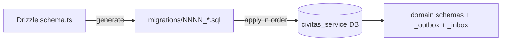

# CivitasOne Suite — Database Schema

> **Version:** 0.1.0 · PostgreSQL 16 · Drizzle ORM 0.30
> Database-per-service. 32 physical databases named `civitas_<service>`. `queue` (embedded library) and `gateway` (stateless proxy) own no database.

---

## 1. Database Inventory

Each service owns exactly one database. Money columns are `BigInt` (paise); all timestamps are `timestamptz`.

| # | Service | Port | Database | Owns DB |
|---|---|---|---|---|
| 1 | identity | 3001 | `civitas_identity` | yes |
| 2 | tenant | 3002 | `civitas_tenant` | yes |
| 3 | policy | 3003 | `civitas_policy` | yes |
| 4 | audit | 3004 | `civitas_audit` | yes |
| 5 | install | 3005 | `civitas_install` | yes |
| 6 | notification | 3006 | `civitas_notification` | yes |
| 7 | finance | 3007 | `civitas_finance` | yes |
| 8 | procurement | 3008 | `civitas_procurement` | yes |
| 9 | contract | 3009 | `civitas_contract` | yes |
| 10 | estab | 3010 | `civitas_estab` | yes |
| 11 | stock | 3011 | `civitas_stock` | yes |
| 12 | hrms | 3012 | `civitas_hrms` | yes |
| 13 | payroll | 3013 | `civitas_payroll` | yes |
| 14 | project | 3014 | `civitas_project` | yes |
| 15 | asset | 3015 | `civitas_asset` | yes |
| 16 | report | 3016 | `civitas_report` | yes |
| 17 | plugin | 3017 | `civitas_plugin` | yes |
| 18 | theme | 3018 | `civitas_theme` | yes |
| 19 | grant | 3019 | `civitas_grant` | yes |
| 20 | citizen | 3020 | `civitas_citizen` | yes |
| 21 | legal | 3021 | `civitas_legal` | yes |
| 22 | admin | 3022 | `civitas_admin` | yes |
| 23 | billing | 3023 | `civitas_billing` | yes |
| 24 | crm | 3024 | `civitas_crm` | yes |
| 25 | inventory | 3025 | `civitas_inventory` | yes |
| 26 | telephony | 3026 | `civitas_telephony` | yes |
| 27 | helpdesk | 3027 | `civitas_helpdesk` | yes |
| 28 | knowledge | 3028 | `civitas_knowledge` | yes |
| 29 | workflow | 3029 | `civitas_workflow` | yes |
| 30 | analytics | 3031 | `civitas_analytics` | yes |
| 31 | location | 4012 | `civitas_location` | yes |
| 32 | queue | — (embedded lib) | — | no |
| 33 | gateway | 8080 (proxy) | — | no |

> 32 of the 33 services are backed by a `civitas_<service>` database. Every one of those databases carries the two infrastructure schemas `_outbox` and `_inbox` in addition to its domain schemas.

---

## 2. Schema Organization Within a Database

A service groups its tables into **per-module PostgreSQL schemas**, plus the two mandatory infra schemas:

- Domain schemas — one per functional module (e.g. `gl`, `budget`, `leave`).
- `_outbox` — transactional outbox rows pending relay publication.
- `_inbox` — dedup ledger for consumed events (exactly-once effect).

### Common infra tables (present in every `civitas_<service>`)

**`_outbox.messages`**

| Column | Type | Notes |
|---|---|---|
| id | uuid PK | outbox row id |
| tenant_id | uuid | tenant scope (RLS) |
| topic | text | event topic `{service}.{aggregate}.{pastTense}` |
| payload | jsonb | serialized event |
| created_at | timestamptz | insertion time (ordering) |
| delivered_at | timestamptz null | set when relay publishes |

**`_inbox.processed`**

| Column | Type | Notes |
|---|---|---|
| message_id | text PK | dedup key; `INSERT ... ON CONFLICT DO NOTHING` |
| tenant_id | uuid | tenant scope |
| topic | text | consumed event topic |
| processed_at | timestamptz | first-seen timestamp |

---

## 3. Major Service Schemas

The following covers the highest-traffic services. Relationships are described as text (FK direction shown with `→`).

### identity — `civitas_identity`
Schemas: `auth`, `rbac`, `session`.

- `auth.user` — id, tenant_id, keycloak_sub, email, status.
- `rbac.role` — id, tenant_id, name.
- `rbac.user_role` — user_id → `auth.user`, role_id → `rbac.role` (many-to-many).
- `rbac.permission` — id, code; `rbac.role_permission` maps role_id → permission_id.
- `session.session` — id, user_id → `auth.user`, issued_at, expires_at.

### tenant — `civitas_tenant`
Schemas: `org`, `config`.

- `org.tenant` — id, name, tier (`pool` | `silo`), status.
- `org.unit` — id, tenant_id, parent_id → `org.unit` (self-referential org tree).
- `config.setting` — tenant_id, key, value (jsonb).

### finance — `civitas_finance`
Schemas: `gl`, `budget`, `treasury`, `payments`, `org`.

- `gl.account` — id, tenant_id, code, type (asset/liability/income/expense).
- `gl.journal` — id, tenant_id, posted_at; `gl.journal_line` — journal_id → `gl.journal`, account_id → `gl.account`, debit BigInt, credit BigInt.
- `budget.head` — id, tenant_id, code, fiscal_year.
- `budget.allocation` — head_id → `budget.head`, amount BigInt.
- `treasury.account` — bank account records; `payments.voucher` — voucher_id, amount BigInt, status; `payments.disbursement` — voucher_id → `payments.voucher`.
- Emits `finance.budget.created`; consumes payroll disbursement events.

### hrms — `civitas_hrms`
Schemas: `employee`, `leave`, `gpf`, `pension`, `disciplinary`, `claims`, `recruitment`, `contracts`.

- `employee.employee` — id, tenant_id, code, name, unit_id.
- `leave.leave_type`, `leave.leave_balance` (employee_id → `employee.employee`), `leave.leave_request` (employee_id, type_id → `leave.leave_type`, status).
- `gpf.account` — employee_id → `employee.employee`, opening_balance BigInt; `gpf.transaction`.
- `pension.case` — employee_id, retirement_date, status.
- `disciplinary.case`, `claims.claim`, `recruitment.vacancy` / `recruitment.application`.
- `contracts.hrms_contracts` — id, tenant_id, employee_id, contract_no (unique per tenant), start_date, end_date, terms JSONB, renewal_count, status (draft/active/expiring/expired/renewed/terminated/escalated), previous_contract_id, version. Partial unique index on (tenant_id, employee_id) WHERE status = 'active'.
- `contracts.hrms_contract_renewals` — id, tenant_id, contract_id, renewal_number, initiated_by, status (pending_approval/approved/rejected/budget_insufficient/cancelled), new_end_date, original_terms JSONB, new_terms JSONB, approval_chain JSONB, approved_by, rejected_by, rejection_reason, budget_ref, new_contract_id, version. Partial unique index on (tenant_id, contract_id) WHERE status = 'pending_approval'.
- `contracts.hrms_contract_notifications` — id, tenant_id, contract_id, milestone (integer), sent_at. Unique constraint on (tenant_id, contract_id, milestone) for deduplication.
- `contracts.hrms_contract_config` — id, tenant_id (unique), reminder_milestones JSONB, approval_chain JSONB, auto_separation_enabled boolean, scheduler_time_utc, version.
- `contracts.hrms_contract_seq` — tenant_id (PK), next_val integer. Sequential contract number generator per tenant.
- Emits `hrms.leave.approved`; on leave approval, payroll and finance react.
- Emits `hrms.contract.*` events (created, renewed, expired, escalated, separated); consumes `contractRenewalDecided` from workflow-service.

### payroll — `civitas_payroll`
Schemas: `run`, `component`, `payslip`, `bank`.

- `run.payroll_run` — id, tenant_id, period, status.
- `component.earning` / `component.deduction` — code, amount BigInt.
- `payslip.payslip` — run_id → `run.payroll_run`, employee_id, gross BigInt, net BigInt.
- `bank.mandate` — employee_id, account, ifsc.
- Consumes `hrms.leave.approved` (loss of pay), emits disbursement commands to finance.

### procurement — `civitas_procurement`
Schemas: `tender`, `bid`, `award`, `vendor`.

- `vendor.vendor` — id, tenant_id, name, gstin.
- `tender.tender` — id, tenant_id, ref_no, status.
- `bid.bid` — tender_id → `tender.tender`, vendor_id → `vendor.vendor`, amount BigInt.
- `award.award` — tender_id, bid_id → `bid.bid`.
- Emits `procurement.tender.awarded`; contract service reacts to create the contract.

### workflow — `civitas_workflow`
Schemas: `definition`, `instance`, `task`.

- `definition.workflow` — id, tenant_id, key, version, dag (jsonb of steps).
- `instance.instance` — id, definition_id → `definition.workflow`, status, context (jsonb).
- `task.task` — instance_id → `instance.instance`, assignee, state (pending/approved/rejected).
- Consumes `workflow.instance.create`, emits `workflow.instance.created` and per-task events; drives approvals for leave, tenders, disposals.

### audit — `civitas_audit`
Schemas: `log`.

- `log.event` — id, tenant_id, actor, action, resource, occurred_at, detail (jsonb).
- Append-only. Subscribes broadly to `*.{pastTense}` events across services to build an immutable audit trail.

### estab — `civitas_estab`
Schemas: `post`, `posting`, `seniority`, `quarters`, `fleet`.

- `post.post` — sanctioned posts (id, tenant_id, grade, cadre).
- `posting.posting` — employee_id (from hrms), post_id → `post.post`, from_date, to_date.
- `seniority.list` — cadre-wise seniority ordering.
- `quarters.estab_quarters` — quarter inventory (id, tenant_id, quarter_no, quarter_type, category, address, locality, carpet_area_sqft, status, condition, org_unit, version).
- `quarters.estab_quarter_allotments` — allotment workflow (id, tenant_id, quarter_id → `quarters.estab_quarters`, employee_ref, eligibility_score, waitlist_position, status, allotted_at/by, occupied_at, vacation_due_date, vacated_at, version).
- `quarters.estab_licence_fee_rates` — effective-dated monthly licence-fee schedule (id, tenant_id, quarter_type, pay_level, monthly_minor BigInt, currency, effective_from/to, version).
- `quarters.estab_overstay_penalties` — overstay penalty records (id, tenant_id, allotment_id → `quarters.estab_quarter_allotments`, employee_ref, penalty_days, daily_rate_minor BigInt, multiplier, total_minor BigInt, status, version).
- `fleet.fuel_logs` — refuelling events (id, tenant_id, vehicle_id, log_date, fuel_type, litres numeric(10,2), cost_minor BigInt, currency, odometer_km, pump_name, receipt_ref, version).
- `fleet.trip_logs` — trip/log-book (id, tenant_id, vehicle_id, driver_id, trip_date, start_odometer, end_odometer, start_time, end_time, purpose, passenger_name, route, status, version).
- `fleet.vehicle_documents` — permits/insurance/PUC/fitness (id, tenant_id, vehicle_id, doc_type, doc_number, issued_at, valid_from, valid_until, issuer, amount_minor BigInt, currency, status, reminder_sent, version).
- `fleet.driver_roster` — driver shift assignments (id, tenant_id, driver_id, vehicle_id, shift_date, shift_type, status, version).

### grant — `civitas_grant`
Schemas: `scheme`, `sanction`, `utilization`.

- `scheme.scheme` — id, tenant_id, name, fiscal_year, ceiling BigInt.
- `sanction.sanction` — scheme_id → `scheme.scheme`, beneficiary, amount BigInt, status.
- `utilization.uc` — sanction_id → `sanction.sanction`, utilized BigInt (utilization certificate).

### asset — `civitas_asset`
Schemas: `register`, `lifecycle`, `depreciation`, `maintenance`, `insurance`, `enterprise`.

- `register.asset` — id, tenant_id, tag, category, acquired_at, cost BigInt.
- `depreciation.entry` — asset_id → `register.asset`, period, amount BigInt.
- `lifecycle.asset_disposals` — asset_id, method, status; emits `asset.disposal.decided` after `asset.disposal.file_decided` command.
- `lifecycle.condemnation_surveys` — id, tenant_id, asset_id, survey_date, surveyed_by, condition, estimated_repair_cost_minor BigInt, recommendation, status, version.
- `lifecycle.condemnation_recommendations` — id, tenant_id, survey_id, asset_id, committee_members JSONB, decision, reserve_value_minor BigInt, floor_value_minor BigInt, status, version.
- `lifecycle.asset_auctions` — id, tenant_id, asset_id, recommendation_id, reserve_value_minor BigInt, highest_bid_minor BigInt, sale_proceeds_minor BigInt, finance_receipt_ref, status, version.
- `maintenance.ticket` — asset_id, schedule.

### citizen — `civitas_citizen`
Schemas: `rti`, `grievance`, `service`, `application`, `catalogue`, `eligibility`, `documents`, `fee`, `issuance`, `appeal`, `discovery`.

- `rti.request` — id, tenant_id, applicant, subject, status.
- `rti.transfer` — request_id → `rti.request`, to_unit; emits `citizen.rti.transferred` after `citizen.rti.transfer`.
- `grievance.grievance` — id, applicant, category, status.
- `service.application` — citizen service delivery requests.

**Service delivery — SVC-081..090 (migrations `0015`/`0016`; every table tenant_id + FORCE RLS via `portal.current_tenant_id()`):**
- `catalogue.service_definitions` — **SVC-081** versioned service catalogue: owner, linked eligibility rule-set / fee schedule / issuance type, required-docs checklist, SLA, channels, forms, outputs. Maker-checker + immutable-per-version publish; emits `citizen.catalogue.published`.
- `application.citizen_applications` (+ `tracking_no`, `channel`, `assisted_by`, `acknowledged_at`), `application.application_drafts` — **SVC-082** online + assisted intake: draft save/resume, acknowledgement with unique tracking number, channel attribution (portal/counter/mobile/assisted).
- `eligibility.rule_sets` (versioned, maker-checker publish), `eligibility.evaluations` — **SVC-083** configurable entitlement rules → reasoned outcome (eligible / refer-manual / not-eligible); emits `citizen.eligibility.ruleset_published`.
- `documents.submissions` — **SVC-084** upload + DigiLocker-gated intake (env-gated: `provider_unconfigured`, no fake success), checklist sourced from catalogue, verify/reject/deficiency-memo/resubmission; emits `citizen.document.verified`.
- `fee.schedules`, `fee.payments`, `fee.refunds` — **SVC-085** fee calc + exemptions, online (gateway env-gated → honest `pending`) + offline receipt, refund (maker-checker), reconciliation; emits `citizen.payment.requested`, `citizen.receipt.issued`.
- `issuance.counters`, `issuance.certificates`, `issuance.certificate_events` — **SVC-086** certificate/licence/permit issuance: maker-checker approval, gapless number, HMAC seal + public token/QR verify (no auth), validity + amend/renew/revoke; emits `citizen.certificate.issued`, `citizen.certificate.revoked`.
- `appeal.appeals`, `appeal.hearings` — **SVC-089** appeal/review/revision: filing-window validation, appellate authority, records transfer, hearing, order (maker-checker prepare≠issue), remand; emits `citizen.appeal.filed`, `citizen.appeal.decided`.
- `discovery.consents`, `discovery.matches` — **SVC-090** consent-gated proactive discovery: run eligibility rules against a citizen profile → likely-eligible services → notify + assisted enrolment; emits `notification.send`, `citizen.discovery.service_discovered`.

> Runtime note: `citizen_svc` currently holds `BYPASSRLS`, so the FORCE-RLS policies above are a defence-in-depth backstop; tenant isolation is enforced at the app layer via tenant-scoped `WHERE` (`findByIdTx(id, tenantId)`).

### billing — `civitas_billing`
Schemas: `checkout`, `invoice`, `subscription`.

- `checkout.session` — id, tenant_id, amount BigInt, status; command `billing.checkout.verify` → event `billing.checkout.verified`.
- `invoice.invoice` — session_id → `checkout.session`, number, total BigInt.
- `subscription.subscription` — tenant_id, plan, period.

### works — `civitas_works`
Schema: `works`.

**Masters (17 lookup/reference tables):**
- `works.authorities` — id, tenant_id, name, code, level, active, version.
- `works.work_types` — id, tenant_id, name, code, active, version.
- `works.work_sub_types` — id, tenant_id, work_type_id → `works.work_types`, name, code, active, version.
- `works.proposer_types` — id, tenant_id, name, active, version.
- `works.programs` — id, tenant_id, name, active, version.
- `works.publication_levels` — id, tenant_id, name, active, version.
- `works.repair_types` — id, tenant_id, program_id → `works.programs`, name, active, version.
- `works.schemes` — id, tenant_id, name, sponsor, active, version.
- `works.scopes` — id, tenant_id, work_type_id → `works.work_types`, name, unit, active, version.
- `works.tender_types` — id, tenant_id, name, rate_type, active, version.
- `works.user_departments` — id, tenant_id, name, demand_number, active, version.
- `works.contractor_classes` — id, tenant_id, name, description, active, version.
- `works.issue_types` — id, tenant_id, name, active, version.
- `works.issue_description_types` — id, tenant_id, issue_type_id → `works.issue_types`, name, active, version.
- `works.assets` — id, tenant_id, code, name, type, district, taluka, chainage, cost BigInt, active, version.
- `works.work_description_types` — id, tenant_id, work_type_id → `works.work_types`, keyword, active, version.
- `works.sr_items` — id, tenant_id, zone, sr_year, item_code, description, unit, rate BigInt, active, version.

**Domain tables (proposals, approvals, BoQ, tender, execution, billing):**
- `works.work_proposals`, `works.work_coa_mappings`, `works.work_office_mappings`, `works.work_splits`
- `works.administrative_approvals`, `works.technical_sanctions`, `works.financial_targets`
- `works.boq_items`, `works.schedule_a_items`, `works.material_coefficients`, `works.recapitulation`
- `works.tenders`, `works.pre_tenders`, `works.quotations`, `works.quotation_items`, `works.awards`
- `works.work_scopes`, `works.scope_progress`, `works.work_issues`, `works.issue_observations`, `works.work_photos`, `works.physical_targets`, `works.physical_completions`
- `works.measurement_books`, `works.measurements`, `works.bills`, `works.bill_items`, `works.bill_recoveries`, `works.account_compilations`, `works.work_closures`

---

## 4. Migration Conventions

- Migrations are authored with **Drizzle ORM 0.30** and materialized as **numbered SQL files** under each service's `migrations/` directory (e.g. `0001_init.sql`, `0002_add_leave_balance.sql`).
- Migrations are **additive and idempotent**: prefer `CREATE ... IF NOT EXISTS`, `ADD COLUMN IF NOT EXISTS`, and guarded policy creation so re-running is safe.
- Numbering is strictly increasing; migrations apply in order and are never edited after release — a follow-up numbered migration corrects a prior one.
- Each service migrates its **own** database only; there are no cross-database migrations.



---

## 5. RLS Policy Overview

Every tenant-scoped table uses the same isolation pattern:

```sql
-- Helper (created once per database)
CREATE OR REPLACE FUNCTION current_tenant_id() RETURNS uuid
  LANGUAGE sql STABLE AS
  $$ SELECT current_setting('app.tenant_id', true)::uuid $$;

-- Per table
ALTER TABLE leave.leave_request ENABLE ROW LEVEL SECURITY;
ALTER TABLE leave.leave_request FORCE ROW LEVEL SECURITY;

CREATE POLICY tenant_isolation ON leave.leave_request
  USING (tenant_id = current_tenant_id())
  WITH CHECK (tenant_id = current_tenant_id());
```

- `current_tenant_id()` reads the **`app.tenant_id` GUC**, which the service sets per request via `SET LOCAL app.tenant_id = '<tenant>'` inside a tenant-scoped transaction.
- `USING` filters reads; `WITH CHECK` prevents writing rows for another tenant.
- `FORCE ROW LEVEL SECURITY` ensures the policy applies even to the table owner.
- The `_outbox` and `_inbox` schemas are likewise `tenant_id`-scoped so relayed events and dedup records never cross tenants.
- **Silo tier** tenants get a dedicated database; RLS still applies but the tenant set is a single tenant.

---

## 6. Cross-Service Referential Integrity

Because each service owns its own database, **there are no cross-database foreign keys**. References to entities owned by another service (e.g. payroll referencing an hrms `employee_id`) are stored as **plain identifiers** and kept consistent through events:

- hrms emits employee lifecycle events; payroll/estab project the minimal fields they need into their own tables.
- Integrity across services is **eventual**, reconciled by the outbox→event→inbox pipeline, not enforced by the database engine.

### revenue — `civitas_revenue`
Schemas: `rates`, `assessee`, `billing`, `bbps`, `collection`.

- `rates.rate_heads` — id, tenant_id, code varchar(64), name, category varchar(64) (property_tax/water/sewerage/etc.), unit_of_measure, is_active boolean, version. Unique: (tenant_id, code).
- `rates.rate_slabs` — id, tenant_id, rate_head_id → `rates.rate_heads`, slab_type varchar(16) (flat/band/ad_valorem), band_from BigInt, band_to BigInt, rate_value BigInt (paise or bps depending on slab_type), effective_from date, effective_to date, unit_of_measure, is_active, version.
- `rates.penalty_rules` — id, tenant_id, rate_head_id → `rates.rate_heads`, interest_type (simple/compound), annual_rate_bps int, grace_days int, cap_months int (nullable = uncapped), rounding_mode (round_half_up/floor/ceil), is_active, version.
- `rates.rebate_rules` — id, tenant_id, rate_head_id → `rates.rate_heads`, rebate_type (early_payment/category), discount_bps int, valid_until_days_before_due int, is_active, version.
- `assessee.assessees` — property/tax assessees (id, tenant_id, registration details).
- `billing.bills` — demand/bill generation (id, tenant_id, amount BigInt).
- `bbps.biller_config`, `bbps.bbps_transactions` — BBPS integration.
- `collection.collections` — payment collections.
- Port 3038, gateway prefix `/api/v1/revenue`.
- Emits `revenue.rate_head.created`, `revenue.bill.generated`; consumes `finance.bank_statement.reconciled`.

---

*For messaging contracts and per-service routes see `SERVICES.md`; for the overall architecture see `ARCHITECTURE.md`.*
