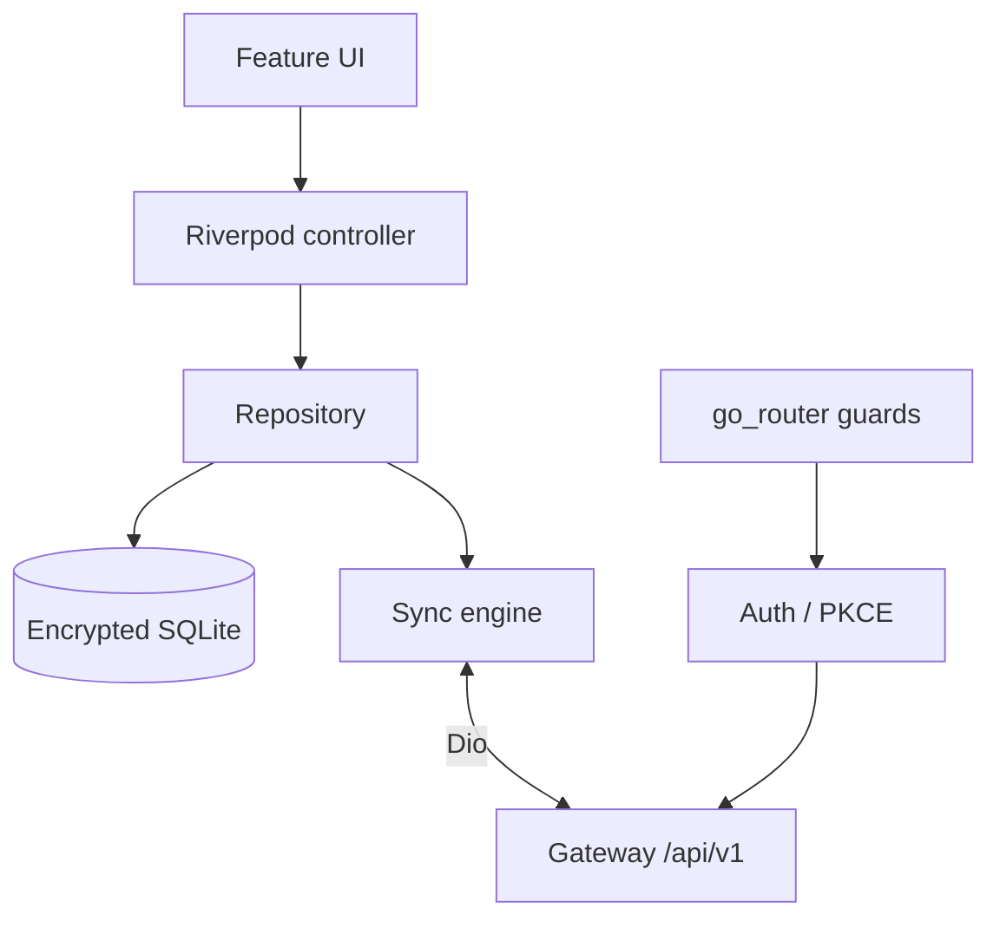
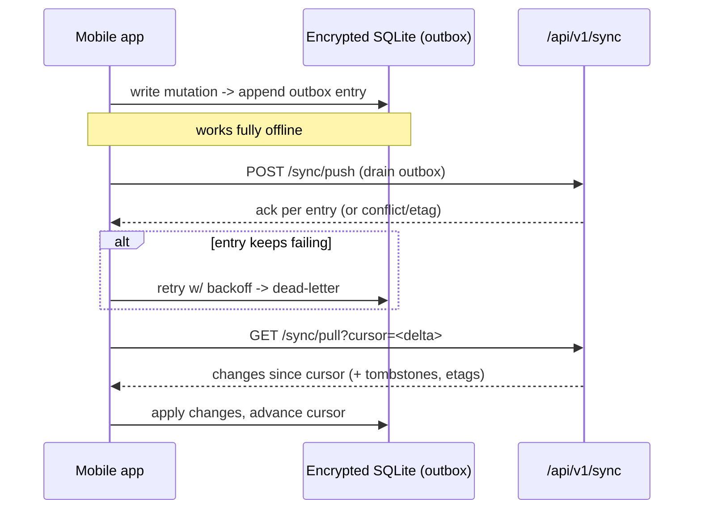

# CivitasOne Suite — Mobile Guide

The CivitasOne mobile client (`apps/mobile`) is a **Flutter** application targeting field
and on-the-go usage: attendance, approvals, and read/write access to core modules while
offline. It talks to the same gateway API (`/api/v1/...`) as the web app.

> **Platform honesty.** The app is **Android-only today.** There is **no iOS build yet** —
> iOS is on the roadmap, not shipped. Some capabilities below are explicitly marked as
> **planned** (notably push notifications) or **being hardened** (biometric PIN crypto).
> Everything not so marked is implemented.

- **Framework:** Flutter 3.3+
- **State:** Riverpod
- **Routing:** go_router
- **HTTP:** Dio
- **Local store:** `sqflite_sqlcipher` (encrypted SQLite)
- **Auth:** Keycloak PKCE via `flutter_appauth`; tokens in `flutter_secure_storage`
- **Biometrics:** `local_auth` + PBKDF2 PIN

---

## 1. Architecture

The app follows a layered, unidirectional structure with Riverpod providers wiring layers
together.

```
apps/mobile/
├── lib/
│   ├── router/          # go_router route table, guards (auth/redirect)
│   ├── auth/            # Keycloak PKCE, secure token storage, biometric lock
│   ├── data/
│   │   ├── api/         # Dio client, interceptors (auth, retry)
│   │   ├── db/          # sqflite_sqlcipher schema, DAOs, outbox
│   │   └── sync/        # offline-first sync engine (push/pull)
│   ├── features/        # per-module UI + Riverpod controllers
│   └── main.dart
```

- **Riverpod** holds app state and exposes controllers to the UI; providers are the seams
  for testing and for swapping implementations.
- **go_router** owns navigation and route guards — e.g. redirecting to login when there is
  no valid session, or to the biometric lock screen on resume.
- **Dio** is the single HTTP client. Interceptors attach the bearer token and handle
  token refresh and retry.



---

## 2. Offline-first sync engine

The app is **offline-first**: writes are recorded locally and reconciled with the server
when connectivity allows. This is the most important subsystem to understand.

### 2.1 Storage

Local data lives in **encrypted SQLite** via `sqflite_sqlcipher`. Alongside domain tables
there is an **outbox** table: every local mutation is appended as an outbox entry before
(or instead of) hitting the network.

### 2.2 Push and pull

- **Push** — the outbox is drained by `POST /api/v1/sync/push`. Each entry carries the
  intended change; the server applies it (via the same CQRS command path) and acknowledges.
- **Pull** — `GET /api/v1/sync/pull` uses a **delta cursor** so the client only fetches
  changes since its last successful sync, not the whole dataset.

### 2.3 Conflict handling

- **etag / version checks** detect when the server copy changed since the client last saw
  it, surfacing a **conflict** rather than blindly overwriting.
- **Tombstones** represent deletes so a delete propagates and isn't resurrected by a stale
  local row.
- **Retry + dead-letter** — failed outbox entries are retried with backoff; entries that
  keep failing are moved to a **dead-letter** state for inspection rather than blocking the
  queue.



### 2.4 Practical rules

- Treat push as **at-least-once**; the server dedupes on the entry's id.
- Never assume a local write is authoritative until it has been acked by push.
- Honor tombstones on pull — a pulled delete must remove the local row.
- Surface conflicts to the user (or resolve by policy) — do not silently clobber.

---

## 3. Authentication — Keycloak PKCE

The app authenticates against **Keycloak 24** using the **Authorization Code + PKCE** flow
via `flutter_appauth`. There is no password handling in the app itself — the login happens
in the system browser/custom tab.

Flow:

1. `flutter_appauth` starts the PKCE authorization request against the Keycloak realm.
2. The user authenticates in Keycloak; the app receives an authorization code.
3. `flutter_appauth` exchanges the code (with the PKCE verifier) for `access_token`,
   `refresh_token`, and `id_token`.
4. Tokens are stored in **`flutter_secure_storage`** (Android Keystore-backed).
5. The Dio auth interceptor attaches `Authorization: Bearer <access_token>` and refreshes
   using the refresh token when the access token nears expiry.

```dart
final result = await appAuth.authorizeAndExchangeCode(
  AuthorizationTokenRequest(
    clientId,
    redirectUrl,
    issuer: 'https://$kcHost/realms/$realm',
    scopes: ['openid', 'profile', 'offline_access'],
    // PKCE is handled by flutter_appauth
  ),
);
await secureStorage.write(key: 'access_token', value: result!.accessToken);
await secureStorage.write(key: 'refresh_token', value: result.refreshToken);
```

Tokens never touch plain SharedPreferences or the SQLite DB — only secure storage.

---

## 4. Biometric lock

On app resume (and optionally per sensitive action) the app can require a **biometric or
PIN** unlock using **`local_auth`**. A user-set PIN is stretched with **PBKDF2** rather
than stored in plaintext.

> **Being hardened.** The PIN key-derivation and lockout parameters (iteration count, salt
> handling, failed-attempt backoff) are actively being strengthened. Do not treat the
> current PIN crypto as final; follow the auth module's current implementation and avoid
> copying older parameters.

```dart
final ok = await localAuth.authenticate(
  localizedReason: 'Unlock CivitasOne',
  options: const AuthenticationOptions(biometricOnly: false, stickyAuth: true),
);
if (!ok) { /* fall back to PIN entry -> PBKDF2 verify */ }
```

Biometric unlock gates access to the app session; it does not replace the Keycloak
tokens, which remain the source of API authorization.

---

## 5. GPS attendance with anti-spoofing

The attendance feature captures location for check-in/check-out and applies
**anti-spoofing** checks so a mock-location provider can't fabricate presence. In practice
this means validating the location source and rejecting readings flagged as mocked, in
addition to the normal geofence/accuracy checks before an attendance event is recorded.

Attendance events flow through the same offline-first path: recorded locally, drained via
the sync outbox, and reconciled server-side.

---

## 6. Push notifications (planned)

Push via **FCM** is **planned but not yet wired**. There is currently no live push
delivery in the app. When it lands it will complement — not replace — the sync engine:
sync remains the source of truth for data; push will be a wake/notify signal. Until then,
do not design flows that depend on server-initiated push.

---

## 7. Build & release

### 7.1 Android (today)

```bash
cd apps/mobile
flutter pub get
flutter run                 # debug on a connected device/emulator
flutter build apk --release
flutter build appbundle --release   # for Play distribution
```

Requirements:

- Flutter **3.3+** toolchain.
- A signing config for release builds.
- App configuration pointing at the target gateway host and Keycloak realm/redirect URI.

### 7.2 iOS (roadmap — not available)

There is **no iOS build** today. iOS support is planned; until then, do not assume any
iOS-specific code paths, entitlements, or App Store artifacts exist.

---

## 8. Testing the mobile client

- **Widget/unit tests:** `flutter test`.
- **Provider tests:** override Riverpod providers to inject fakes for the API and DB.
- **Sync tests:** exercise the outbox → push → pull cycle against a fake `/sync` endpoint,
  including conflict (etag), tombstone, and dead-letter paths.
- **Auth tests:** stub `flutter_appauth` and verify secure-storage handling + refresh.

```bash
flutter test
flutter test test/sync/         # sync engine suite
```

---

## 9. Gotchas

- **Android-only.** Don't ship or promise iOS behavior yet.
- **Offline writes aren't authoritative** until push-acked; reflect pending state in UI.
- **Tokens only in secure storage** — never in SQLite or SharedPreferences.
- **PIN crypto is being hardened** — use the current auth module, not older parameters.
- **No push yet** — sync is the only reliable server→client channel today.
- **Respect tombstones and conflicts** on pull; silent overwrite is a data-loss bug.
