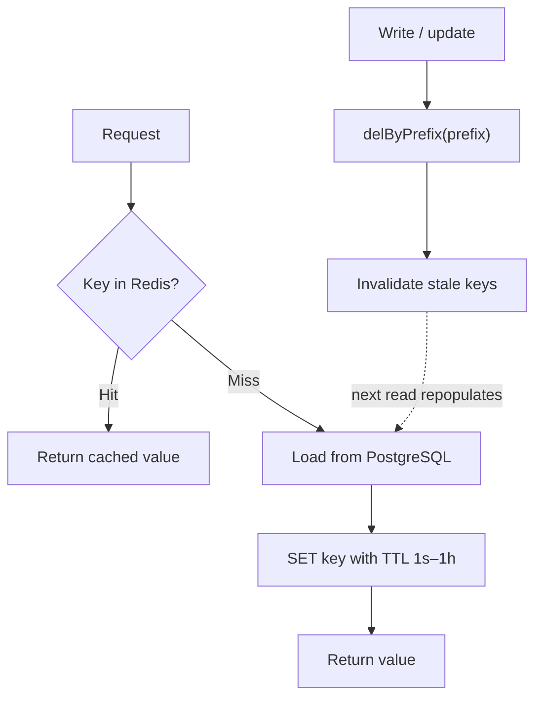

# CivitasOne Suite — Performance Guide

**Version:** 0.1.0 · **License:** AGPL-3.0 · **Audience:** Backend & platform engineers

This document defines the performance targets for CivitasOne and the mechanisms that achieve
them: connection pooling, the Redis read-through cache, query-optimization patterns, exact
money precision, pagination limits, and the k6 load-testing methodology. Figures here trace
to the platform's SCALABILITY-AUDIT.

---

## 1. Target metrics (SLOs)

| Metric | Target |
|--------|--------|
| Throughput | ~1000 TPS (sustained, platform goal) |
| p95 latency — GET | < 500 ms |
| p95 latency — POST | < 1000 ms |
| Error rate | < 1% |

These apply per service at the gateway (`:8080`) boundary. Each of the 33 Fastify services is
measured independently; the aggregate goal is ~1000 TPS across the platform under a realistic
mixed workload.

---

## 2. Connection pooling (pgbouncer)

PostgreSQL connections are expensive; with 33 services each running multiple instances, naive
pooling exhausts Postgres. **pgbouncer** (transaction mode, port **6432**) multiplexes many
short-lived client connections onto a small server-side pool.

| Setting | Value | Why |
|---------|-------|-----|
| `pool_mode` | `transaction` | Connection returned to pool at transaction end — maximum reuse for short OLTP transactions. |
| `max_client_conn` | 500 | Ceiling on client-side connections across all app instances. |
| `default_pool_size` | 20 | Server-side connections per (user, database) pair. |
| Listen port | 6432 | Services set `DATABASE_URL` to pgbouncer, never directly to Postgres. |

Because RLS relies on the `current_tenant_id()` GUC being `SET` inside a transaction,
**transaction mode is required** — the tenant GUC is scoped to the transaction and never
leaks to the next client borrowing the connection.

Config lives at `infra/pgbouncer`. Alert on pool saturation (see `SELF-HOSTING.md` §5).

---

## 3. Redis read-through cache

Read-heavy lookups (policies, tenant config, reference data) are cached in **Redis 7** via the
shared `packages/cache` module. The core primitive is **`getOrLoad`**: on a miss it loads
from Postgres, populates Redis with a TTL, and returns the value; on a hit it serves from
Redis without touching the database.



### 3.1 TTL guidance

| Data volatility | Example | TTL |
|-----------------|---------|-----|
| Near-real-time | live counters, hot lookups | 1 s |
| Semi-static | tenant settings, policy rules | 1–5 min |
| Reference data | code lists, org structure | up to 1 h |

### 3.2 Invalidation

`delByPrefix` clears a whole key namespace on write (e.g. invalidate `policy:tenant:42:*`
after a policy edit) so reads never serve stale data past the write boundary. Prefer explicit
prefix invalidation on mutation over relying solely on TTL expiry for correctness-sensitive
data.

### 3.3 Rules

- **Cache is never the source of truth** — Postgres is. Redis loss must be non-fatal (cold
  cache warms via `getOrLoad`).
- **Never cache un-scoped tenant data.** Cache keys must include `tenant_id` to preserve
  isolation.
- Keep TTLs short for anything a user can mutate and see immediately.

---

## 4. Query optimization patterns

- **Index the access path.** Every tenant-scoped query filters on `tenant_id`; composite
  indexes lead with `tenant_id` (e.g. `(tenant_id, created_at)`), matching RLS predicates.
- **Push filters into SQL** via Drizzle `where` clauses — never filter in application memory
  over large result sets.
- **Avoid N+1.** Batch related lookups or use joins/`inArray` instead of per-row queries in a
  loop.
- **Select only needed columns.** Especially avoid pulling large/BLOB or encrypted PII columns
  unless required.
- **Use read replicas** for reporting/analytics-style reads (large tier) to keep the primary
  free for OLTP.
- **EXPLAIN ANALYZE** slow queries against production-like data volumes; watch for sequential
  scans on tenant-scoped tables (usually a missing leading-`tenant_id` index).
- **Cache before you optimize the query** where the data tolerates a short TTL — a cache hit
  is cheaper than any index.

---

## 5. Money precision — BigInt paise

All monetary values are stored and computed as **`BigInt` paise** (integers), never floating
point.

- `1.00` INR is represented as `100n` paise.
- Arithmetic uses integer operations — no `float`/`double` anywhere in money paths, which
  eliminates rounding drift in finance, payroll, billing, procurement, and grant flows.
- Serialization to/from the API converts BigInt paise explicitly; clients format to rupees for
  display only.
- Database columns are integer (`bigint`) typed; migrations touching money must preserve
  integer typing (see `DEPLOYMENT.md` §7).

This is a **correctness** requirement first and a performance property second: integer math is
also faster and index-friendly.

---

## 6. Pagination & query limits

Unbounded reads are the most common latency and memory regression. Enforce limits everywhere:

- **Always paginate** list endpoints. Default and maximum page sizes are capped server-side;
  clients cannot request unbounded pages.
- Prefer **keyset (seek) pagination** on `(tenant_id, created_at, id)` for deep pages instead
  of large `OFFSET`, which degrades linearly.
- Reject or clamp oversized `limit` parameters at the handler boundary.
- Stream or chunk exports (reports/analytics) rather than materializing entire result sets in
  memory.

---

## 7. k6 load-testing methodology

The load harness lives at `tests/load/k6-baseline.js`.

### 7.1 Method

1. **Baseline** each service in isolation through the gateway (`:8080`) with realistic auth
   (RS256 tokens from Keycloak) and tenant context so RLS + pgbouncer are exercised.
2. **Ramp** virtual users in stages (e.g. ramp-up → steady → ramp-down) toward the ~1000 TPS
   goal; hold steady long enough to observe cache warm-up and pool behaviour.
3. **Assert SLOs** as k6 thresholds so a run fails CI when a target is breached:

   ```js
   export const options = {
     thresholds: {
       http_req_failed:   ['rate<0.01'],                 // <1% errors
       'http_req_duration{method:GET}':  ['p(95)<500'],  // GET p95 < 500ms
       'http_req_duration{method:POST}': ['p(95)<1000'], // POST p95 < 1000ms
     },
   };
   ```

4. **Measure both cold and warm cache** — report the first (cold) window and the steady
   (warm) window separately, since read-through caching materially shifts p95.
5. **Watch the backend** during the run: pgbouncer pool usage, Postgres active connections,
   replication lag, Redis hit rate, and SQS depth.

### 7.2 Results table format

Record every run in this shape so results are comparable across releases:

| Service | Scenario | VUs | TPS | p50 (ms) | p95 (ms) | p99 (ms) | Error % | Cache hit % | Notes |
|---------|----------|-----|-----|----------|----------|----------|---------|-------------|-------|
| finance | GET list (warm) | 200 | — | — | — | — | — | — | keyset paginated |
| finance | POST create | 200 | — | — | — | — | — | n/a | outbox write |
| policy | GET rule (warm) | 300 | — | — | — | — | — | — | 1 h TTL cache |
| gateway | mixed | 500 | ~1000 | — | — | — | <1 | — | aggregate goal |

A run **passes** only when: p95 GET < 500 ms, p95 POST < 1000 ms, and error rate < 1%.

---

## 8. Performance checklist

- [ ] Service connects via pgbouncer `:6432` (transaction mode), not directly to Postgres.
- [ ] Hot reads use `getOrLoad`; keys include `tenant_id`; writes call `delByPrefix`.
- [ ] TTLs match data volatility (1 s–1 h).
- [ ] Tenant-scoped queries have a leading-`tenant_id` composite index; no seq scans.
- [ ] Money is `BigInt` paise end-to-end — no floats.
- [ ] All list endpoints paginated with server-side caps; deep pages use keyset.
- [ ] k6 thresholds encode the SLOs and gate CI.
- [ ] pgbouncer pool, Postgres connections, Redis hit rate, and SQS depth monitored.

---

## 9. Related documents

- `DEPLOYMENT.md` — env reference, migration strategy, rollback.
- `SELF-HOSTING.md` — hardware sizing, monitoring, DR.
- `COMPLIANCE.md` — regulatory mapping.
