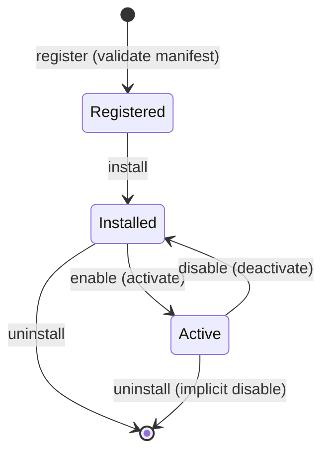

# CivitasOne Suite — Plugin SDK

CivitasOne can be extended with **tenant-scoped plugins**. A plugin is a package with a
manifest, a set of permissions, a lifecycle, and one or more **hooks** that subscribe to
platform events. Plugins are managed by the **plugin-service** and authored against
`packages/plugin-sdk`.

> **Honesty note — read this first.** The plugin **lifecycle, manifest, permissions, and
> registry** are solid. The **hook execution runtime** (`executeHooks`) is **still
> maturing**: sandbox isolation, resource limits, and the exact set of APIs exposed to a
> running hook are evolving and may change between minor versions. Treat runtime behavior
> as beta, pin your SDK version, and expect the surface to tighten over time.

---

## 1. Concepts

| Concept       | What it is                                                                 |
|---------------|-----------------------------------------------------------------------------|
| **Manifest**  | `manifestJson` — declares id, version, permissions, and the hooks a plugin registers. |
| **Registry**  | plugin-service component that tracks each plugin's lifecycle state per tenant. |
| **Lifecycle** | The state machine: install → enable (activate) → disable (deactivate) → uninstall. |
| **Hook**      | A binding of `eventType → handler`; the runtime invokes it when that event fires. |
| **Runtime**   | The engine (`executeHooks`) that runs a plugin's hooks. *(maturing — see note.)* |
| **Permissions** | Declared capabilities the plugin needs; enforced at install and at runtime. |

Everything is **tenant-scoped**: installing/enabling a plugin affects only that tenant,
and management operations are **RBAC-gated** — you need `plugin_admin` or `super_admin`.

---

## 2. Lifecycle state machine

The registry drives each plugin through a controlled lifecycle. Transitions are the only
way state changes; you cannot, for example, enable a plugin that was never installed.



| Transition | Trigger      | Effect                                                        |
|------------|--------------|---------------------------------------------------------------|
| register   | manifest submitted | Manifest is validated; plugin known but not installed.  |
| install    | `install`    | Resources provisioned for the tenant; hooks registered (inert).|
| enable     | `enable`     | Plugin activated; its hooks become eligible for execution.    |
| disable    | `disable`    | Plugin deactivated; hooks stop firing but state is retained.  |
| uninstall  | `uninstall`  | Hooks deregistered and plugin resources removed for the tenant.|

All transitions are RBAC-gated (`plugin_admin` / `super_admin`) and tenant-scoped.

---

## 3. Hook system

A plugin subscribes to platform **event types** by registering hooks. When a matching
event occurs, the runtime calls the handler. Hooks are registered on install/enable and
deregistered on disable/uninstall.

- **register** — bind `eventType → handler`.
- **deregister** — remove the binding.
- **executeHooks** — the runtime engine that invokes matching handlers for an event.

Event types mirror the domain events services publish (for example
`finance.invoice.posted`, `procurement.po.approved`, `hrms.employee.created`). A hook
receives the event payload and may react — produce a report row, dispatch a notification,
call an allowed API.

> Because the runtime is maturing, do not assume unbounded compute, arbitrary network
> access, or long-running work inside a hook. Keep handlers small, fast, and idempotent.

---

## 4. `packages/plugin-sdk` reference

The SDK gives you the building blocks: a **manifest validator**, **lifecycle** helpers, a
**permissions** model, and the **runtime** contract for handlers.

### 4.1 Manifest schema

```ts
import { defineManifest } from 'plugin-sdk';

export default defineManifest({
  id: 'gov.finance.monthly-report',   // globally unique, reverse-DNS style
  name: 'Monthly Finance Report',
  version: '1.0.0',                    // semver
  editions: ['govt', 'psu'],          // optional edition gating
  permissions: [
    'read:finance.invoices',          // scoped data reads
    'emit:report',                    // produce report artifacts
  ],
  hooks: [
    { eventType: 'finance.invoice.posted', handler: 'onInvoicePosted' },
  ],
});
```

The manifest is validated on `register`; an invalid manifest (bad semver, unknown
permission, malformed hook) is rejected before it can be installed.

### 4.2 Permissions

Permissions are **declared** in the manifest and **enforced** by the platform. A plugin
can only do what it declared, and only within the installing tenant.

- Data-scope permissions (`read:finance.invoices`) gate which resources a hook may read.
- Capability permissions (`emit:report`, `emit:notification`) gate what it may produce.
- Granting happens at install time and is visible to `plugin_admin` / `super_admin`.

Request the **minimum** set. Over-broad permission requests should be rejected in review.

### 4.3 Lifecycle & runtime handler contract

```ts
import type { PluginHandler } from 'plugin-sdk';

// Handler name must match the manifest's hooks[].handler.
export const onInvoicePosted: PluginHandler = async (event, ctx) => {
  // event: the domain event payload
  // ctx:   permission-scoped APIs (data access, emit, logger) + tenant context
  ctx.logger.info({ invoiceId: event.data.id }, 'invoice posted');
  // ... react within declared permissions ...
};
```

The `ctx` object only exposes what your permissions allow. Calls outside your granted
scope fail. `ctx` is provided by the runtime and its exact shape is still firming up —
program defensively and pin your SDK version.

---

## 5. Worked example A — custom report plugin

A plugin that accumulates posted invoices into a monthly report artifact.

**manifest**
```ts
import { defineManifest } from 'plugin-sdk';

export default defineManifest({
  id: 'gov.finance.monthly-report',
  name: 'Monthly Finance Report',
  version: '1.0.0',
  permissions: ['read:finance.invoices', 'emit:report'],
  hooks: [{ eventType: 'finance.invoice.posted', handler: 'onInvoicePosted' }],
});
```

**handler**
```ts
import type { PluginHandler } from 'plugin-sdk';

export const onInvoicePosted: PluginHandler = async (event, ctx) => {
  const { id, amount, currency, postedAt } = event.data;
  const period = postedAt.slice(0, 7); // YYYY-MM

  await ctx.report.upsertRow('monthly-finance', period, (row) => ({
    invoiceCount: (row?.invoiceCount ?? 0) + 1,
    total: (row?.total ?? 0) + amount,
    currency,
  }));

  ctx.logger.info({ id, period }, 'aggregated invoice into monthly report');
};
```

Install and enable it (RBAC-gated, tenant-scoped) and every `finance.invoice.posted`
event for that tenant folds into the report. It reads nothing it didn't declare, and its
only output capability is `emit:report`.

---

## 6. Worked example B — notification-channel plugin

A plugin that turns approved purchase orders into an outbound notification on a custom
channel (e.g. a departmental messaging bridge).

**manifest**
```ts
import { defineManifest } from 'plugin-sdk';

export default defineManifest({
  id: 'psu.procurement.po-notifier',
  name: 'PO Approval Notifier',
  version: '0.3.0',
  editions: ['psu', 'govt'],
  permissions: ['read:procurement.purchase-orders', 'emit:notification'],
  hooks: [{ eventType: 'procurement.po.approved', handler: 'onPoApproved' }],
});
```

**handler**
```ts
import type { PluginHandler } from 'plugin-sdk';

export const onPoApproved: PluginHandler = async (event, ctx) => {
  const po = event.data;
  await ctx.notify.send({
    channel: 'department-bridge',
    title: `PO ${po.number} approved`,
    body: `Amount ${po.amount} ${po.currency}, vendor ${po.vendorName}`,
    ref: po.id,
  });
};
```

Because delivery may be retried, `ctx.notify.send` should be treated as
**at-least-once** — dedupe downstream on `ref`.

---

## 7. Security sandbox constraints

Plugins run under tenant isolation and permission scoping. Concretely:

- **Tenant isolation.** A plugin only ever sees the data of the tenant it is installed in.
- **Least privilege.** A hook can only read/emit what the manifest declared and the admin
  granted. Undeclared access fails.
- **RBAC on management.** Only `plugin_admin` / `super_admin` can install, enable, disable,
  or uninstall.
- **Handlers should be pure and fast.** Do not rely on long-running loops, large in-memory
  state, or ambient network access — the runtime is expected to constrain these.
- **Idempotency.** Events (and therefore hook invocations) can repeat. Design handlers to
  produce the same result if replayed.

> **Where the runtime is still evolving:** the strength of process/vm isolation, CPU/memory
> limits, execution timeouts, and the precise allow-list of `ctx` APIs are being hardened.
> Until that stabilizes, keep plugins conservative, pin the SDK version, and re-test on
> each upgrade. Do not depend on undocumented `ctx` capabilities — they may be removed.

---

## 8. Checklist for shipping a plugin

1. Manifest validates (semver, known permissions, hook handler names resolve).
2. Permissions are minimal and justified.
3. Every handler is idempotent and small.
4. No reliance on undocumented runtime capabilities.
5. Tested against install → enable → (fire events) → disable → uninstall.
6. SDK version pinned; upgrade path re-tested.
