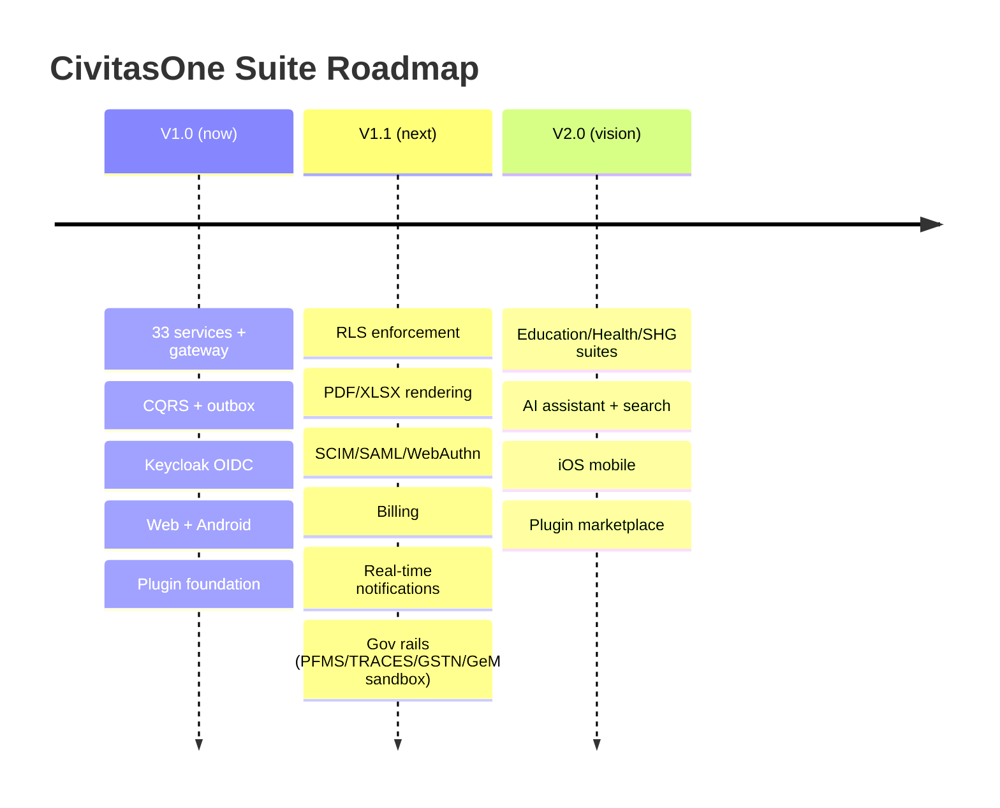

# CivitasOne Suite — Roadmap

CivitasOne Suite is an ERP platform for Indian Government departments, PSUs, Section-8
companies, cooperatives, and small offices — spanning finance, HRMS, payroll, procurement,
workflow, audit, and more across **33 microservices**, a Next.js web app, and a Flutter
mobile client.

This roadmap is public and deliberately honest. It marks what is done, what is in flight,
and what is planned — including the areas that are **not** production-ready yet.

**Status markers:** ✅ Done · 🚧 In Progress · 📋 Planned

Current release: **v0.1.0** (AGPL-3.0). This is an early, pre-production version — the V1.1
line below is explicitly about hardening it toward production.

---

## V1.0 — Current

The foundation: a working, multi-edition ERP built on a consistent CQRS + event-driven
architecture.

- ✅ **33 Fastify microservices** with a shared module anatomy (routes/commands/consumer/
  repo/schema/topics) and DB-per-service isolation.
- ✅ **API gateway** (`:8080`) — single edge with JWT verification, `/api/v1/...` routing,
  and 3-tier rate limiting (global + per-tenant + per-route class).
- ✅ **CQRS write model** — writes return `202 Accepted` with a correlation id; commands
  flow through SQS to consumers using the **outbox** pattern for reliable event emission.
- ✅ **Keycloak 24 OIDC** auth (RS256), tenant-scoped and RBAC-gated throughout.
- ✅ **Multi-edition support** — `govt`, `psu`, `private`, `ngo`, `section8`,
  `cooperative`, `small_office`.
- ✅ **Core modules** — identity, finance, HRMS, payroll, procurement, workflow, audit,
  admin (webhooks), and more.
- ✅ **Outbound webhooks** — HMAC-SHA256-signed, registered via admin-service.
- ✅ **Next.js 14 web app** (`apps/web`).
- ✅ **Flutter mobile (Android)** with offline-first encrypted-SQLite sync engine, Keycloak
  PKCE auth, biometric/PIN lock, and GPS attendance.
- ✅ **Plugin system foundation** — registry lifecycle, hooks, manifest + permissions SDK
  (`packages/plugin-sdk`), tenant-scoped and RBAC-gated.
- ✅ **Test & quality tooling** — vitest, Playwright, contract tests, k6, pino structured
  logs, CI coverage gate (80/75/65).

Known limitations at V1.0 (addressed in V1.1): row-level security not yet enforced
end-to-end, no document rendering, government-rail integrations not yet live, no real-time
notifications, and the plugin hook runtime still maturing.

---

## V1.1 — Next (pre-production hardening)

The theme of V1.1 is turning V1.0 into something you can run in production. These items
are about safety, compliance, integrations, and operability.

- 🚧 **Row-Level Security (RLS) enforcement rollout** — push tenant isolation down into the
  database with Postgres RLS across services, so isolation is enforced by the datastore,
  not just application queries.
- 🚧 **Document rendering** — server-side generation of **PDF and XLSX** artifacts
  (invoices, payslips, reports, tender documents).
- 📋 **Enterprise identity** — **SCIM** provisioning, **SAML** SSO, and **WebAuthn**
  (passkeys) alongside the existing OIDC flows.
- 📋 **Billing & provisioning** — tenant onboarding, plan/edition provisioning, and billing
  lifecycle automation.
- 📋 **Real-time notifications** — a live notification channel (in-app/web push) so users
  don't rely on polling; this also unblocks mobile FCM push.
- 📋 **Government-rail live integrations (to sandbox)** — connect to the Indian government
  financial and compliance rails in sandbox first:
  - 📋 **PFMS** (Public Financial Management System)
  - 📋 **TRACES** (TDS reconciliation)
  - 📋 **GSTN** (GST network)
  - 📋 **GeM** (Government e-Marketplace)
- 🚧 **Plugin hook runtime hardening** — stronger sandbox isolation, resource/time limits,
  and a stabilized `ctx` API surface for hooks.
- 🚧 **Mobile security hardening** — finalize PIN key-derivation (PBKDF2) parameters and
  lockout policy.

> V1.1 is where the honest gaps in V1.0 get closed. Until RLS enforcement and the
> government-rail integrations land (and mature past sandbox), treat production deployments
> as design-partner / pilot engagements, not general availability.

---

## V2.0 — Vision

V2.0 broadens CivitasOne from a horizontal ERP into vertical suites, intelligent
assistance, and a platform ecosystem.

- 📋 **Vertical suites** — domain-specific modules built on the core:
  - 📋 **Education** — institutions, admissions, academics, fees.
  - 📋 **Health** — facilities, records, supply, and health-scheme workflows.
  - 📋 **SHG / NRLM rural livelihoods** — self-help groups and rural-livelihood-mission
    workflows (member ledgers, group finance, scheme disbursements).
- 📋 **AI assistant + cross-module search** — a natural-language assistant over the suite
  and unified search that spans modules (find the invoice, the PO, the employee, the
  workflow task — in one place).
- 📋 **iOS mobile** — bring the Flutter client to iOS (Android ships first; iOS follows).
- 📋 **Marketplace / plugin store** — a distribution channel for the plugin ecosystem, so
  third parties can publish and tenants can discover, install, and manage plugins — built
  on the V1.x plugin foundation once the runtime is production-hardened.

---

## Roadmap at a glance

---

## How to read this roadmap

- **✅ Done** items are in V1.0 today and documented in the API, Development, Plugin, and
  Mobile guides.
- **🚧 In Progress** items are being actively built and their surfaces may change — pin
  versions and re-test on upgrade.
- **📋 Planned** items are committed direction but **not yet available**; do not design
  integrations that assume them.

Dates are intentionally omitted — this is a direction-of-travel document, not a delivery
commitment. Priorities, especially the ordering within V1.1 and V2.0, may shift based on
pilot feedback and compliance requirements. The one constant: we will keep the status
markers honest.
