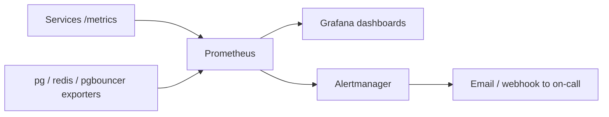

# CivitasOne Suite — Self-Hosting Guide for Government IT Teams

**Version:** 0.1.0 · **License:** AGPL-3.0 · **Audience:** Government / PSU data-centre & IT teams

This guide is written for on-prem operators — State Data Centres, NIC-managed facilities, PSU
IT wings, and cooperative/Section-8 IT staff — who will run CivitasOne inside their own
infrastructure. It covers hardware sizing, network topology, TLS, backup & disaster recovery,
monitoring, log aggregation, and upgrades.

CivitasOne is **33 Fastify microservices** + a **Next.js 14** web app + a **Flutter** mobile
app, backed by **PostgreSQL 16**, **Redis 7**, **AWS SQS** (or a compatible queue), and
**Keycloak 24** for OIDC. Each service owns its own database (`civitas_<service>`), and all
services sit behind the **gateway** edge proxy on port **8080**.

---

## 1. Hardware sizing

Sizing is driven by concurrent-user scale. The platform targets ~1000 TPS at the large tier
with p95 latency under 500 ms (GET) / 1000 ms (POST). All tiers assume PostgreSQL fronted by
**pgbouncer** (transaction mode, `:6432`) and Redis 7 as a read-through cache.

| Tier | Users | App nodes | vCPU / RAM per app node | PostgreSQL | Redis | SQS/queue | Shared storage (disk) |
|------|-------|-----------|-------------------------|------------|-------|-----------|-----------------------|
| **Small** | ≤ 5,000 | 2 (HA pair) | 8 vCPU / 16 GB | 1× 8 vCPU / 32 GB / 500 GB SSD | 1× 4 GB | Managed SQS or single-node | 500 GB–1 TB |
| **Medium** | ≤ 50,000 | 4–6 | 8 vCPU / 32 GB | Primary + 1 replica, 16 vCPU / 64 GB / 2 TB NVMe | 2× 8 GB (HA) | Managed SQS / DLQ | 2–4 TB |
| **Large** | ≤ 1,000,000 | 10+ (autoscaled) | 16 vCPU / 64 GB | Primary + 2 replicas, 32 vCPU / 128 GB / 4 TB+ NVMe | Redis cluster, 3× 16 GB | Managed SQS w/ DLQ + redrive | 8 TB+ (tiered) |

Sizing notes:

- **Database is the scaling bottleneck**, not app CPU. Give Postgres the fastest disk
  (NVMe) and the most RAM; add read replicas before adding app nodes.
- **pgbouncer** caps client connections (`max_client_conn = 500`, `default_pool_size = 20`),
  so many app pods share a small server-side pool — size Postgres `max_connections`
  accordingly (server-side pool ≪ app instance count).
- **Redis** should be sized to hold the hot working set; the cache uses TTLs from 1 s to 1 h.
- Add ~20% headroom for month-end / payroll-run spikes.

---

## 2. Network topology

Segment the deployment into a public edge zone, an application zone, and a data zone. Only
the gateway is reachable from client networks; east–west traffic is authenticated with
`INTERNAL_SERVICE_SECRET` and locked down by firewall/NetworkPolicy.

```mermaid
graph TB
    subgraph DMZ / Edge Zone
        LB[Load Balancer / TLS termination]
        GW[Gateway edge proxy :8080]
    end

    subgraph App Zone (private)
        SVC[33 Fastify services<br/>:3001-3031, :4012]
        KC[Keycloak 24 OIDC]
    end

    subgraph Data Zone (isolated)
        PGB[pgbouncer :6432]
        PG[(PostgreSQL 16<br/>primary + replicas)]
        RD[(Redis 7)]
        Q[[SQS / queue]]
    end

    Internet -->|HTTPS 443| LB --> GW
    GW -->|JWT verify| KC
    GW -->|HTTP + INTERNAL_SERVICE_SECRET| SVC
    SVC --> PGB --> PG
    SVC --> RD
    SVC --> Q
```

Firewall rules (minimum):

| From | To | Port | Notes |
|------|----|------|-------|
| Clients | Load Balancer | 443 | Only public ingress. |
| LB | Gateway | 8080 | Edge proxy. |
| Gateway | Services | 3001–3031, 4012 | East–west, secret-authenticated. |
| Services | pgbouncer | 6432 | No direct Postgres access from app zone. |
| Services | Redis | 6379 | Cache. |
| Services | SQS/queue | 443 / 4566 | AWS endpoint or on-prem broker. |
| Services / Gateway | Keycloak | 8443 | OIDC discovery + JWKS. |

Data-zone hosts should have **no route to the internet** except for the SQS endpoint (or use
a fully on-prem broker in air-gapped sites).

---

## 3. SSL/TLS setup

- **Terminate TLS at the edge** (load balancer or the gateway ingress). Client ↔ edge must be
  TLS 1.2+ (prefer 1.3).
- Use a **government CA** (e.g. an NICCA-issued certificate) for public-facing endpoints.
- **Keycloak** must be served over HTTPS; OIDC discovery and JWKS URLs must be `https://`.
  Access tokens are **RS256** — services fetch the realm's public keys from `JWKS_URI` and
  verify signatures locally (no secret shared with Keycloak).
- **Internal mTLS (recommended):** in medium/large tiers, enable mTLS or an mesh for
  east–west traffic in addition to `INTERNAL_SERVICE_SECRET`, so a compromised app-zone host
  cannot impersonate a service.
- Rotate `PII_ENC_KEY`, `INTERNAL_SERVICE_SECRET`, and `METRICS_TOKEN` on a fixed schedule;
  store them in a secrets manager / Ansible Vault, never in plain config.

---

## 4. Backup & Disaster Recovery

**Targets:** RPO ≤ 15 minutes, RTO ≤ 4 hours.

### 4.1 PostgreSQL strategy (per-database)

Because each service owns `civitas_<service>`, back up **all 32 databases**. Use a combined
logical + physical (WAL) strategy:

1. **Nightly logical dumps** — `pg_dump` per database for portable, granular restore:

   ```bash
   for db in $(psql -Atc "SELECT datname FROM pg_database WHERE datname LIKE 'civitas_%'"); do
     pg_dump -Fc -d "$db" -f "/backup/nightly/${db}_$(date +%F).dump"
   done
   ```

2. **Continuous WAL archiving** for Point-In-Time Recovery — this is what meets the
   **15-minute RPO**:

   ```ini
   # postgresql.conf
   wal_level = replica
   archive_mode = on
   archive_command = 'test ! -f /wal_archive/%f && cp %p /wal_archive/%f'
   archive_timeout = 300      # force a WAL segment at least every 5 min
   ```

   Take periodic base backups with `pg_basebackup`; replay archived WAL to any point in time
   to recover within RPO.

### 4.2 Redis

Redis holds only cache and transient state — it is **rebuildable** and does not need DR-grade
backup. Enable AOF/RDB for faster warm-up, but never treat Redis as the source of truth.

### 4.3 Queue / SQS

Configure a **dead-letter queue** with a redrive policy (provided by
`infra/aws/modules/sqs`). Messages are transient; the transactional **outbox** pattern in
services like `finance` means the durable record lives in Postgres and is relayed to the
queue, so a queue loss does not lose committed business events.

### 4.4 Audit chain

The `audit` service maintains an **append-only SHA-256 hash chain** (immutable). Back it up
like any other database, but **never restore it to an earlier state** — corrections are made
forward with compensating entries to preserve legal admissibility (see `COMPLIANCE.md`,
IT Act §65B).

### 4.5 DR runbook (meeting RTO ≤ 4h)

1. Provision standby data zone (or promote a warm replica).
2. Restore Postgres: latest base backup + WAL replay to target timestamp.
3. Start pgbouncer, Redis (cold cache is fine — it warms via read-through).
4. Roll out services via Helm (`infra/onprem/helm/civitasone`) pointed at the restored DB.
5. Verify `/ready` = 200 across all services, gateway JWKS verification, and SQS draining.
6. Run smoke checks and reconnect the load balancer.

---

## 5. Monitoring (Prometheus + Grafana)

The repository ships observability config under `infra/observability`
(**Prometheus + Grafana + Alertmanager**).

- Every service exposes `GET /metrics` in Prometheus format, guarded by `METRICS_TOKEN` or an
  internal-IP allowlist. Point Prometheus at all 33 services plus pgbouncer, Postgres, and
  Redis exporters.
- Import the shipped Grafana dashboards for per-service RED metrics (Rate, Errors, Duration).
- Alertmanager rules to configure at minimum:
  - `/ready` failing (service shedding traffic).
  - p95 latency over SLO (500 ms GET / 1000 ms POST).
  - Error rate over 1%.
  - SQS DLQ depth > 0 or queue age growing.
  - pgbouncer pool saturation / Postgres connection exhaustion.
  - Replication lag on read replicas.



---

## 6. Log aggregation (pino JSON)

All services log **structured JSON via pino 8.21**. Do not parse free-text — every line is a
JSON object with `level`, `time`, `msg`, request context, and a correlation/tenant id.

- Ship stdout to a central store (Loki, Elasticsearch/OpenSearch, or an SIEM the department
  already runs). In Kubernetes, a node-level agent (Promtail/Fluent Bit) collects container
  stdout.
- **Retention:** align with CERT-In log-retention requirements — retain security-relevant
  logs for **at least 180 days** in a rollover-protected store (see `COMPLIANCE.md`).
- Never log PII in plaintext; PII fields are AES-256-GCM encrypted at rest and should be
  redacted in logs.
- Correlate app logs with the immutable audit chain from the `audit` service for
  investigations.

---

## 7. Upgrade procedures

Upgrades follow an **expand → migrate → contract** discipline so the platform stays available.

1. **Read the release notes** for breaking migrations or env-var changes.
2. **Back up first** — logical dump + confirm WAL archiving is healthy (RPO safety net).
3. **Apply migrations** (backward-compatible / expand phase) before rolling pods:

   ```bash
   pnpm -r run db:migrate         # Drizzle, all services
   ```

4. **Roll out services** one tier at a time (core platform → business services) via
   `helm upgrade` (see `DEPLOYMENT.md` §3). Readiness probes gate each pod.
5. **Verify** `/ready`, gateway health, SQS draining, and SLOs.
6. **Contract phase** (drop deprecated columns) only after the new version is confirmed
   stable and rollback is no longer needed.

### Rollback

`helm rollback civitasone <revision>` returns to the prior image. Because migrations are
backward-compatible, app rollback is safe without reversing the schema. Full procedure and
data-safety checklist are in `DEPLOYMENT.md` §9.

---

## 8. Operational checklist

- [ ] pgbouncer in transaction mode on `:6432`; app connects only through it.
- [ ] All 32 `civitas_*` databases backed up nightly + WAL archived (RPO ≤ 15m).
- [ ] DR restore rehearsed to confirm RTO ≤ 4h.
- [ ] TLS 1.2+ at edge; Keycloak over HTTPS; RS256 JWKS reachable.
- [ ] Prometheus scraping all `/metrics`; Alertmanager routes wired.
- [ ] pino JSON logs shipped centrally; ≥180-day retention for security logs.
- [ ] `PII_ENC_KEY`, `INTERNAL_SERVICE_SECRET`, `METRICS_TOKEN` in a secrets manager, rotated.
- [ ] RLS verified: tenant data isolated via `current_tenant_id()` GUC.

---

## 9. Related documents

- `DEPLOYMENT.md` — deployment targets, env reference, migrations, rollback.
- `PERFORMANCE.md` — SLOs, pooling, caching, k6 load methodology.
- `COMPLIANCE.md` — DPDP, CERT-In, GFR-2017, CSMOP, IT Act 65B.
