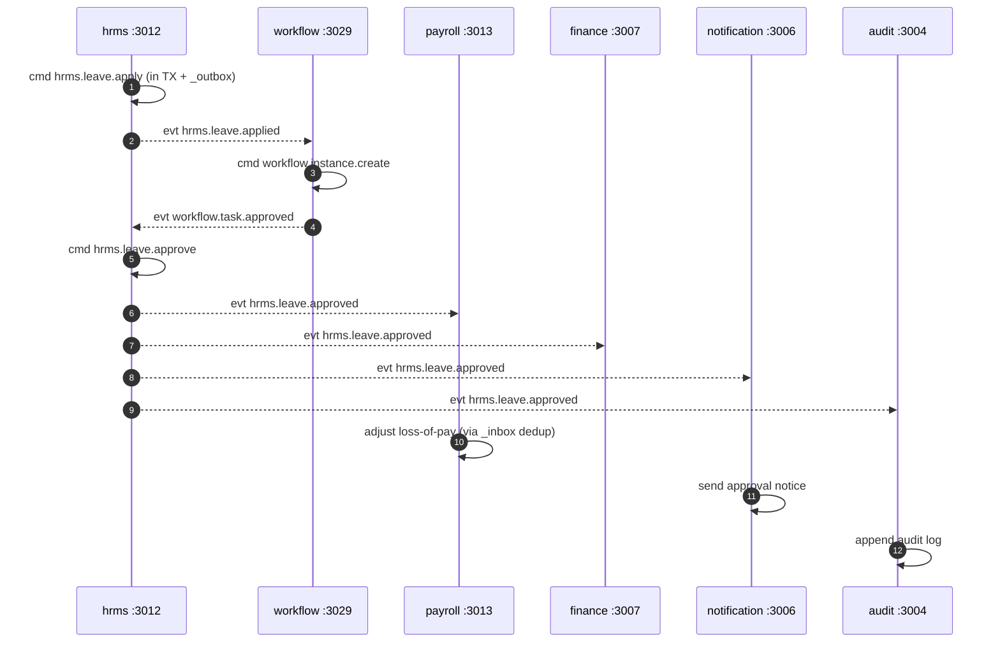

# CivitasOne Suite — Service Catalog

> **Version:** 0.1.0 · 33 Fastify microservices + Next.js 14 web + Flutter mobile
> Every service is an independently deployable Fastify 4.27 app on Node 20, owning one `civitas_<service>` database and its own SQS topic surface.

---

## 1. Shared Service Anatomy

Every service follows the same internal layout. This uniformity means once you know one service, you know them all.

| File | Responsibility |
|---|---|
| `src/routes.ts` | Registers Fastify HTTP routes under `/v1/{service}/...`. Validates request bodies with **zod**. Publishes commands; never writes domain tables directly. |
| `src/commands.ts` | Command definitions and publish helpers — one per `{service}.{aggregate}.{action}` topic. |
| `src/consumer.ts` | Durable SQS consumers. Each handler runs inside a DB transaction, writes domain tables + an `_outbox` row, and (for events) dedups via `_inbox` `markProcessed`. |
| `src/repo.ts` | Data-access layer (Drizzle queries), scoped by the request's tenant via the `app.tenant_id` GUC. |
| `src/schema.ts` | Drizzle table/schema definitions; source for numbered migrations under `migrations/`. |
| `src/shared/topics.ts` | Single source of truth for the service's messaging contract: exports `COMMANDS` and `EVENTS` objects. |
| `src/shared/` | Cross-cutting helpers (cache keys, tenant context, outbox helpers) shared within the service. |

Cross-service infrastructure (SQS transport, outbox relay, cache `getOrLoad`/`delByPrefix`, JWT verification) lives in shared workspace packages (e.g. `packages/cache`, the embedded `queue` library) so every service composes the same primitives.

---

## 2. Tier Overview

The 33 services (31 with an HTTP surface plus the embedded `queue` library and the `gateway` proxy) are grouped into four tiers by their role in the platform. Lower tiers are depended upon by higher ones; dependencies always flow **through events**, never through shared databases.

| Tier | Services | Role |
|---|---|---|
| **Core ERP** | identity, tenant, finance, hrms, payroll | Identity, tenancy, and the financial/personnel backbone every deployment needs. |
| **Domain** | procurement, contract, estab, stock, project, asset, grant, citizen, legal, crm, inventory, billing | Line-of-business capabilities for a specific department function. |
| **Supporting** | policy, audit, notification, report, telephony, helpdesk, knowledge, workflow, analytics, location | Shared operational capabilities consumed across domains. |
| **Platform** | install, plugin, theme, admin, queue, gateway | Bootstrap, extensibility, branding, administration, transport, and edge. |

---

## 3. Core ERP Tier

Foundational services other tiers depend on: identity, tenancy, and the financial/personnel backbone.

| Service | Port | Database | Purpose | Key routes | Representative topics (C=command, E=event) | Key dependencies |
|---|---|---|---|---|---|---|
| identity | 3001 | `civitas_identity` | Users, roles, RBAC, sessions | `/v1/identity/users`, `/v1/identity/roles`, `/v1/identity/sessions` | C `identity.user.create` · E `identity.user.created`, `identity.role.assigned` | Keycloak 24 (OIDC) |
| tenant | 3002 | `civitas_tenant` | Tenant lifecycle, org tree, config | `/v1/tenant/tenants`, `/v1/tenant/units`, `/v1/tenant/config` | C `tenant.tenant.provision` · E `tenant.tenant.provisioned` | identity |
| finance | 3007 | `civitas_finance` | GL, budget, treasury, payments | `/v1/finance/gl`, `/v1/finance/budget`, `/v1/finance/payments` | C `finance.budget.create` · E `finance.budget.created`, `finance.voucher.paid` | tenant, workflow, payroll |
| hrms | 3012 | `civitas_hrms` | Employee, leave, GPF, pension, claims | `/v1/hrms/employees`, `/v1/hrms/leave`, `/v1/hrms/gpf` | C `hrms.leave.apply` · E `hrms.leave.approved` | tenant, workflow, estab |
| payroll | 3013 | `civitas_payroll` | Salary runs, payslips, bank mandates | `/v1/payroll/runs`, `/v1/payroll/payslips` | C `payroll.run.execute` · E `payroll.run.completed` | hrms, finance |

---

## 3. Domain Tier

Line-of-business services delivering department-specific functionality.

| Service | Port | Database | Purpose | Key routes | Representative topics | Key dependencies |
|---|---|---|---|---|---|---|
| procurement | 3008 | `civitas_procurement` | Tenders, bids, awards, vendors | `/v1/procurement/tenders`, `/v1/procurement/bids` | C `procurement.tender.award` · E `procurement.tender.awarded` | workflow, contract, finance |
| contract | 3009 | `civitas_contract` | Contract lifecycle, milestones | `/v1/contract/contracts`, `/v1/contract/milestones` | C `contract.contract.sign` · E `contract.contract.signed` | procurement, finance |
| estab | 3010 | `civitas_estab` | Establishment: posts, postings, seniority | `/v1/estab/posts`, `/v1/estab/postings` | C `estab.posting.order` · E `estab.posting.ordered` | hrms |
| stock | 3011 | `civitas_stock` | Stores/stock ledgers, issues, receipts | `/v1/stock/items`, `/v1/stock/issues` | C `stock.issue.raise` · E `stock.issue.raised` | inventory, finance |
| project | 3014 | `civitas_project` | Projects, tasks, physical progress | `/v1/project/projects`, `/v1/project/tasks` | C `project.task.create` · E `project.milestone.reached` | finance, workflow |
| asset | 3015 | `civitas_asset` | Fixed-asset register, depreciation, disposal | `/v1/asset/register`, `/v1/asset/disposal` | C `asset.disposal.file_decided` · E `asset.disposal.decided` | finance, workflow |
| grant | 3019 | `civitas_grant` | Grant schemes, sanctions, utilization | `/v1/grant/schemes`, `/v1/grant/sanctions` | C `grant.sanction.approve` · E `grant.sanction.approved` | finance, workflow |
| citizen | 3020 | `civitas_citizen` | RTI, grievances, citizen services | `/v1/citizen/rti`, `/v1/citizen/grievances` | C `citizen.rti.transfer` · E `citizen.rti.transferred` | workflow, notification |
| legal | 3021 | `civitas_legal` | Cases, hearings, legal opinions | `/v1/legal/cases`, `/v1/legal/hearings` | C `legal.case.file` · E `legal.case.filed` | workflow, notification |
| crm | 3024 | `civitas_crm` | Contacts, leads, engagements | `/v1/crm/contacts`, `/v1/crm/leads` | C `crm.lead.convert` · E `crm.lead.converted` | notification |
| inventory | 3025 | `civitas_inventory` | Item master, warehouses, stock levels | `/v1/inventory/items`, `/v1/inventory/warehouses` | C `inventory.item.adjust` · E `inventory.stock.adjusted` | stock |
| billing | 3023 | `civitas_billing` | Checkout, invoicing, subscriptions | `/v1/billing/checkout`, `/v1/billing/invoices` | C `billing.checkout.verify` · E `billing.checkout.verified` | tenant, notification |

---

## 4. Supporting Tier

Shared operational capabilities consumed across domains.

| Service | Port | Database | Purpose | Key routes | Representative topics | Key dependencies |
|---|---|---|---|---|---|---|
| policy | 3003 | `civitas_policy` | Authorization policies, entitlements | `/v1/policy/policies`, `/v1/policy/checks` | C `policy.policy.publish` · E `policy.policy.published` | identity |
| audit | 3004 | `civitas_audit` | Immutable, append-only audit trail | `/v1/audit/events`, `/v1/audit/search` | E `audit.event.recorded` (subscribes broadly to `*.{pastTense}`) | all services |
| notification | 3006 | `civitas_notification` | Email/SMS/push dispatch, templates | `/v1/notification/send`, `/v1/notification/templates` | C `notification.message.send` · E `notification.message.sent` | identity |
| report | 3016 | `civitas_report` | Report definitions, scheduled runs | `/v1/report/definitions`, `/v1/report/runs` | C `report.run.request` · E `report.run.generated` | analytics, finance, hrms |
| telephony | 3026 | `civitas_telephony` | Call logging, IVR, click-to-call | `/v1/telephony/calls`, `/v1/telephony/ivr` | C `telephony.call.dial` · E `telephony.call.completed` | crm, helpdesk |
| helpdesk | 3027 | `civitas_helpdesk` | Support tickets, SLAs, queues | `/v1/helpdesk/tickets`, `/v1/helpdesk/queues` | C `helpdesk.ticket.open` · E `helpdesk.ticket.resolved` | notification, knowledge |
| knowledge | 3028 | `civitas_knowledge` | Knowledge base, articles, search | `/v1/knowledge/articles`, `/v1/knowledge/search` | C `knowledge.article.publish` · E `knowledge.article.published` | — |
| workflow | 3029 | `civitas_workflow` | Approval orchestration engine | `/v1/workflow/instances`, `/v1/workflow/tasks` | C `workflow.instance.create` · E `workflow.instance.created`, `workflow.task.approved` | identity, notification |
| analytics | 3031 | `civitas_analytics` | Metrics, aggregations, dashboards | `/v1/analytics/metrics`, `/v1/analytics/dashboards` | E `analytics.metric.rolled_up` (subscribes broadly) | all domain services |
| location | 4012 | `civitas_location` | Geocoding, admin boundaries, GIS | `/v1/location/geocode`, `/v1/location/boundaries` | C `location.geocode.request` · E `location.geocode.resolved` | — |

---

## 5. Platform Tier

Infrastructure and configuration services, plus the non-database components.

| Service | Port | Database | Purpose | Key routes | Representative topics | Key dependencies |
|---|---|---|---|---|---|---|
| install | 3005 | `civitas_install` | Installation, bootstrap, seed | `/v1/install/setup`, `/v1/install/seed` | C `install.instance.bootstrap` · E `install.instance.ready` | tenant, identity |
| plugin | 3017 | `civitas_plugin` | Plugin registry, enablement | `/v1/plugin/registry`, `/v1/plugin/enable` | C `plugin.plugin.enable` · E `plugin.plugin.enabled` | tenant |
| theme | 3018 | `civitas_theme` | Theming, branding per tenant | `/v1/theme/themes`, `/v1/theme/branding` | C `theme.theme.apply` · E `theme.theme.applied` | tenant |
| admin | 3022 | `civitas_admin` | Cross-service admin console backend | `/v1/admin/services`, `/v1/admin/health` | C `admin.action.execute` · E `admin.action.executed` | all services |
| queue | — (embedded lib) | — | SQS transport + outbox relay library | in-process API | — (provides publish/consume primitives) | AWS SQS |
| gateway | 8080 (proxy) | — | Edge proxy: JWT verify, header strip, routing | proxies `/v1/*` | — | Keycloak, all services |

**Notes on non-database components**

- **queue** is not a standalone service — it is the embedded library that every service composes to publish/consume SQS topics and to run the transactional outbox relay. It owns no `civitas_` database.
- **gateway** is a stateless Fastify proxy on port `8080`. It verifies RS256 JWTs against Keycloak's JWKS (validating `iss` and `aud`), strips spoofable internal identity headers from inbound client requests, and forwards to services with an `x-service-secret` header (constant-time compared, fail-closed). It owns no database.

---

## 6. Route & Topic Conventions

- **Routes:** all HTTP endpoints are versioned and namespaced as `/v1/{service}/{resource}` and are only reachable through the gateway.
- **Commands:** `{service}.{aggregate}.{action}` — imperative, e.g. `finance.budget.create`, `procurement.tender.award`, `citizen.rti.transfer`, `workflow.instance.create`, `asset.disposal.file_decided`.
- **Events:** `{service}.{aggregate}.{pastTense}` — factual, e.g. `hrms.leave.approved`, `finance.budget.created`, `procurement.tender.awarded`, `billing.checkout.verified`, `citizen.rti.transferred`.
- Each service declares both sets in `src/shared/topics.ts` (`COMMANDS`, `EVENTS`). A service publishes only its own commands/events and subscribes to others' events; it never invokes another service's command topic directly.

---

## 7. Representative Cross-Service Interaction

An HRMS leave approval that touches workflow, payroll, finance, notification, and audit:

Each subscriber records the event in its `_inbox` (`markProcessed` → `INSERT ... ON CONFLICT DO NOTHING`) before reacting, so redelivery is idempotent (exactly-once effect).

---

*For the data model see `DATABASE-SCHEMA.md`; for architecture and messaging patterns see `ARCHITECTURE.md`.*
