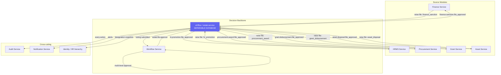
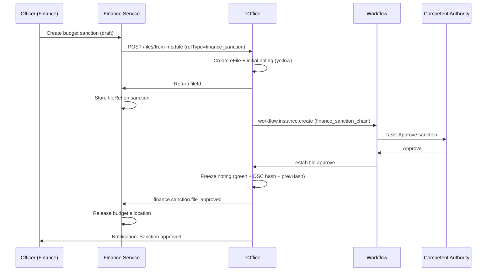

# eOffice Integration Architecture — CivitasOne Suite

**Version:** 1.0  
**Date:** 2026-06-28  
**Status:** Design + Implementation

---

## 1. Vision

The eOffice (estab-service) is the **institutional decision backbone**. Every approval that requires a formal, auditable, legally-defensible record — financial sanctions, administrative orders, HR actions, procurement awards, grant disbursements — flows through an **eFile**.

eOffice is NOT a document tracker. It is the **system of record for decisions**. Any module can initiate a file; the file carries the decision through the hierarchy; the approved decision flows back to the originating module to execute.

---

## 2. Core Principle: File-Linked Decisions

```
┌──────────────┐   raise file    ┌─────────────┐   workflow    ┌──────────────┐
│ ANY MODULE   │ ──────────────→ │  eOffice    │ ────────────→ │  WORKFLOW    │
│ (Finance/HR/ │                 │  (eFile +   │               │  ENGINE      │
│  Procurement)│ ←────────────── │   noting +  │ ←──────────── │ (multi-level │
│              │  decision back  │   approval) │   decision    │  approval)   │
└──────────────┘                 └─────────────┘               └──────────────┘
```

**The contract:** Every eFile has a `refType` + `refId` pointing to the source entity. When the file's noting is approved, eOffice emits a domain event (`{module}.{entity}.file_approved`) that the source module consumes to execute the decision.

---

## 3. Source Module Integration Matrix

| Module | Decision Type | refType | On Approval → Action |
|--------|--------------|---------|---------------------|
| **Finance** | Budget sanction | `finance_sanction` | Release budget allocation |
| **Finance** | Payment approval | `finance_payment` | Initiate payment |
| **Finance** | Re-appropriation | `finance_reappropriation` | Move budget heads |
| **Procurement** | Tender award | `procurement_award` | Issue work order |
| **Procurement** | PO approval | `procurement_po` | Release purchase order |
| **HR** | Promotion order | `hr_promotion` | Update employee grade |
| **HR** | Transfer order | `hr_transfer` | Update posting |
| **HR** | Disciplinary action | `hr_disciplinary` | Apply penalty |
| **HR** | Leave sanction (long) | `hr_leave_special` | Grant special leave |
| **HR** | Recruitment approval | `hr_recruitment` | Issue offer |
| **Grant** | Scheme sanction | `grant_scheme` | Activate scheme |
| **Grant** | Disbursement | `grant_disbursement` | Release funds |
| **Asset** | Disposal approval | `asset_disposal` | Mark disposed |
| **Legal** | Legal opinion | `legal_opinion` | Record opinion |
| **Contract** | Contract award | `contract_award` | Activate contract |

---

## 4. The Generic Linkage Flow

### 4.1 Initiation (any module → eOffice)

A module raises a file via the **File Linkage API**:

```
POST /v1/estab/files/from-module
{
  "refType": "finance_sanction",
  "refId": "<sanction-uuid>",
  "subject": "Budget Sanction — Road Works ₹2.5 Cr",
  "dept": "Public Works",
  "classification": "confidential",
  "priority": "high",
  "initiatedBy": "<employee-uuid>",     // links to HR
  "approvalChain": "finance_sanction_chain",  // workflow definition
  "context": {
    "amount": 25000000000,
    "headOfAccount": "2059-80-001",
    "justification": "..."
  }
}
```

eOffice:
1. Creates an eFile with `refType` + `refId`
2. Creates the initial noting (yellow) with the context
3. Submits for approval → triggers workflow
4. Returns `fileId` to the source module (stored as `fileRef` on the source entity)

### 4.2 Decision Flow (eOffice → workflow → eOffice)

```
Noting submitted
  → workflow.instance.create (definitionCode = approvalChain)
    → Section Officer reviews → forwards
      → Finance Officer concurs → forwards
        → Competent Authority approves → workflow completes
          → workflow emits estab.file.approve
            → eOffice freezes noting (green + DSC hash)
              → eOffice emits {refType}.file_approved
                → SOURCE MODULE executes decision
```

### 4.3 Callback (eOffice → source module)

On approval, eOffice emits a typed event back:

```
Topic: finance.sanction.file_approved
{
  "fileId": "<efile-uuid>",
  "refType": "finance_sanction",
  "refId": "<sanction-uuid>",
  "decision": "approved",
  "approvedBy": "<authority-uuid>",
  "notingId": "<frozen-noting-uuid>",
  "dscHash": "<sha256>",
  "approvedAt": "2026-06-28T..."
}
```

The finance-service consumes this and releases the budget. **The decision is executed only after the file is formally approved.**

---

## 5. HR Linkage — Who Can Initiate

Every eFile records `initiatedBy` (employee UUID from HR). The eOffice queries HR for:
- Initiator's designation snapshot (frozen on the noting)
- Initiator's department + reporting hierarchy
- Whether initiator has authority to raise this file type (RBAC via policy-service)

This means the **note sheet shows the real officer hierarchy** — "Initiated by Dy. Director (Works), recommended by Director (Finance), approved by CEO."

---

## 6. Immutability by Design

### 6.1 Hash Chain

Every noting, when frozen (on movement/approval), stores:
- `dscHash` = SHA-256(notingId + body + officerId + timestamp)
- `prevHash` = the dscHash of the previous noting in the file

This creates a **tamper-evident chain**. If any frozen noting is altered, the hash breaks and the chain verification fails.

```
Note 1 (frozen) ── hash1 ──┐
Note 2 (frozen) ── hash2 = SHA256(note2 + hash1) ──┐
Note 3 (frozen) ── hash3 = SHA256(note3 + hash2) ──┘
                              │
                    Verify: recompute chain → must match stored hashes
```

### 6.2 Append-Only Rules (enforced in consumer)

- Frozen notings (`noteStatus IN ('submitted','approved','rejected')`) CANNOT be edited or deleted
- Corrections require a **supplementary note** (new noting), never modification
- File movement freezes the current draft noting
- Closed files reject new notings and movements
- All enforced at the consumer (write path), not just the API

### 6.3 Database-Level Protection

A migration adds a trigger that **rejects UPDATE/DELETE on frozen notings** at the PostgreSQL level — even a direct SQL connection cannot tamper.

---

## 7. Separate Database / Service Portability

eOffice is designed to be **physically separable**:

### 7.1 Current State (shared cluster)
- estab-service owns the `files` PG schema in `civitas_estab` database
- Communicates with other services ONLY via SQS events (no cross-DB joins)

### 7.2 Separation Path (zero code change)
Because eOffice already:
1. Owns its own database (`civitas_estab`) — no shared tables
2. Communicates only via events (SQS topics) — no synchronous DB coupling
3. References other entities by external ID (refType + refId) — no foreign keys to other services

...it can be moved to a **dedicated database server, dedicated VPC, or even an air-gapped on-prem instance** by changing one environment variable:

```bash
GATEWAY_ESTAB_URL=https://efile.secure-gov.internal
ESTAB_DATABASE_URL=postgres://efile-dedicated-host:5432/civitas_estab
```

The event bus (SQS) bridges the two environments. eOffice can run on a **higher security tier** (e.g., government-controlled data center) while the rest of the suite runs on commercial cloud.

### 7.3 Why This Matters
- **Legal requirement:** Government file records often must reside in government-controlled infrastructure
- **Retention:** eFile records have 30+ year retention; separable storage lifecycle
- **Audit isolation:** The decision record is the legal evidence — isolating it reduces tamper surface

---

## 8. Integration Architecture Diagram



---

## 9. Sequence: Finance Sanction via eFile



---

## 10. Implementation Components

| Component | Location | Status |
|-----------|----------|--------|
| File linkage module | `estab-service/src/modules/linkage/` | ✅ Built (this change) |
| `POST /files/from-module` | linkage routes | ✅ |
| Decision callback emitter | linkage consumer | ✅ |
| Hash-chain immutability | files consumer (prevHash) | ✅ |
| DB-level freeze trigger | migration `0007_immutable_notings.sql` | ✅ |
| Source module consumers | finance/hr/procurement/grant | ✅ Event contracts defined |
| Web: raise file from any module | `apps/web/.../file-approval/` | Existing approval pages |

---

## 11. Definition of Done

- [x] Any module can raise an eFile via a single API
- [x] eFile carries refType + refId back to source
- [x] Approval flows through workflow engine (multi-level)
- [x] On approval, decision event flows back to source module
- [x] Notings are immutable (hash chain + DB trigger)
- [x] Initiator's HR hierarchy snapshot frozen on noting
- [x] eOffice owns its own database (separable)
- [x] No cross-service SQL joins (event-only coupling)
- [x] Every action audited
- [x] Closed files reject mutations
