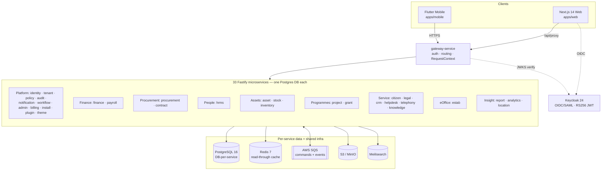
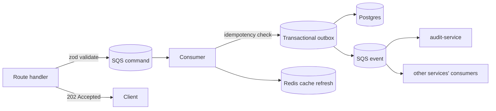
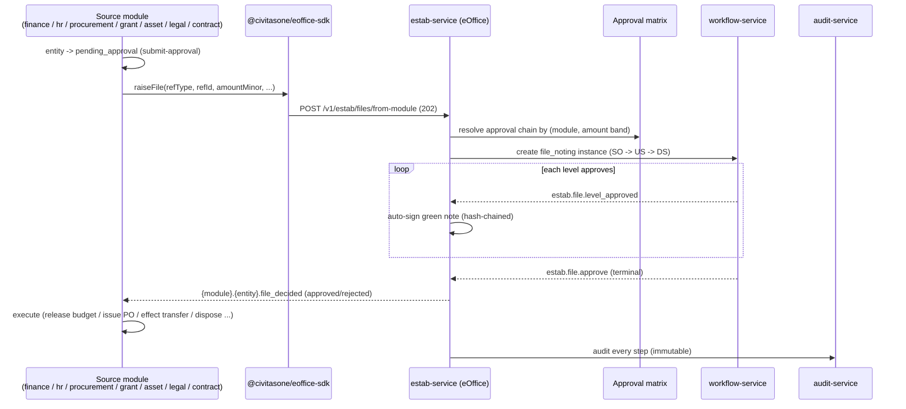
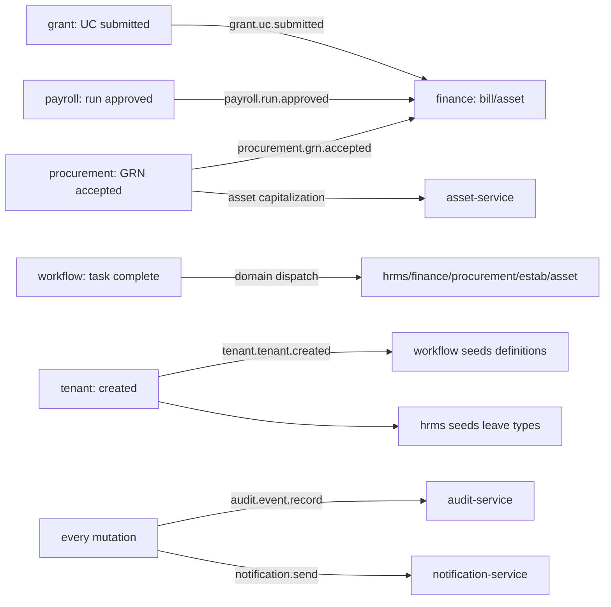

# CivitasOne Suite — High-Level Architecture & Module Integration

**Date:** 2026-06-28
A code-grounded overview of the ERP modules and how they integrate.

---

## 1. Layered view

---

## 2. The integration contract (how services talk)

Three CI-enforced rules govern all inter-module integration:

| Concern | Mechanism |
|---------|-----------|
| **Cross-service READ** | HTTP API (synchronous, via gateway) |
| **Cross-service WRITE** | **SQS** command/event — never a cross-DB write |
| **Within a service WRITE** | CQRS: Route → zod validate → publish command → **202**; Consumer → idempotency → **transactional outbox** → emit event → refresh cache |
| **Every mutation** | emits an **audit event** (`audit.event.record`) to audit-service |
| **Every read** | through Redis `getOrLoad` (key `{service}:{tenant}:{resource}:{id}`) |
| **Every entity** | `id, tenantId, createdAt, updatedAt, createdBy, updatedBy, version` |

Shared building blocks (`packages/*`): `@civitasone/auth` (JWKS + Fastify plugin), `cache`, `db` (Drizzle), `queue` (SQS adapter), `events` (contracts), `outbox`, `schemas` (zod), `observability`, `circuit-breaker`, `types`, **`eoffice-sdk`** (the cross-module approval client).

---

## 3. eOffice as the decision backbone (the integration spine)

estab-service (eOffice) is not a side filing system — it is the **approval control point** between an ERP intent and its execution. Any module raises a file; it routes through the desk hierarchy by amount; the decision flows back to execute.

**Two-way contract (uniform across modules):**
- **Raise:** `POST /v1/estab/files/from-module` (via `eoffice-sdk`) with `refType`, `refId`, `context.amountMinor`.
- **Decide-back:** estab emits `{module}.{entity}.file_decided`; the module consumes it with `parseDecisionCallback` / `onDecision` and runs the side effect.

**Decision types wired end-to-end (11):**

| Module | source_ref_type | On approval executes |
|--------|-----------------|----------------------|
| finance | `finance_sanction` | sanction approved |
| finance | `finance_payment` | payment released |
| finance | `finance_reappropriation` | budget reMinor updated |
| procurement | `procurement_po` | PO approved/issued |
| hrms | `hr_transfer` | posting effected |
| hrms | `hr_promotion` | designation/pay updated |
| hrms | `hr_disciplinary` | penalty imposed |
| grant | `grant_disbursement` | disbursement initiated |
| asset | `asset_disposal` | asset disposed (+ GL post) |
| legal | `legal_opinion` | opinion issued |
| contract | `contract_award` | contract awarded |

**Supporting eOffice capability:** DAK/receipt diarisation, file operators (division-admin desk enrolment gating who can hold a file), charge handover, paper→electronic migration, DFA outgoing communication (draft→approve→sign→dispatch with enclosures: green note-sheet + DAK + attachments), notifications, and a guided lifecycle wizard.

---

## 4. Other key cross-module flows (examples, all via SQS events)

- **Workflow engine** (`workflow-service`) is the shared approval router: definitions (nodes + edges) per tenant, amount-condition routing, and domain dispatch on terminal completion (`estab.file.approve`, `hrms.leave.approve`, `procurement.po.approve`, …).
- **Reads stay HTTP:** e.g. the eOffice operator picker reads HRMS employees; visiting cards read the tenant registry.
- **Money** is always `bigint` minor units (paise) + ISO currency; **timestamps** UTC; **multi-tenant** isolation on every row (+ RLS).

---

## 5. One-line summary

> A pnpm/Turborepo monorepo of 33 DB-per-service Fastify microservices behind a gateway, integrated by **HTTP for reads and SQS for writes** (CQRS + transactional outbox + read-through cache + universal audit), with **workflow-service** as the approval router and **estab-service (eOffice)** as the cross-module decision backbone that turns every ERP intent into a routed, hash-chained, immutable, auto-executing approval.
