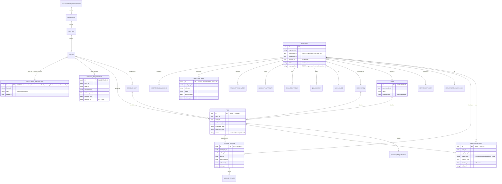
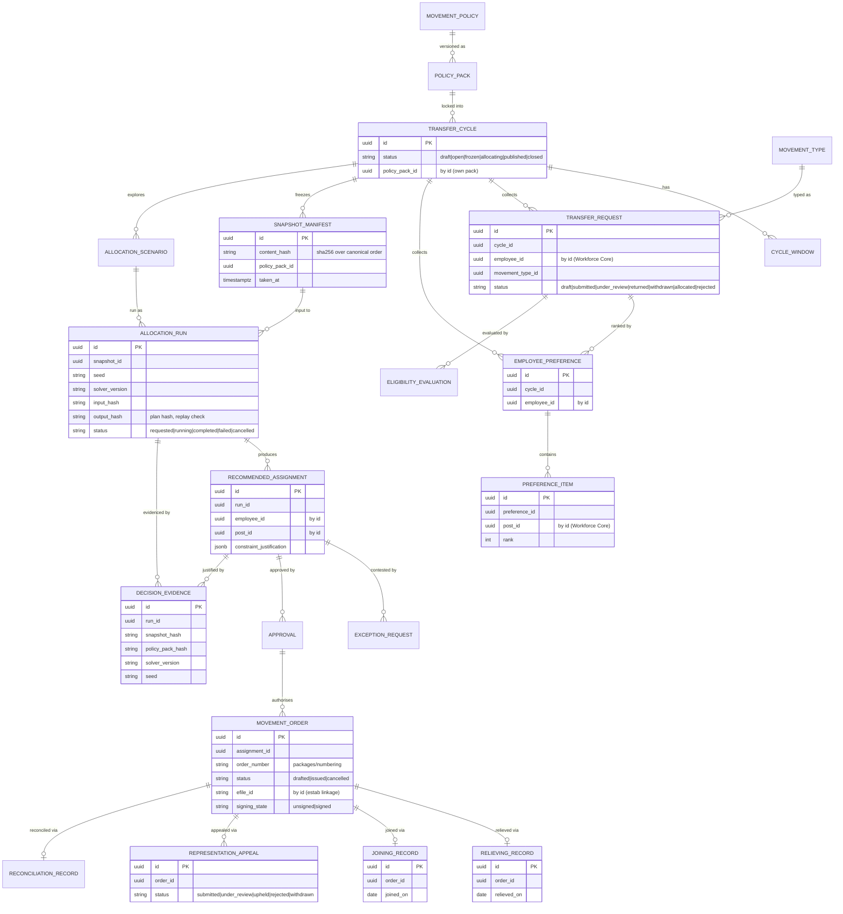
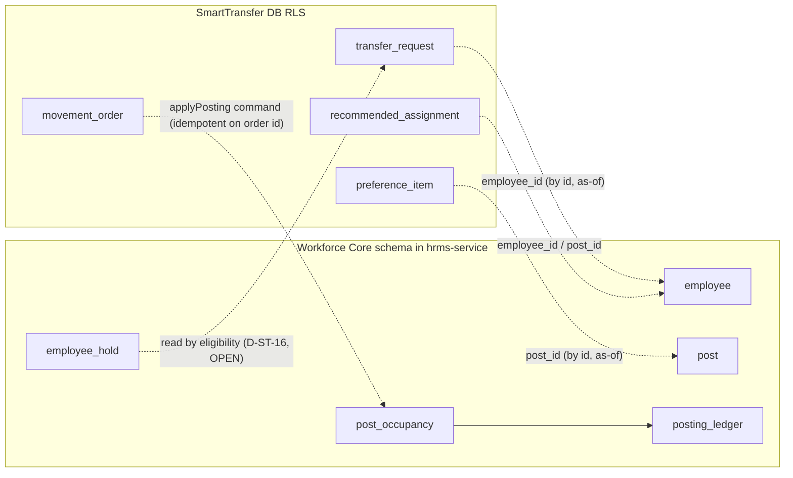

# SmartTransfer OS — ER model

> Spec §4 (Universal domain model) and §19 deliverable 7. Baseline: `origin/main` `9d4fa95e5`.
>
> **Reading rules (CLAUDE.md §3, docs/ARCHITECTURE.md §5):** this is a *logical* model. Entities are grouped by
> **owning service**. There are **no cross-service foreign keys**: SmartTransfer references Workforce Core / location
> entities **by opaque id + as-of version only** (shown as dotted relationships labelled `by id`). Every entity carries
> the standard columns `id, tenant_id, created_at, updated_at, created_by, updated_by, version` (CLAUDE.md §3.6); these
> are omitted from the diagrams for readability. Every table is **FORCE RLS** on `tenant_id`.
>
> Entities marked **(BUILD)** do not exist on `origin/main` and are delivered by later M01 PRs (07, 09, 12). Entities
> marked **(EXISTS)** are current rows cited by `path:line`.

## 1. Workforce Core (module profile of `hrms-service`, own schema)

Owns people, posts, occupancy, cadre and the office tree ([ADR-0001](adr/0001-post-and-occupancy-owner.md),
[ADR-0002](adr/0002-office-hierarchy-owner.md), [ADR-0003](adr/0003-cadre-master-owner.md),
[ADR-0023](adr/0023-standalone-packaging.md)). New tables live in their own schema so they are liftable later.

**Occupancy invariant (hard):** at most one `POST_OCCUPANCY` row with `charge_type = 'substantive'` and
`effective_to IS NULL` per `(tenant_id, post_id)`. This mirrors the prior-art partial unique index
`uniq_postings_substantive` on `hierarchy.postings` (`location-service/migrations/0005a_org_model.sql:159-161`),
enforced on the new `post_occupancy` table in ST-M01-07.

**Legacy fragments** being made derived/retired under D-ST-01: `manpower.plans` (`manpower-planning/schema.ts:8-27`),
`reservation.hrms_sanctioned_posts` (migration `0022:194`), `tenant.positions` (`positions/schema.ts:5-20`),
and `hierarchy.positions/postings` (prior art). See [ADR-0001](adr/0001-post-and-occupancy-owner.md).

## 2. SmartTransfer (movement entities, `services/smarttransfer-service`)

Owns only the movement entities and references Workforce Core / location by opaque id + as-of version
([ADR-0010](adr/0010-hrms-write-boundary.md); M00 §6.2). Built from ST-M01-12 onward.

## 3. Cross-service reference boundary (by id, never FK)

Writes from SmartTransfer into Workforce Core happen **only** through the `applyPosting` command
([ADR-0010](adr/0010-hrms-write-boundary.md)); reads are through `getOrLoad` over internal HTTP or a frozen snapshot
(M00 §6.1–§6.2). No money fields appear in C0; any that are added later (e.g. a payroll reconciliation record under
D-ST-13/14, **OPEN**) must be `bigint` minor units + ISO 4217 (CLAUDE.md §3.11).
