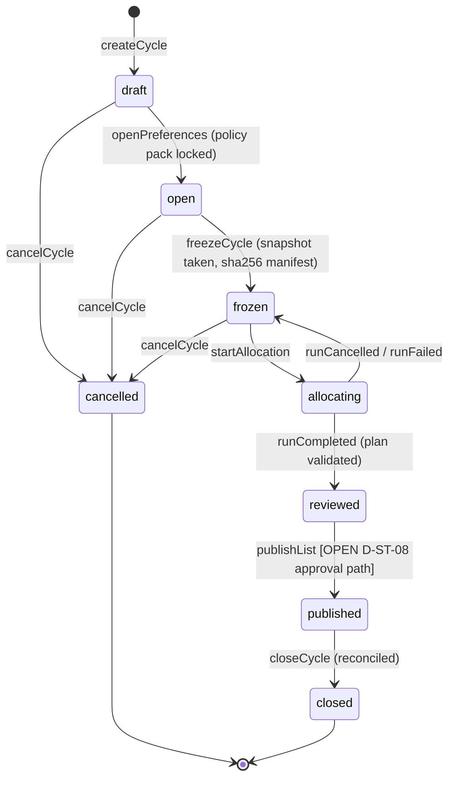
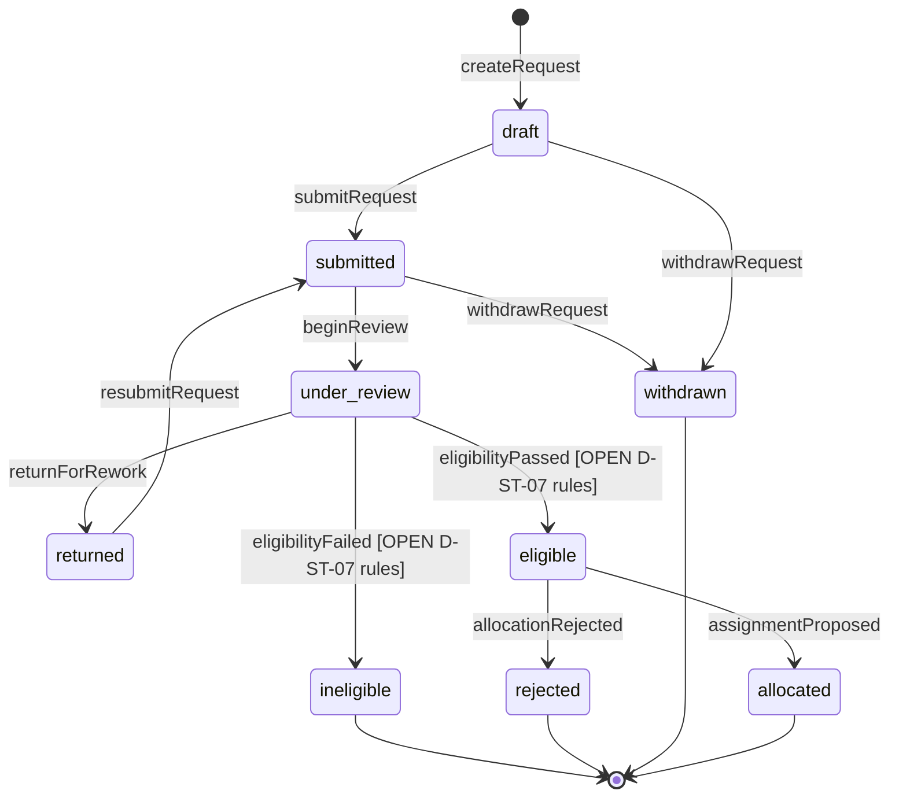
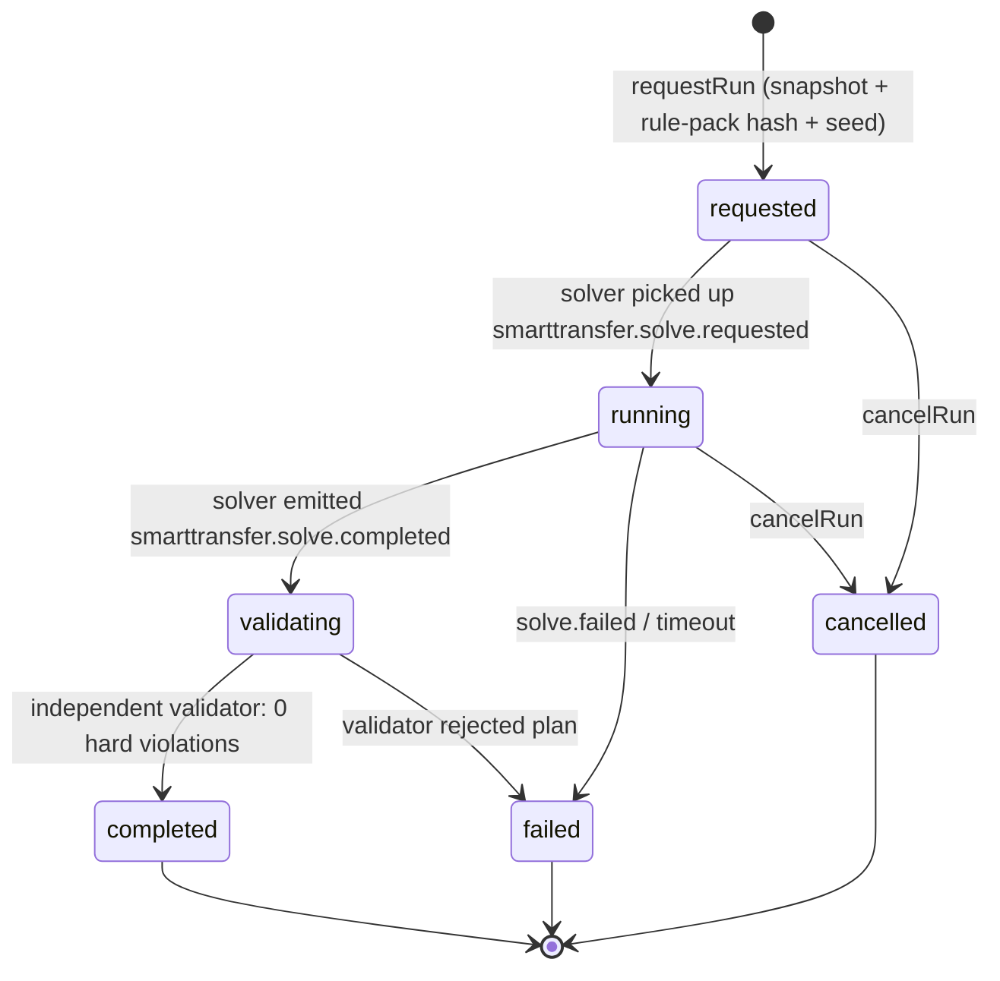
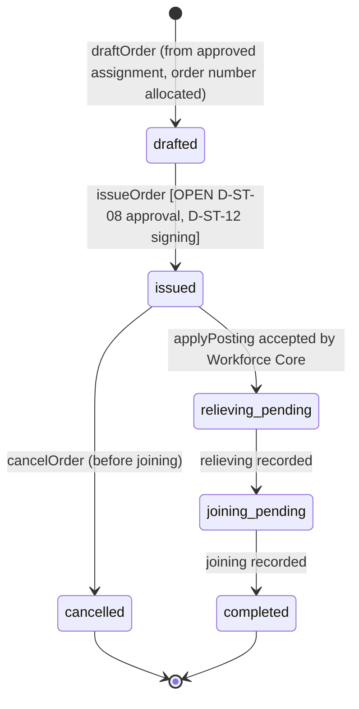
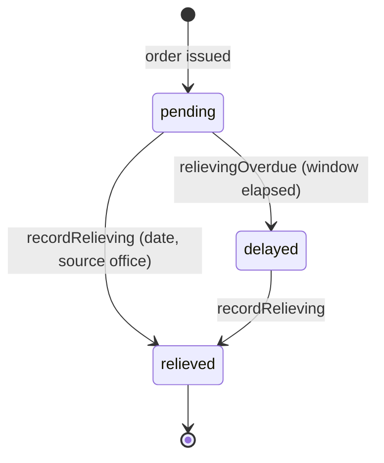
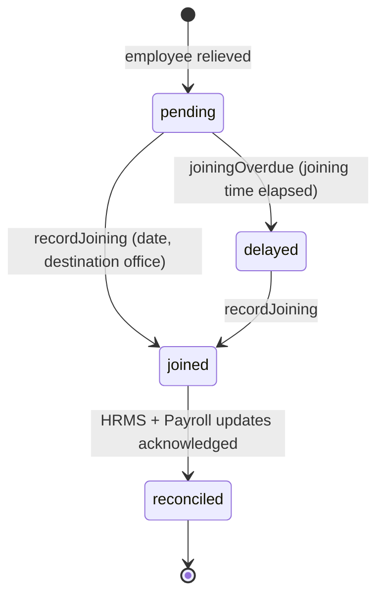
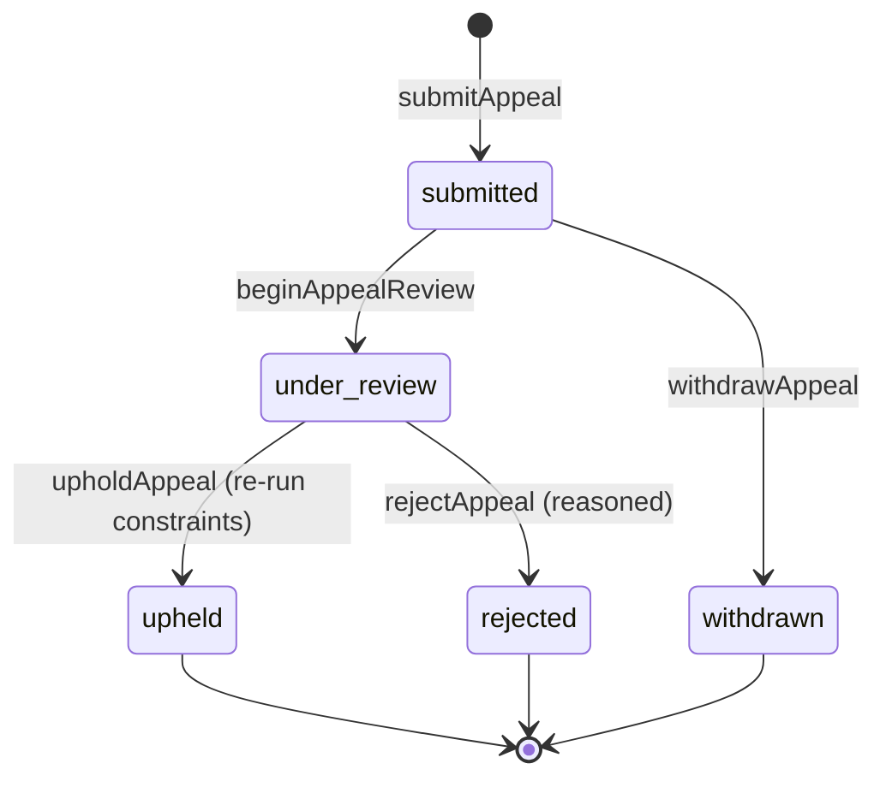

# SmartTransfer OS — state machines

> Spec §4 (state-transition authority), §10 (command-centre screens), §18 (M01), §19 deliverable 8.
> Baseline: `origin/main` `9d4fa95e5`.
>
> Each machine lists its **owning service** and **transition authority**. Transitions that depend on a **PROPOSED**
> decision are marked `[OPEN D-ST-NN]` and are **not** frozen here — they show the intended shape only; see
> [open-items.md](open-items.md). Every transition is driven by the write path route → zod → command (`messageId`) →
> 202 → consumer (CLAUDE.md §6), and every transition writes an `audit.event.record` in the same transaction.

## Cycle

Owner: SmartTransfer. Authority: HR admin for setup/freeze; competent authority for publish/close.

Notes:
- The **policy pack is locked** at `open` and its id+hash is recorded on the cycle (spec §10 screen 4 "Policy Selection
  and Version Lock"). The rule-pack engine itself is **OPEN** (D-ST-07).
- `freezeCycle` writes an immutable snapshot (spec §7.3; M00 §6.4). The snapshot depends on the posting ledger's as-of
  capability (ST-M01-07).
- `publishList` requires competent-authority approval. The approval path (eOffice linkage vs. workflow) is **OPEN**
  (D-ST-08); the diagram shows the state, not the mechanism.

## Transfer request

Owner: SmartTransfer. Authority: employee (submit/withdraw); HR admin (review/return); system (allocate/reject).
SmartTransfer holds its own request state and does **not** rely on workflow callbacks for a visible `returned` state
(M00 §1A, FF-11).

Notes:
- `eligible` / `ineligible` carry rule-citation reason codes (spec §6, §7.1 stage 1). The evaluation engine is **OPEN**
  (D-ST-07); eligibility reads holds (**OPEN** D-ST-16).
- A request can be withdrawn only before allocation.

## Allocation run

Owner: SmartTransfer (coordinates); the solver is a separate stateless service (M00 §4.1). Authority: HR admin.

Notes:
- Determinism/replay: same snapshot + rule-pack hash + seed must yield a byte-identical `output_hash` over three runs
  (spec §7.3). The solver **runtime** is **OPEN** (D-ST-05/06); the state machine is independent of the chosen engine
  because it sits behind the `SolverPort` (M00 §4.1).
- `validating` runs an **independent** hard-constraint recheck (spec §7.1 stage 5); a plan that fails cannot be used for
  orders.

## Movement order

Owner: SmartTransfer. Authority: competent authority (issue); HR admin (cancel). The `applyPosting` command into
Workforce Core fires on `issued` ([ADR-0010](adr/0010-hrms-write-boundary.md)).

Notes:
- `issueOrder` depends on the approval path (**OPEN** D-ST-08) and legally valid signing (**OPEN** D-ST-12). Until
  signing credentials exist, orders are stamped **"system generated, not digitally signed"** (D-ST-12 interim).
- Issuing an order triggers the idempotent `applyPosting` command (idempotent on order id, ST-M01-09). SmartTransfer
  never writes the posting itself ([ADR-0010](adr/0010-hrms-write-boundary.md)).
- Order numbers come from `packages/numbering` with SmartTransfer's own counter table (M00 §2).

## Relieving record

Owner: SmartTransfer. Authority: source office.

Notes:
- `delayed` is the "delayed relieving" scenario (spec §16). The overdue window itself is a policy value and is **OPEN**
  (D-ST-18); the state exists regardless.

## Joining record

Owner: SmartTransfer. Authority: destination office. A joining is the **actual physical joining** placement kind
(spec §4), distinct from the substantive appointment.

Notes:
- Joining time / delayed-joining pay and the payroll effect are **OPEN** (D-ST-13/14).
- `reconciled` is reached when the posting event has been consumed by HRMS/Payroll (reconciliation record). Payroll
  consumption is **OPEN** (D-ST-13).

## Appeal (representation)

Owner: SmartTransfer. Authority: appellate authority. Appeals are first-class (M00 §11 R13).

Notes:
- An upheld appeal re-runs constraints and may create a new assignment/order; the override governance (reason codes,
  dual approval, windows) is **OPEN** (D-ST-18).
- Every appeal transition records reasoned, audited evidence (no raw `e.message` to users; CLAUDE.md §4).
