# D02 — Current Architecture: District Governance Lens
_Lane L01 · Generated 2026-07-13 · Branch: court-management-service_

> **BUILDS ON** (do not re-read): `02-architecture-discovery.md`, `04-dependency-map.md`, `08-tenant-isolation-report.md`.
> This document applies the **district federation lens** to findings already established in those reports.

---

## 1. Architecture Classification [VERIFIED]

**Class: MICROSERVICES (event-choreographed) with DB-per-service — genuine, not distributed-monolith.**

| Test | Result | Evidence |
|------|--------|----------|
| Per-service packages | ✓ 38 `services/*` dirs, each with own `package.json`, `Dockerfile`, `migrations/` | `ls /tmp/cms-wt/services/` → 38 entries |
| Per-service DB | ✓ 35 `civitas_*` DBs, each with dedicated `*_svc` login | `docker exec civitasone-postgres psql … \l` → 35 rows |
| Per-service least-priv role | ✓ `civitas_court` owned by `civitas_admin`; `court_svc` role NOSUPERUSER NOBYPASSRLS exists | `court-service/integration/README.md:25`, live `\l` output |
| Cross-DB coupling | **0 violations** | `04-dependency-map.md §2` — no cross-schema Drizzle imports found |
| Cross-schema JOINs | **0 violations** | `04-dependency-map.md §2` |
| Async backbone | ✓ 62 active event pairs + 15 eOffice callbacks + transactional outbox | `04-dependency-map.md §3` |
| Sync HTTP coupling (internal) | **12 call-sites** — not negligible but well below distributed-monolith threshold | `04-dependency-map.md §4` |

**Distributed-monolith smell score: LOW.** No shared DB, no cross-schema reads. Sync HTTP is bounded to auth-gates (acceptable) + ML adapters (circuit-breakered in 4/5 cases) + hrms↔payroll bidirectional (highest coupling risk).

---

## 2. Runtime Stack Summary (verified facts only)

```
Gateway (Fastify, port 3000)          [VERIFIED: gateway-service/src/registry.ts — 44 route entries]
  │  RS256 JWT edge (tid claim → x-tenant-id)
  │  module-guard (BUILT, UNWIRED)  quota-check (BUILT, UNWIRED)
  │
  ├─ 37 upstream services (Fastify 4, TypeScript strict, Node 20)
  │    CQRS: route → zod → queue.publish → 202 → consumer → markProcessed → DB write → outbox
  │
  ├─ PostgreSQL 16 cluster  (FORCE RLS + NOBYPASSRLS per-service role)
  │    38 databases  ·  ~559 tables  ·  pool | silo | shard routing in packages/db/tenant-router.ts [BUILT, UNWIRED]
  │
  ├─ Redis 7  (single shared instance; keys `{svc}:{tenant}:{resource}:{id}`)
  │
  ├─ queue-service  (memory | SQS | Kafka | RabbitMQ adapter; FIFO MessageGroupId=tenantId)
  │    transactional outbox: `_outbox.messages` → relay  [packages/outbox]
  │    idempotent consumer: `_inbox.processed` markProcessed-first  [all consumer.ts files]
  │
  ├─ Keycloak (RS256 OIDC/SAML; JWKS verified by packages/auth)
  ├─ Meilisearch (search)
  └─ packages/{db,cache,queue,outbox,events,auth,types,config,observability,gov-adapters,eoffice-sdk}
```

**gov-adapters package** [VERIFIED: `ls packages/gov-adapters/src`]:
- `gstn.ts` — GSTN e-invoice API
- `nach.ts` — NACH bank transfer
- `pfms.ts` — PFMS disbursement
- `traces.ts` — TDS reconciliation
- **Absent**: CCTNS, ICJS, LGD API, DigiLocker, eCourts (handled separately in legal-service), NeSDA

---

## 3. Architecture Diagram (Mermaid) [VERIFIED from registry.ts + topics.ts]

```mermaid
flowchart TD
    subgraph Client["Clients"]
        WEB["apps/web\nNext.js 14 App Router"]
        MOB["apps/mobile\nFlutter 3.22"]
        EXT["External Citizens / CCTNS / PFMS"]
    end

    GW["gateway-service :3000\nJWT edge · prefix routing · circuit-breaker\n(module-guard + quota-check UNWIRED)"]

    WEB --> GW
    MOB --> GW
    EXT --> GW

    subgraph Platform["Platform / Control-plane (8 services)"]
        ID["identity :3001\nUsers · RBAC · MFA · WebAuthn"]
        TN["tenant :3002\nTenant CRUD · Quotas · Plans"]
        POL["policy :3003\nRBAC/ABAC eval"]
        AUD["audit :3004\nPara · CAG · Risk"]
        INST["install :3005\nProvision orchestrator"]
        ADM["admin :3022\nConfig · Feature-flags · Break-glass"]
        META["metadata :3???*\n⚠ STUB — no routes, no gateway entry"]
        PLGN["plugin :3017\nPlugin sandbox"]
    end

    subgraph Finance_Domain["Finance & Procurement (7 services)"]
        FIN["finance :3007\nGL · Budget · Treasury · Payments\nDDO/PAO codes · HOA codes"]
        PRO["procurement :3008\nIndent · Tender · GRN · GeM"]
        CON["contract :3009\nContract lifecycle · e-Sign"]
        INV["inventory :3025\nItem catalog · 3-way match"]
        STK["stock :3011\nStock ledger · e-Way Bill"]
        BIL["billing :3023\nSaaS billing · GST e-invoice"]
        GRT["grant :3019\nScheme · UC · Disbursement ⚠63% test-fail"]
    end

    subgraph HR_Domain["HR & Payroll (2 services)"]
        HRM["hrms :3012\nEmployee · Leave · Attendance\ndeptId · station(varchar) · govtTier"]
        PAY["payroll :3013\nPayroll run · PF · TDS · NACH"]
    end

    subgraph Citizen_Domain["Citizen & Legal (5 services)"]
        CIT["citizen :3020\nGrievance · RTI Act 2005"]
        CRM["crm :3024\nContacts · Leads · Pipeline"]
        LEG["legal :3021\nLegal cases · eCourts stub"]
        COURT["court :3034 ★NEW\n22 tables · 73 routes · DPDP PII\nCNR · cause-list · DSC orders\n⚠ jurisdiction=text (no FK)"]
        EST["estab :3010\neOffice · NAI · Committee\n⚠20% test-fail"]
    end

    subgraph Ops_Domain["Operations (8 services)"]
        PRJ["project :3014\nWBS · Milestones · Geo-tag"]
        AST["asset :3015\nFixed-asset register"]
        HLP["helpdesk :3027\nITSM · SLA · CMDB"]
        NOT["notification :3006\nEmail · SMS · Push ⚠smtp missing"]
        WFL["workflow :3029\nBPMN · DMN · Human tasks"]
        ANA["analytics :3031\nKPI · Dashboards · Facts"]
        ML["ml :3032\nModel registry · Inference"]
        RPT["report :3016\nMIS · PDF/Excel"]
    end

    subgraph Infra["Infrastructure (6 services)"]
        LOC["location :4012\nHierarchy(state→district→block→gp→ward→zone)\nJurisdictions(officeId,unitId,level)\n⚠ NO tehsil/division/police-station/ULB"]
        MTG["meeting :3033\nBoard governance · Voting · Minutes"]
        VIS["visitor :3035\nVMS · QR passes · Blacklist"]
        KNOW["knowledge :3028\nDocs · Meilisearch"]
        TEL["telephony :3026\nIVR · Call recording"]
        THM["theme :3018\nBranding · Design tokens"]
    end

    GW -->|JWT + prefix routing| Platform
    GW -->|JWT + prefix routing| Finance_Domain
    GW -->|JWT + prefix routing| HR_Domain
    GW -->|JWT + prefix routing| Citizen_Domain
    GW -->|JWT + prefix routing| Ops_Domain
    GW -->|JWT + prefix routing| Infra

    subgraph SharedInfra["Shared Infrastructure"]
        PG[("PostgreSQL 16\n38 DBs · FORCE RLS\npool|silo|shard router (UNWIRED)")]
        REDIS[("Redis 7\nShared · tenant-scoped keys")]
        QUE["queue-service :3030\nmemory|SQS|Kafka|RabbitMQ\noutbox relay"]
    end

    Platform --> PG
    Finance_Domain --> PG
    HR_Domain --> PG
    Citizen_Domain --> PG
    Ops_Domain --> PG
    Infra --> PG
    Platform --> REDIS
    Finance_Domain --> REDIS
    Ops_Domain --> REDIS
    Platform -->|events via outbox| QUE
    Finance_Domain -->|events via outbox| QUE
    HR_Domain -->|events via outbox| QUE
    Citizen_Domain -->|events via outbox| QUE
    Ops_Domain -->|events via outbox| QUE
    Infra -->|events via outbox| QUE

    HRM <-->|"sync HTTP (bidirectional — highest coupling risk)"| PAY
    BIL -->|"sync HTTP (circuit-breakered)"| ML
    HLP -->|"sync HTTP (circuit-breakered)"| ML
    CRM -->|"sync HTTP (circuit-breakered)"| ML
    PRJ -->|"sync HTTP (circuit-breakered)"| ML
    INV -->|"sync HTTP ⚠ NO circuit-breaker"| ML
```



---

## 4. Cross-Service Coupling Map [VERIFIED]

### 4.1 Synchronous HTTP (tight coupling — blocks on downstream availability)

| Caller | Callee | Direction | Circuit-Breaker | District Risk |
|--------|--------|-----------|-----------------|---------------|
| gateway | identity | → (API key verify) | No (auth gate, acceptable) | Low |
| gateway | policy | → (ABAC eval) | No (auth gate, acceptable) | Low |
| gateway | admin | → (module-guard) | No (BUILT, UNWIRED) | Medium |
| gateway | tenant | → (screen manifest) | No | Low |
| hrms | payroll | → (F&F tax breakdown) | **YES** (CircuitBreaker 5/30s) | High |
| payroll | hrms | → (employee master) | **NO** | **HIGH** |
| helpdesk | asset | → (CMDB lookup) | No (graceful degrade) | Low |
| billing | ml | → (churn prediction) | **YES** | Low |
| helpdesk | ml | → (breach risk) | **YES** | Low |
| crm | ml | → (lead scoring) | **YES** | Low |
| project | ml | → (delay forecast) | **YES** | Low |
| inventory | ml | → (demand forecast) | **NO** | Medium |

**Finding**: bidirectional hrms↔payroll (both directions exist, only one has circuit-breaker) is the highest coupling risk. An hrms restart blocks payroll statutory exports; a payroll restart blocks hrms F&F — mutual availability dependency. [VERIFIED: `hrms/src/shared/payroll-client.ts:10`, `payroll/src/shared/hrms-client.ts:1`]

### 4.2 Async Event Coupling (62 active pairs + 15 eOffice callbacks) [VERIFIED from 04-dependency-map.md]

Key active event flows relevant to district governance:
- `hrms.employee.*` → payroll, meeting (HR cascade)
- `finance.payment.made` → grant, notification, payroll
- `audit.para.pending_recovery` → finance (statutory recovery)
- `procurement.grn.accepted` → asset, finance, inventory, stock (procurement-to-receipts)
- `meeting.decision.*` → finance, procurement, hrms, project, legal (board decisions)
- `court.*` → **analytics only** (3 topics); 27 court events unconsumed [VERIFIED: `court/src/topics.ts CONSUMED_EVENTS = {} as const`]

**6 broken topic linkages** (silent data loss): most critical = `payroll.run.finalized` (never emitted) → finance GL never posts payroll cost; `billing.invoice.paid` → finance never books revenue. [VERIFIED: 04-dependency-map.md §5.1]

---

## 5. District Governance Architecture Gap Analysis

### 5.1 Org/Office Hierarchy Model — THE CENTRAL GAP

**Current tenancy model** [VERIFIED: `tenant-service/src/modules/tenant/schema.ts`]:

```
Tenant (id, name, domain, edition, orgCategory, region, residency, isolationTier)
  └─ Department (hrms_departments: code, name, parentId, type, level, govtTier, locationId)
       └─ User (identity/users: tenantId, email, name, empCode)
```

**What is ABSENT** (every item below is [PROPOSED] — not found in any schema):

| Missing Concept | Required For | Gap Priority |
|----------------|-------------|--------------|
| `parentTenantId` / federated-tenant | Ministry → State → Division → District chain | P0 |
| `officeType` enum on tenant (`DM_OFFICE | SP_OFFICE | SDM_OFFICE | BDO_OFFICE | PANCHAYAT | ULB | POLICE_STATION`) | Know which tier of district hierarchy | P0 |
| `lgdCode` on tenant row | Canonical LGD (Local Govt Directory) identifier for inter-op | P0 |
| `administrativeUnitId` FK to location-service `administrative_units` | Bind tenant to its jurisdictional boundary | P0 |
| `position` / `sanctionedPost` table | Who can authorise what (post-based RBAC) | P1 |
| `postingOrder` table | Effective dates for who sits in which office | P1 |
| Effective-date delegation model | Collector delegates to SDM; SDM to Tehsildar | P1 |
| Inter-tenant delegation grants | DGP directing SP; CM directing Collector | P2 |
| Data residency zone routing | District data stays in state boundary | P2 |

**location-service administrative_units** [VERIFIED from schema.ts]:
```sql
type enum: state | district | block | gp | ward | zone
```
**Missing levels**: `ministry`, `state_secretariat`, `division`, `tehsil` / `taluka`, `police_station`, `ulb` (Urban Local Body), `circle`, `range` (police range).

### 5.2 Finance Org Model — Partially District-Ready

`finance-service` org-structure module [VERIFIED: `finance/src/modules/org-structure/schema.ts`]:
- `legal_entities`: has `ddoCode`, `paoCode`, `treasuryCode` — DDO/PAO coding is government-aware
- `budget` tables: `hoaCode char(18)` and `demandNo` — Indian government budget classification present
- **Missing**: no link from `legalEntities` to `administrative_units` in location-service; HOA code is not validated against PFMS/NIC HOA master

### 5.3 Court Service — District Courts on this Branch [VERIFIED]

New service on `court-management-service` branch:
- **22 tables** in `civitas_court.court.*` [VERIFIED: live DB `\dt court.*`]
- `courts.jurisdiction` = `text` free-form field — **not a FK to location-service** `administrative_units` [VERIFIED: `court-registry/schema.ts:31`]
- `courts.parentCourtId` = self-referential UUID — hierarchy of courts is possible but court jurisdiction boundary is unconstrained text
- **DB owner anomaly**: `civitas_court` owned by `civitas_admin`, not `court_svc` [VERIFIED: `\l` output]; `court_svc` role exists but is not the DB owner — migrations run as superuser, which can bypass RLS on table DDL
- **CONSUMED_EVENTS = {} as const** — court service receives 0 events from any other service [VERIFIED: `court-service/src/topics.ts`]
- **Statutory compliance**: CPC/NIC § citations in JSDoc (§5–§35.5); CNR UUIDv5 idempotent; DSC maker-checker; SHA-256 evidence tamper-chain; DPDP AES-256-GCM PII at rest — these are correct and production-worthy
- **Not integrated with CCTNS/ICJS** — court service tracks civil/revenue cases, not FIR/criminal investigation; no CCTNS adapter in gov-adapters package [VERIFIED]

### 5.4 Tenancy Primitives — Built But Unwired

[VERIFIED: `packages/db/tenant-router.ts` read in full]

`TenantRouter` (pool | silo | shard) exists with:
- `envTenantResolver()` — `TENANT_SILO_IDS` env-var list
- `envShardResolver()` — `TENANT_SHARD_MAP` JSON env var
- `cachedResolver()` — in-process TTL cache wrapper
- LRU-capped silo client pool (25 default, configurable)

**What is MISSING** (all [PROPOSED]):
- No cell registry (which district cluster owns which tenants)
- No placement engine (route new district office to correct cell/silo)
- No governance layer: who decides pool→silo migration, who pays for silo, how is approval tracked
- No queue fairness: FIFO MessageGroupId=tenantId works for shared queue; dedicated silo tenants need dedicated queues
- `install.silo_provisions` provisions into an EMPTY DB — no data movement / migration path between pool and silo

### 5.5 RLS / Tenant Isolation at District Pilot Readiness [VERIFIED from 08-tenant-isolation-report.md]

Score: **7/10**. Fail-closed, no leak found. Residual gaps before district pilot:
1. ~23 services have consumer writes fixed centrally but read path still uses bare `db.select()` — returns 0 rows (fail-closed) under real role but not correct behaviour
2. Route-write path (`db.execute` in routes): 3 finance + 61 hrms + 16 identity direct writes [VERIFIED: 08-report]
3. `workflow_svc` role has BYPASSRLS (infra misconfig) — must be set NOBYPASSRLS before pilot

### 5.6 Court DB Ownership Gap [VERIFIED]

`civitas_court` is owned by `civitas_admin` (superuser), not `court_svc`. This matters because:
- Superuser owns the table DDL → can bypass FORCE RLS on `court.*` tables if migration runs as `civitas_admin` and does not explicitly set FORCE ROW LEVEL SECURITY for the schema owner
- `court_svc` role exists, is NOSUPERUSER NOBYPASSRLS, and has correct GRANT USAGE — but the DB provisioning script (`infra/docker-compose.prod.yml` or install-service) must transfer table ownership to `court_svc` or at minimum confirm all tables have `SECURITY DEFINER` or a forced-RLS policy that applies to the `civitas_admin` superuser path

**This is a P0 security gap for the court-service pilot.**

---

## 6. District Platform Target Architecture [PROPOSED]

### 6.1 Required Org Model Extension (DDL)

```sql
-- PROPOSED: extend tenant with district-federation fields
ALTER TABLE tenant.tenants ADD COLUMN IF NOT EXISTS parent_tenant_id UUID;
ALTER TABLE tenant.tenants ADD COLUMN IF NOT EXISTS office_type VARCHAR(32);
  -- ENUM: 'ministry' | 'state_secretariat' | 'state_hod' | 'division' | 'district_collector'
  --       | 'district_sp' | 'sdm' | 'tehsil' | 'bdo_block' | 'ulb' | 'panchayat'
  --       | 'police_station' | 'court' | 'autonomous_body'
ALTER TABLE tenant.tenants ADD COLUMN IF NOT EXISTS lgd_code VARCHAR(12);
  -- LGD (Local Government Directory) unique code — cross-service canonical ID
ALTER TABLE tenant.tenants ADD COLUMN IF NOT EXISTS admin_unit_id UUID;
  -- FK (opaque) to location-service.hierarchy.administrative_units.id
ALTER TABLE tenant.tenants ADD COLUMN IF NOT EXISTS data_residency_zone VARCHAR(32);
  -- e.g. 'IN-MH' — for geo-fenced storage routing

-- PROPOSED: add missing administrative unit types in location-service
ALTER TYPE hierarchy.unit_type ADD VALUE IF NOT EXISTS 'tehsil';
ALTER TYPE hierarchy.unit_type ADD VALUE IF NOT EXISTS 'division';
ALTER TYPE hierarchy.unit_type ADD VALUE IF NOT EXISTS 'ulb';
ALTER TYPE hierarchy.unit_type ADD VALUE IF NOT EXISTS 'police_station';
ALTER TYPE hierarchy.unit_type ADD VALUE IF NOT EXISTS 'circle';

-- PROPOSED: inter-tenant delegation grants (new table in identity-service or policy-service)
CREATE TABLE IF NOT EXISTS rbac.inter_tenant_grants (
  id             UUID PRIMARY KEY DEFAULT gen_random_uuid(),
  tenant_id      UUID NOT NULL,            -- grantor (e.g. District Collector tenant)
  grantee_tenant UUID NOT NULL,            -- grantee (e.g. SDM tenant)
  scope          TEXT NOT NULL,            -- 'finance.budget.read' | 'hrms.transfer.approve' etc.
  effective_from TIMESTAMPTZ NOT NULL,
  effective_to   TIMESTAMPTZ,
  granted_by     UUID NOT NULL,
  revoked_at     TIMESTAMPTZ,
  revoked_by     UUID,
  version        INTEGER NOT NULL DEFAULT 1
);
-- FORCE ROW LEVEL SECURITY on this table; policy: tenant_id = current grantor context
```

### 6.2 Court Service: Fix Jurisdiction FK [PROPOSED]

```typescript
// services/court-service/src/modules/court-registry/schema.ts
// CHANGE: jurisdiction text → jurisdictionUnitId UUID (opaque ref to location-service)
jurisdictionUnitId: uuid("jurisdiction_unit_id"),   // replaces jurisdiction text
// Keep jurisdiction text as display-only / migration-period field
```

### 6.3 Event Wires Critical for District Governance [PROPOSED P0]

```
court.order.issued → legal-service (court order visible to govt legal team)
court.notice.issued → notification-service (party notification)
court.order.issued → hrms-service (contempt/compliance for govt servants)
payroll.run.finalized [FIX: change topic name in payroll/src/topics.ts] → finance GL
billing.invoice.paid [ADD consumer in finance-service] → finance GL
```

### 6.4 Missing gov-adapters [PROPOSED P1]

```
packages/gov-adapters/src/
  lgd.ts       — LGD API to resolve lgdCode → name, parent, type
  digilocker.ts — DigiLocker document pull for grant/citizen
  umang.ts     — UMANG API for citizen-facing integrations
  # cctns.ts  — NOT recommended: CCTNS is system-of-record for FIR; integrate read-only
  #             via approved POLNET API (MHA mandate), never duplicate
```

---

## 7. Score Summary

| Dimension | Current | District-Ready Threshold | Gap |
|-----------|---------|-------------------------|-----|
| Service isolation (DB-per-service) | ✓ 10/10 | ✓ | None |
| RLS / tenant isolation | 7/10 | 9/10 | 23 services' read path + route-writes |
| Org model depth (office/position/posting) | 2/10 | 8/10 | No federated-tenant, no position registry |
| Administrative unit hierarchy completeness | 4/10 | 9/10 | Missing tehsil, division, ULB, police station |
| Court service integration | 3/10 | 8/10 | No CONSUMED_EVENTS, jurisdiction free-text, DB owner gap |
| Cross-service event completeness | 4/10 | 7/10 | 6 broken linkages, 27 court events unconsumed |
| Gov-adapters coverage | 3/10 | 7/10 | Only GSTN/NACH/PFMS/TRACES; missing LGD/DigiLocker |
| Federation/delegation model | 0/10 | 8/10 | Not built; no inter-tenant parent-child, no delegation |

**Overall district-platform readiness: 4/10.**
The microservices substrate is production-grade. The blocking gaps are the org model (no federated-tenant, no office registry, no position/posting) and the incomplete administrative unit hierarchy — these are architectural additions, not defects in what exists.
