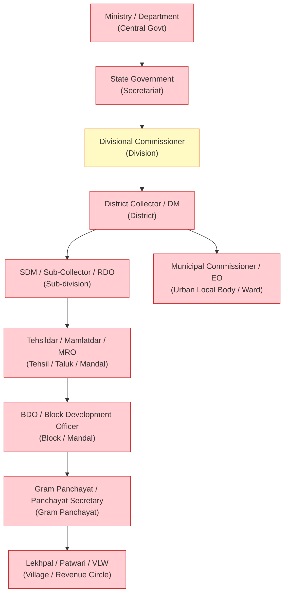

# D05 — Administrative Hierarchy & Office/Jurisdiction Model Assessment

**Lane:** L02 · **Date:** 2026-07-13  
**Reviewer role:** District Administration Domain Expert + GIS/Administrative-Geography Expert  
**Source branch:** `court-management-service` · repo at `/tmp/cms-wt`

---

## 1. Evidence Base

All findings are marked [VERIFIED] (code + DB seen) or [PROPOSED] (recommendation). Prior board deliverables referenced: `erp-assessment/02-architecture-discovery.md`, `08-tenant-isolation-report.md`.

Key files inspected:
- `services/location-service/src/modules/hierarchy/schema.ts` — defines `hierarchy.administrative_units`
- `services/location-service/src/modules/jurisdiction/schema.ts` — defines `jurisdiction.jurisdictions`
- `services/identity-service/src/modules/users/schema.ts` — `users.users`
- `services/identity-service/src/modules/rbac/schema.ts` — `rbac.roles`, `rbac.role_assignments`
- `services/hrms-service/src/modules/employee/schema.ts` — `employee.hrms_departments`, `employee.hrms_designations`, `employee.hrms_employees`
- `services/hrms-service/src/modules/employee/dept-domain.ts` — hardcoded vocabulary
- `packages/auth/src/index.ts` — JWT payload, `RequestContext`
- `packages/types/src/index.ts` — `RequestContext` interface
- `services/policy-service/src/modules/evaluate/domain.ts` — RBAC-only evaluation
- `services/policy-service/src/modules/abac/schema.ts` — `abac.rules`

DB verified via `docker exec civitasone-postgres`:
- `civitas_location`: only `location.locations` in DB (hierarchy/jurisdiction tables **NOT migrated**)
- `civitas_identity`: `users.users`, `rbac.*` — no office/position columns
- `civitas_policy`: `bindings.bindings` — no office/jurisdiction scope

---

## 2. Current Org Model: Verdict

**FINDING: The model is Tenant → Department → User. INSUFFICIENT for district governance.**

| Layer | Table | Service | In DB? | Office? | Position? | Posting? | Effective dates? |
|---|---|---|---|---|---|---|---|
| Tenant | `tenant.tenants` | tenant-service | ✓ | N | N | N | N |
| User | `users.users` | identity-service | ✓ | N | N | N | N |
| Role assignment | `rbac.role_assignments` | identity-service | ✓ | N | N | N | N [VERIFIED] |
| Department (HRMS) | `employee.hrms_departments` | hrms-service | ✓ | PARTIAL | N | N | N |
| Designation | `employee.hrms_designations` | hrms-service | ✓ | N | N | N | N |
| Employee posting | `lifecycle.hrms_transfers` | hrms-service | ✓ | N | PARTIAL | PARTIAL | effective_date only |
| Admin unit | `hierarchy.administrative_units` | location-service | **NO** (code only) | N | N | N | N |
| Jurisdiction | `jurisdiction.jurisdictions` | location-service | **NO** (code only) | ✓ (officeId FK) | N | N | N |

[VERIFIED] `civitas_location` DB has only `location.locations` (1 table). The `hierarchy.*` and `jurisdiction.*` schemas exist in TypeScript (`schema.ts`) but have **never been migrated** to the live database.

[VERIFIED] `RequestContext` (`packages/types/src/index.ts:71`):
```typescript
interface RequestContext {
  tenantId: string;
  actorId:  string;
  actorType: 'user' | 'service_account';
  roles:    string[];         // ← flat string array, no scope
  correlationId: string;
  sessionId?: string;
  idempotencyKey?: string;
}
```
There is no `officeId`, `positionId`, `jurisdictionId`, `departmentId`, or `classification` in any token or request context.

---

## 3. Gap Analysis: District Hierarchy Requirements vs Current Model

| Requirement | Current support | Gap verdict |
|---|---|---|
| Administrative units: State/Division/District/Subdivision/Tehsil/Block/GP/Village | Enum has 6 types: `state,district,block,gp,ward,zone`; subdivision, tehsil, mandal, taluk, panchayat, village **absent** from enum [VERIFIED `hierarchy/validators.ts:4`] | **GAP — P0** |
| Unit type is configurable per state (Tehsil vs Taluk vs Mandal vs Firka) | Unit types are a PG enum — cannot be changed without DDL migration | **GAP — P0** |
| Hierarchy depth configurable (some states have division level, some don't) | Depth is implicit via parentId; no `hierarchy_domain` or `domain_config` | **GAP — P1** |
| Office entity (distinct from administrative unit) | Absent — `jurisdiction.officeId` references an office but no `offices` table exists | **GAP — P0** |
| Position (sanctioned post) entity | Absent | **GAP — P0** |
| Officer Posting: person → position → office with effective_from/to | `hrms_transfers` has from/to dept + dates but no positionId, no jurisdictionId, no `acting`/`additional` charge flag | **GAP — P0** |
| Additional charge / Acting charge | Absent — no flag on posting | **GAP — P0** |
| Delegation of powers (financial, administrative, magisterial) | Absent — no delegation table | **GAP — P1** |
| Competent authority for financial powers | Absent | **GAP — P1** |
| Magisterial powers (Section 144, Exec Magistrate powers) | Absent | **GAP — P1** |
| Workflow authority (who can approve at which stage) | `estab_approval_rule` exists but no linkage to jurisdiction/position | **GAP — P1** |
| Effective dates on role assignments | `rbac.role_assignments` has no `valid_from`/`valid_to` [VERIFIED DB] | **GAP — P0** |
| Boundary changes / office reorganisation history | Absent | **GAP — P2** |
| Constituency boundaries (election, revenue, legislative) | Absent | **GAP — P2** |
| Dual hierarchy: civil AND police over same geography | Same geography but no `hierarchy_domain` flag on units | **GAP — P0** |
| Revenue hierarchy (Collector → SDM → Tehsildar → Patwari) | Same geography; revenue circle not a hierarchy level | **GAP — P0** |
| Health/Education department jurisdictions | No multi-department jurisdiction model | **GAP — P1** |

---

## 4. Proposed Target Model

**Principle:** Geography (administrative units) is a neutral fact layer. Offices, positions, postings, jurisdictions, and powers are overlaid by department and domain. A single `hierarchy.administrative_units` table serves civil, police, revenue, education, health — each overlaying their own office tree on top of the same geography.

### 4.1 Administrative Unit (extend existing table)

```sql
-- location-service / hierarchy schema
-- Replace the hardcoded PG ENUM with a varchar + lookup table

-- [PROPOSED] Drop the PG enum, use a reference table instead
CREATE TABLE hierarchy.unit_types (
  id         UUID PRIMARY KEY DEFAULT gen_random_uuid(),
  tenant_id  UUID NOT NULL,
  code       VARCHAR(32)  NOT NULL,           -- 'state','division','district','subdivision',
                                               -- 'tehsil','taluk','mandal','block','gp',
                                               -- 'ward','village','beat','hamlet'
  name       VARCHAR(120) NOT NULL,            -- State-configured label (Tehsil/Taluk/Firka)
  display_order INTEGER NOT NULL DEFAULT 0,
  is_leaf    BOOLEAN NOT NULL DEFAULT FALSE,
  UNIQUE (tenant_id, code)
);

-- Modify administrative_units: replace enum type with varchar FK to unit_types
ALTER TABLE hierarchy.administrative_units
  ADD COLUMN unit_type_code VARCHAR(32) NOT NULL DEFAULT 'district',
  ADD COLUMN lgd_code VARCHAR(32),             -- LGD master code (already in schema)
  ADD COLUMN hierarchy_domain VARCHAR(32),     -- NULL = civil/revenue; 'police','health','education'
  ADD COLUMN effective_from DATE,              -- boundary change support
  ADD COLUMN superseded_by UUID;               -- points to replacement unit after reorg
```

Rationale: replacing the PG enum with a lookup table makes unit types configurable per tenant (state) without DDL migrations.

### 4.2 Office Entity (NEW — location-service or identity-service)

```sql
-- [PROPOSED] New table: hierarchy.offices
-- One row per government office (District Collector's Office, SDM Office, Police Station, etc.)
CREATE TABLE hierarchy.offices (
  id                UUID PRIMARY KEY DEFAULT gen_random_uuid(),
  tenant_id         UUID NOT NULL,
  code              VARCHAR(64) NOT NULL,
  name              VARCHAR(256) NOT NULL,
  office_type_code  VARCHAR(64) NOT NULL,      -- 'collectorate','sdm_office','police_station',
                                               --  'tehsil','block_office','panchayat_office'
  hierarchy_domain  VARCHAR(32) NOT NULL DEFAULT 'civil',  -- 'civil','police','revenue','health','education'
  dept_code         VARCHAR(64),               -- links to hrms.hrms_departments via code
  admin_unit_id     UUID NOT NULL,             -- REFERENCES hierarchy.administrative_units(id)
  parent_office_id  UUID,                      -- self-ref: SP Office → Range IG → DGP
  lgd_code          VARCHAR(32),
  address           TEXT,
  is_active         BOOLEAN NOT NULL DEFAULT TRUE,
  established_date  DATE,
  dissolved_date    DATE,
  created_at        TIMESTAMPTZ NOT NULL DEFAULT NOW(),
  updated_at        TIMESTAMPTZ NOT NULL DEFAULT NOW(),
  created_by        UUID NOT NULL,
  updated_by        UUID NOT NULL,
  version           INTEGER NOT NULL DEFAULT 1,
  UNIQUE (tenant_id, code)
);

-- Office type lookup (configurable, not hardcoded)
CREATE TABLE hierarchy.office_types (
  id          UUID PRIMARY KEY DEFAULT gen_random_uuid(),
  tenant_id   UUID NOT NULL,
  code        VARCHAR(64) NOT NULL,
  name        VARCHAR(200) NOT NULL,           -- 'District Collectorate' / 'SDM Office'
  domain      VARCHAR(32) NOT NULL DEFAULT 'civil',
  UNIQUE (tenant_id, code)
);
```

### 4.3 Position (Sanctioned Post)

```sql
-- [PROPOSED] New table: hierarchy.positions
-- A position is a sanctioned post (e.g. "District Collector, Prayagraj") that can be
-- occupied by successive officers. It exists independent of any individual.
CREATE TABLE hierarchy.positions (
  id               UUID PRIMARY KEY DEFAULT gen_random_uuid(),
  tenant_id        UUID NOT NULL,
  code             VARCHAR(64) NOT NULL,
  title            VARCHAR(256) NOT NULL,      -- "District Collector" / "Circle Officer"
  office_id        UUID NOT NULL,              -- REFERENCES hierarchy.offices(id)
  designation_code VARCHAR(64),               -- cross-svc ref to hrms designation
  pay_level        VARCHAR(32),
  is_head_of_office BOOLEAN NOT NULL DEFAULT FALSE,
  cadre            VARCHAR(64),               -- IAS/IPS/IFS/State-PCS/etc.
  sanctioned       BOOLEAN NOT NULL DEFAULT TRUE,
  vacancies        INTEGER NOT NULL DEFAULT 1,
  created_at       TIMESTAMPTZ NOT NULL DEFAULT NOW(),
  updated_at       TIMESTAMPTZ NOT NULL DEFAULT NOW(),
  created_by       UUID NOT NULL,
  updated_by       UUID NOT NULL,
  version          INTEGER NOT NULL DEFAULT 1,
  UNIQUE (tenant_id, code)
);
```

### 4.4 Officer Posting (Person in Position)

```sql
-- [PROPOSED] New table: hierarchy.postings
-- One row per officer-in-position assignment. Temporal (effective dates).
CREATE TABLE hierarchy.postings (
  id               UUID PRIMARY KEY DEFAULT gen_random_uuid(),
  tenant_id        UUID NOT NULL,
  employee_id      UUID NOT NULL,             -- cross-svc ref to hrms.hrms_employees
  user_id          UUID,                      -- cross-svc ref to identity.users
  position_id      UUID NOT NULL,             -- REFERENCES hierarchy.positions(id)
  office_id        UUID NOT NULL,             -- denorm for fast lookup
  charge_type      VARCHAR(24) NOT NULL DEFAULT 'regular',
                                              -- 'regular','additional','acting','temporary'
  effective_from   DATE NOT NULL,
  effective_to     DATE,                      -- NULL = current posting
  order_ref        VARCHAR(120),
  order_date       DATE,
  relieved_date    DATE,
  joined_date      DATE,
  status           VARCHAR(24) NOT NULL DEFAULT 'active',
                                              -- 'active','relieved','completed','cancelled'
  created_at       TIMESTAMPTZ NOT NULL DEFAULT NOW(),
  updated_at       TIMESTAMPTZ NOT NULL DEFAULT NOW(),
  created_by       UUID NOT NULL,
  updated_by       UUID NOT NULL,
  version          INTEGER NOT NULL DEFAULT 1
);
CREATE INDEX idx_postings_employee   ON hierarchy.postings(tenant_id, employee_id, effective_to NULLS LAST);
CREATE INDEX idx_postings_position   ON hierarchy.postings(tenant_id, position_id, effective_to NULLS LAST);
CREATE INDEX idx_postings_office     ON hierarchy.postings(tenant_id, office_id, effective_to NULLS LAST);
```

### 4.5 Jurisdiction Assignment

```sql
-- [PROPOSED] Replace jurisdiction.jurisdictions with richer model
-- An office/position holds functional or territorial jurisdiction over units.
CREATE TABLE jurisdiction.assignments (
  id                UUID PRIMARY KEY DEFAULT gen_random_uuid(),
  tenant_id         UUID NOT NULL,
  office_id         UUID NOT NULL,            -- REFERENCES hierarchy.offices(id)
  position_id       UUID,                     -- if jurisdiction is per-position, not per-office
  admin_unit_id     UUID NOT NULL,            -- REFERENCES hierarchy.administrative_units(id)
  jurisdiction_type VARCHAR(32) NOT NULL,     -- 'territorial','functional','appellate'
  domain            VARCHAR(32) NOT NULL DEFAULT 'civil',
  is_primary        BOOLEAN NOT NULL DEFAULT TRUE,
  effective_from    DATE NOT NULL,
  effective_to      DATE,
  created_at        TIMESTAMPTZ NOT NULL DEFAULT NOW(),
  updated_at        TIMESTAMPTZ NOT NULL DEFAULT NOW(),
  created_by        UUID NOT NULL,
  updated_by        UUID NOT NULL,
  version           INTEGER NOT NULL DEFAULT 1
);
```

### 4.6 Delegation of Powers

```sql
-- [PROPOSED] New table: hierarchy.delegations
-- Records formal delegations (financial, administrative, magisterial).
CREATE TABLE hierarchy.delegations (
  id                UUID PRIMARY KEY DEFAULT gen_random_uuid(),
  tenant_id         UUID NOT NULL,
  from_position_id  UUID NOT NULL,            -- delegating officer's position
  to_position_id    UUID NOT NULL,            -- receiving officer's position
  power_type        VARCHAR(32) NOT NULL,     -- 'financial','administrative','magisterial'
  power_code        VARCHAR(64) NOT NULL,     -- e.g. 'gfr_23','crpc_144','land_acq_4'
  max_amount_minor  BIGINT,                   -- financial limit in minor units (paise)
  currency          CHAR(3) DEFAULT 'INR',
  effective_from    DATE NOT NULL,
  effective_to      DATE,
  gazette_ref       VARCHAR(120),
  created_at        TIMESTAMPTZ NOT NULL DEFAULT NOW(),
  updated_at        TIMESTAMPTZ NOT NULL DEFAULT NOW(),
  created_by        UUID NOT NULL,
  updated_by        UUID NOT NULL,
  version           INTEGER NOT NULL DEFAULT 1
);
```

---

## 5. District Administrative Organogram

### 5.1 Civil Hierarchy (District Level)



**Legend:**
- 🟢 [VERIFIED] Can represent — green
- 🟡 [PARTIAL] — yellow  
- 🔴 [GAP] — red

| Level | DB table | CAN represent? | Evidence |
|---|---|---|---|
| Ministry / Central Dept | — | **N [GAP]** | No `hierarchy_domain='central'` unit type; tenant = whole state/dept, not ministry subdivision |
| State Secretariat | `tenant.tenants` | **PARTIAL** | Tenant is at state/dept level; no intra-secretariat structure |
| Division | `hierarchy.administrative_units` (code only) | **N [GAP]** | `division` not in `UNIT_TYPES` enum; table not migrated to DB |
| District | enum value `district` | **PARTIAL** | Code exists, not in DB; no office row, no Collector posting with jurisdiction |
| Subdivision (SDM) | — | **N [GAP]** | `subdivision` missing from enum; no SDM office entity |
| Tehsil / Taluk / Mandal | — | **N [GAP]** | `tehsil` absent from enum; terminology not configurable per state |
| Block | enum value `block` | **PARTIAL** | In enum; not in DB; no BDO office or posting |
| Gram Panchayat | enum value `gp` | **PARTIAL** | In enum; not in DB |
| Village / Revenue Circle | — | **N [GAP]** | `village` absent from enum |
| Urban Local Body | enum value `ward` | **PARTIAL** | Ward in enum but ULB itself (corporation/municipality/NAC) has no type |

---

## 6. Hardcoded Structures — Configurability Register

| Item | Location | Hardcoded as | Config-driven? | Risk |
|---|---|---|---|---|
| `UNIT_TYPES` hierarchy levels | `location-service/src/modules/hierarchy/validators.ts:4` | `as const` + PG ENUM | **NO** | Must add new unit types with DDL migration — code fork risk for states with division/taluk levels |
| `JURISDICTION_LEVELS` | `location-service/src/modules/jurisdiction/validators.ts:4` | `as const` array | **NO** | Same 6 values; any new level needs code change |
| `CENTRAL_GOVT_TYPES` | `hrms-service/src/modules/employee/dept-domain.ts` | `as const` array | **NO** | Central-specific vocabulary baked in |
| `STATE_GOVT_TYPES` | same file | `as const` array | **NO** | Missing: directorate-general, attached office |
| `LOCAL_BODY_TYPES` | same file | `as const` array | **NO** | Missing: nagar panchayat, cantonment board |
| `govtTier` Zod enum | `hrms-service/src/modules/employee/masters-routes.ts:21` | `z.enum([...])` | **NO** | Hard-stop — adding cooperative federation requires code PR |
| Unit `type` field in `hrms_departments` | `employee/schema.ts:14` | `text("type")` + freeform | NO (freeform, no lookup) | Inconsistent data; no controlled vocabulary |
| Service-account roles | `packages/auth/src/context.ts:48` | string literal array | **NO** | `["super_admin","hr_admin","payroll_admin","finance_admin"]` hardcoded |

**Not hardcoded (confirmed absent):** SDM, Tehsildar, Mamlatdar, MRO, RDO, BDO, Collector, Sub-Collector, Constable, Inspector — none appear as enum values or const literals in service code. They are referenced only as free-text strings in user data, which is correct for designation names.

---

## 7. Prioritised Gap List

| Gap ID | Description | Priority | Target service | DDL/code required |
|---|---|---|---|---|
| G-H01 | `hierarchy.administrative_units` not migrated to DB | **P0** | location-service | Run Drizzle migration |
| G-H02 | `hierarchy.unit_types` not configurable (PG enum) | **P0** | location-service | Replace enum with lookup table |
| G-H03 | Missing unit types: division, subdivision, tehsil, taluk, mandal, panchayat, village, beat | **P0** | location-service | See §4.1 DDL |
| G-H04 | No `offices` entity (separate from administrative units) | **P0** | location-service | See §4.2 DDL |
| G-H05 | No `positions` (sanctioned posts) | **P0** | location-service | See §4.3 DDL |
| G-H06 | No `postings` with effective dates and charge type | **P0** | location-service + hrms-service | See §4.4 DDL |
| G-H07 | `jurisdiction.jurisdictions` not migrated to DB | **P0** | location-service | Run Drizzle migration |
| G-H08 | Jurisdiction model missing domain (civil/police/revenue) and effective dates | **P0** | location-service | See §4.5 DDL |
| G-H09 | No delegation of powers table | **P1** | location-service | See §4.6 DDL |
| G-H10 | `RequestContext` carries no office/position/jurisdiction | **P0** | packages/types, packages/auth | See d23b |
| G-H11 | RBAC role assignments have no effective dates or office scope | **P0** | policy-service | Add valid_from/to, office_id to bindings |
| G-H12 | `govtTier` and dept-type vocabularies hardcoded in TypeScript | **P1** | hrms-service | Move to `hierarchy.office_types` or admin config |
| G-H13 | No cross-hierarchy LGD code consistency check | **P2** | location-service | LGD master data pipeline |
| G-H14 | No constituency boundary layer | **P2** | location-service | New `constituency.*` schema |
| G-H15 | No office reorganisation history | **P2** | location-service | `effective_from`/`superseded_by` on units (§4.1) |
| G-H16 | Ministry-level federation (Central → State → District) has no representation | **P3** | tenant-service + location-service | New `govt_levels` concept |

---

## 8. Conclusion

The current model provides **Tenant → (HRMS Department → Employee) → (Identity User → RBAC Role)**. It cannot represent:
- An office distinct from an administrative unit or an HRMS department
- A position (sanctioned post) separate from a person
- A posting with effective dates, additional/acting charge
- Multi-domain jurisdictions (civil, police, revenue, health) over shared geography
- Delegation of financial, administrative, or magisterial powers
- A hierarchy deeper than 6 levels without a DDL migration

The location-service has the right conceptual skeleton (`administrative_units`, `jurisdiction.jurisdictions`) but the tables have **never been migrated** to the live DB, the unit type enum is hardcoded at 6 values and missing the critical intermediate levels (subdivision, tehsil, village), and no `offices`, `positions`, or `postings` entities exist anywhere in the system.

**Readiness for district pilot on current model: 1/10.**
