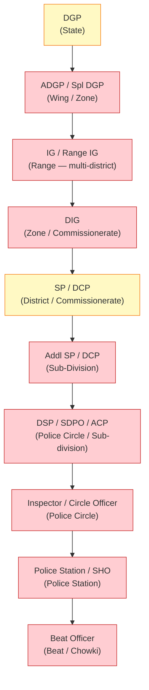

# D06 — Police Hierarchy & Parallel Jurisdiction Assessment

**Lane:** L02 · **Date:** 2026-07-13  
**Reviewer role:** District Administration Domain Expert (Law Enforcement vertical)  
**Source branch:** `court-management-service` · repo at `/tmp/cms-wt`

> This file must be read alongside **D05** (administrative hierarchy model) — the proposed DDL from D05 §4 is the prerequisite for everything here.

---

## 1. The Core Question

Can the current data model host two coexisting hierarchies — civil administration (Collector) and police administration (SP) — over the same geographic territory? This is the litmus test for a district governance platform because:

- The District Collector and the Superintendent of Police both have jurisdiction over the same district.
- Their hierarchies diverge above district (Divisional Commissioner vs Range/Zone DIG) and below district (SDM/Tehsil vs DSP/Circle/Police Station).
- Many workflows require both hierarchies simultaneously: crime statistics by revenue tehsil, law-and-order coordination, election duty, NDRF, disaster management.
- CCTNS/ICJS is the statutory system of record for FIR/case diary/criminal intelligence — **this platform must NOT duplicate those functions**. Its role is to model the police organisational hierarchy for HR, administration, eOffice workflow, and cross-department coordination only.

---

## 2. Police Hierarchy: National Structure

```
Ministry of Home Affairs (GoI)
  └── State Home Department / DGP's Office
        └── DGP (Director General of Police) — State
              ├── ADGP / Special DGP (by wing: Law & Order / Crime / Intel / Traffic)
              └── IGP / IG (Range — covers multiple districts)
                    └── DIG (Deputy Inspector General — Zone / Commissionerate)
                          └── SP (Superintendent of Police — District)
                                ├── Addl SP / DYSP (Sub-Division — mirrors SDM area)
                                ├── DSP / SDPO (Sub-Divisional Police Officer — circle)
                                │     └── Inspector (Circle Officer)
                                │           └── Police Station (PS)
                                │                 ├── Sub-Inspector (SHO)
                                │                 └── Beat Officer (Beat)
                                └── [Urban: DCP / ACP / Police Station (Commissionerate)]
```

The hierarchy depth varies by state: Commissionerate areas (urban districts) replace SP/DSP with DCP/ACP. This is a critical configurability requirement — the hierarchy is **not uniform** across all states.

---

## 3. Verified Current State

[VERIFIED] `civitas_location` DB: only `location.locations` exists. No hierarchy, no jurisdiction tables. The schema code in `location-service/src/modules/hierarchy/schema.ts` defines:

```typescript
// hierarchy/schema.ts (code only — NOT in DB)
export const unitTypeEnum = hierarchySchema.enum("unit_type", [
  "state", "district", "block", "gp", "ward", "zone",
]);
// hierarchy/validators.ts:4
export const UNIT_TYPES = ["state", "district", "block", "gp", "ward", "zone"] as const;
```

[VERIFIED] **Gaps confirmed for police hierarchy:**

| Police level | Maps to geography | Current unit type support |
|---|---|---|
| DGP | State | `state` — PARTIAL (no domain=police) |
| Range / IG | Multiple districts (zone) | `zone` — ambiguous (also used for municipal zones) |
| SP (District) | District | `district` — available but no domain |
| DSP / SDPO | Sub-division / police circle | **ABSENT** — `subdivision` not in enum |
| Circle Officer / Inspector | Police circle (not same as tehsil) | **ABSENT** — `circle` not in enum |
| Police Station | Sub-tehsil | **ABSENT** — `police_station` not in enum |
| Beat | Village cluster | **ABSENT** — `beat` not in enum |

[VERIFIED] `jurisdiction.jurisdictions` (`location-service/src/modules/jurisdiction/schema.ts`):
```typescript
export const jurisdictions = jurisdictionSchema.table("jurisdictions", {
  officeId: uuid("office_id").notNull(),   // no offices table exists
  unitId:   uuid("unit_id").notNull(),     // no hierarchy units in DB
  level:    varchar("level", { length: 24 }).notNull(),  // same 6 hardcoded levels
  isPrimary: boolean("is_primary")...
  // NO: hierarchy_domain, effective_from/to, jurisdiction_type
});
```

There is NO way to distinguish a civil jurisdiction assignment from a police jurisdiction assignment. The `level` field has no `domain` modifier.

[VERIFIED] `services/hrms-service/src/modules/employee/dept-domain.ts`: The hardcoded dept-type vocabulary for Central Govt includes organisational labels but **no police-specific types** (DGP's office, Range office, Police Station are not listed). `STATE_GOVT_TYPES` includes `"regional_office"`, `"district_office"` — these are ambiguous and could serve as proxies but are not semantically correct.

[VERIFIED] No `court-service`, `citizen-service`, or `workflow-service` references to police station or police beat as a jurisdiction scope. CCTNS/ICJS integration stubs were not found in the codebase (correct — integration, not duplication, is the right approach per rule §5 of the prompt).

---

## 4. Police Organogram with Current vs Target Capability



| Level | Current support | Evidence |
|---|---|---|
| DGP | PARTIAL — `state` unit type exists, no `domain='police'` | `hierarchy/validators.ts:4` — NOT in DB |
| ADGP / Spl DGP | **N [GAP]** | No wing/specialisation concept |
| Range / IG | **N [GAP]** | `zone` type exists but semantically wrong; Range ≠ municipality zone |
| DIG / Commissionerate | **N [GAP]** | No type for commissionerate (urban police zone) |
| SP / DCP | PARTIAL — `district` unit type in code | No `office` entity, no `domain` flag, NOT in DB |
| Addl SP | **N [GAP]** | No sub-district police level |
| DSP / SDPO / ACP | **N [GAP]** | `subdivision` absent from unit types |
| Inspector / Circle | **N [GAP]** | `circle` absent from unit types |
| Police Station | **N [GAP]** | `police_station` absent |
| Beat / Chowki | **N [GAP]** | `beat` absent |

---

## 5. Dual Hierarchy Design: Civil + Police on Same Geography

The key insight is that **administrative units (geography) are shared**, but **offices, positions, postings, and jurisdiction assignments are domain-specific**.

### 5.1 Architecture

```
hierarchy.administrative_units          — shared geography, domain-neutral
     ↑ admin_unit_id
hierarchy.offices  (domain = 'civil')   — Collectorate, SDM Office, Tehsil Office
hierarchy.offices  (domain = 'police')  — SP Office, DSP Office, Police Station
     ↑ office_id
jurisdiction.assignments               — links office → unit with domain
     ↑
hierarchy.positions                    — District Collector / SP (by office)
     ↑
hierarchy.postings                     — IAS officer posted as DC / IPS officer as SP
```

The two hierarchies coexist on the same geographic spine. A district's boundary is ONE row in `administrative_units`. The Collector's office and the SP's office are two rows in `hierarchy.offices` (`domain='civil'` and `domain='police'`), both pointing to the same `admin_unit_id`.

### 5.2 Required Unit Type Additions for Police Hierarchy

```sql
-- [PROPOSED] Seed data for hierarchy.unit_types (per §4.1 of D05)
-- Police-domain unit types:
INSERT INTO hierarchy.unit_types (tenant_id, code, name, display_order, is_leaf) VALUES
  ('<tenant>', 'police_range',       'Police Range',           50, FALSE),
  ('<tenant>', 'police_zone',        'Police Zone',            55, FALSE),
  ('<tenant>', 'commissionerate',    'Police Commissionerate', 56, FALSE),
  ('<tenant>', 'police_subdivision', 'Police Sub-Division',    60, FALSE),
  ('<tenant>', 'police_circle',      'Police Circle',          65, FALSE),
  ('<tenant>', 'police_station',     'Police Station',         70, FALSE),
  ('<tenant>', 'beat',               'Beat',                   75, TRUE);

-- Civil-domain additions:
INSERT INTO hierarchy.unit_types (tenant_id, code, name, display_order, is_leaf) VALUES
  ('<tenant>', 'division',           'Division',               15, FALSE),
  ('<tenant>', 'subdivision',        'Sub-Division',           25, FALSE),
  ('<tenant>', 'tehsil',             'Tehsil',                 30, FALSE),
  ('<tenant>', 'taluk',              'Taluk',                  30, FALSE),  -- state alias
  ('<tenant>', 'mandal',             'Mandal',                 30, FALSE),  -- state alias
  ('<tenant>', 'revenue_circle',     'Revenue Circle',         40, FALSE),
  ('<tenant>', 'village',            'Village',                45, TRUE);
```

### 5.3 Commissionerate vs Non-Commissionerate Districts

This is the critical configurability case. Major cities (Mumbai, Bengaluru, Hyderabad, Chennai, Kolkata, Delhi) operate under a Police Commissionerate with a different hierarchy (no SP — replaced by DCP). The model MUST support this via the `hierarchy_domain` and `office_type_code` columns without any code fork.

```sql
-- [PROPOSED] Example: Commissionerate city
INSERT INTO hierarchy.offices VALUES (
  ..., 'mumbai_commissionerate', 'Mumbai Police Commissionerate',
  'commissionerate', 'police', NULL, <state_unit_id>, NULL, ...
);

-- [PROPOSED] Example: Non-commissionerate district
INSERT INTO hierarchy.offices VALUES (
  ..., 'prayagraj_sp', 'SP Office Prayagraj',
  'sp_office', 'police', NULL, <district_unit_id>, <range_office_id>, ...
);
```

---

## 6. Statutory Integration Boundary (CCTNS/ICJS)

Per prompt rule §5: **do NOT duplicate FIR, case diary, criminal intelligence, or evidence functions**.

The police hierarchy model in CivitasOne's scope is limited to:

| In-scope (HR/Admin) | Out-of-scope (CCTNS/ICJS — statutory system of record) |
|---|---|
| Police station as an office entity (HR address) | FIR registration and case number |
| SP/DSP postings and transfers | Case diary and investigation |
| Beat as a geographic unit (for patrol rostering) | Criminal intelligence |
| Budget allocation by police unit | Evidence management |
| Stores/inventory for police station | Crime statistics (use CCTNS API) |
| eOffice workflow routing to SP/DSP | Arrest records |
| Leave/attendance for police personnel | Court calendar (→ court-service integrates with ICJS) |

**Integration contract needed [PROPOSED]:**

```typescript
// [PROPOSED] CCTNS integration via gov-adapters package
// packages/gov-adapters/src/cctns/client.ts
interface CctnsAdapter {
  // Pull crime statistics aggregated by geographic unit (for dashboards only)
  getCrimeStatsByUnit(districtLgdCode: string, period: YearMonth): Promise<CrimeSummary>;
  // Verify FIR existence (for court-service linkage only)
  verifyFir(firNo: string, psCode: string): Promise<FirStatus>;
}
```

The platform's `court-service` (already on this branch) will integrate with ICJS for case data. CivitasOne MUST NOT store FIR data internally.

---

## 7. Required Changes (Police Hierarchy)

| ID | Change | Priority | Owner service |
|---|---|---|---|
| P-01 | Migrate `hierarchy.administrative_units` + `jurisdiction.jurisdictions` to DB | **P0** | location-service |
| P-02 | Replace PG enum with `hierarchy.unit_types` lookup table | **P0** | location-service |
| P-03 | Add police-domain unit types (police_range, police_circle, police_station, beat) | **P0** | location-service seed data |
| P-04 | Implement `hierarchy.offices` with `hierarchy_domain` column | **P0** | location-service |
| P-05 | Add `hierarchy_domain` to `jurisdiction.assignments` | **P0** | location-service |
| P-06 | Support Commissionerate topology (DCP path, no SP) via office_type config | **P1** | location-service |
| P-07 | HR module: police cadre (IPS/State PPS) designation hierarchy in `hrms_designations` | **P1** | hrms-service |
| P-08 | Transfer orders for police officers must reference police positions/offices | **P1** | hrms-service |
| P-09 | CCTNS adapter stub in `packages/gov-adapters` (read-only, crime stats API) | **P2** | gov-adapters package |
| P-10 | Beat as geographic unit for patrol rostering (not FIR tracking) | **P2** | location-service + hrms-service |

---

## 8. Conclusion

The current system **cannot** host a parallel police hierarchy alongside the civil hierarchy. The fundamental blockers are:

1. **No `offices` entity** — every police administrative unit (Range, SP Office, Police Station) needs an office row, not just a geographic unit row.
2. **No `hierarchy_domain`** — the system has no way to distinguish a DSP Office from an SDM Office over the same tehsil geography.
3. **Missing unit types** — `police_circle`, `police_station`, `beat` are absent from the hardcoded enum.
4. **Jurisdiction assignments have no domain** — an office can't declare "I have police jurisdiction (not civil) over this block."
5. **No postings model** — cannot track IPS officers' current posting as SP or DIG.

The proposed model in D05 §4 (offices + positions + postings + jurisdiction with domain) solves all five blockers. The police hierarchy can be built as a parallel tree in `hierarchy.offices (domain='police')` over the same `hierarchy.administrative_units` geography spine.

Police hierarchy readiness: **1/10** (same blockers as civil hierarchy; no additional police-specific data model exists).
